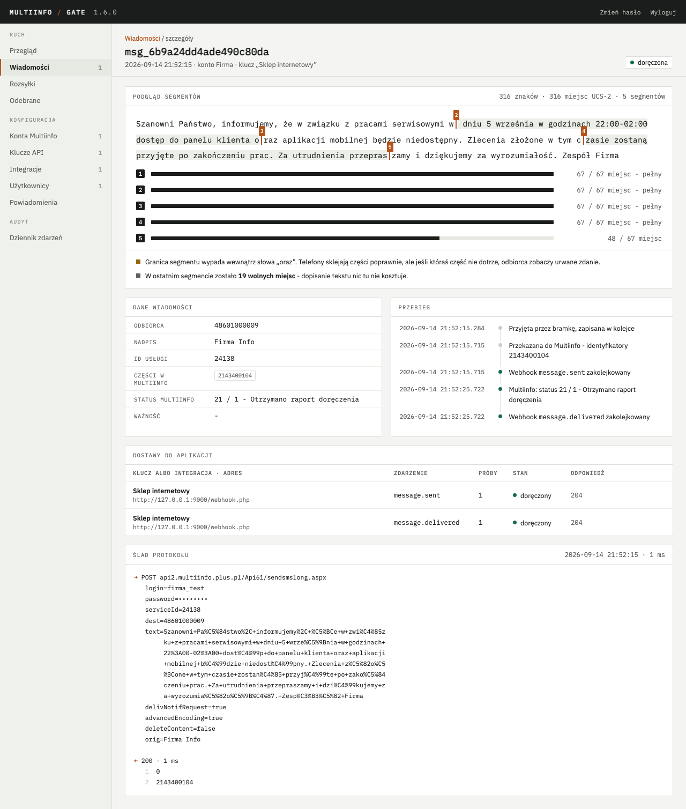

# Multiinfo Gate

Bramka SMS między Twoimi aplikacjami a API Multiinfo (Plus, Polkomtel). Trzyma certyfikat
kliencki, login i hasło do Multiinfo w jednym miejscu, a aplikacjom wystawia proste HTTP API
z kluczem w nagłówku. Aplikacja wysyłająca SMS-y nie instaluje certyfikatów i nie zna ASPX.

## Dla kogo

Dla firmy z kontem Multiinfo, która chce dać własnym systemom albo agencji zewnętrznej
jedno API zamiast certyfikatów, oraz panel do zarządzania kontami, kluczami i podglądu
doręczeń.

## Co trzeba mieć

- Konto Multiinfo z użytkownikiem API i certyfikatem (`.pfx` z hasłem)
- ID usługi (z panelu Multiinfo albo od opiekuna technicznego Polkomtela) i, jeżeli mają być używane, nadpisy nadawcy uruchomione przez Polkomtel na wniosek z panelu Multiinfo
- Serwer Linux (Ubuntu 24.04) z Dockerem; wystarczy najmniejsza maszyna w chmurze, x86-64 albo ARM64

## Instalacja

Bramka działa z gotowego obrazu `ghcr.io/sqlik/multiinfo-gate`, publikowanego przy każdym
wydaniu. Do uruchomienia wystarczą pliki z katalogu `docker/`, klucz główny w `docker/.env`
i `docker compose up -d`; HTTPS pod własną domeną daje Caddy, nginx albo Traefik według
wyboru. Kolejne kroki, od konta Multiinfo po wystawienie API na świat, opisuje instrukcja
poniżej.

## Dokumentacja

- [Uruchomienie krok po kroku](docs/uruchomienie.md) - od konta Multiinfo do pierwszego SMS-a i wystawienia API na świat
- [API dla aplikacji](docs/api.md) - wywołania, webhooki, błędy, limity
- [Przykład w PHP](examples/php/) - strona testowa i kod do skopiowania

## Licencja

MIT, patrz [LICENSE](LICENSE).
