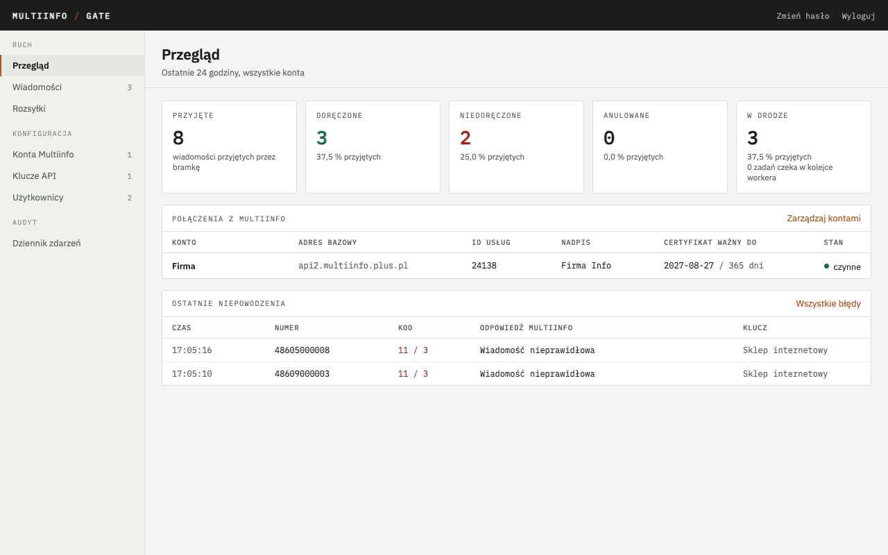

# Multiinfo Gate

Bramka SMS między Twoimi aplikacjami a API Multiinfo (Plus, Polkomtel). Trzyma certyfikat
kliencki, login i hasło do Multiinfo w jednym miejscu, a aplikacjom wystawia proste HTTP API
z kluczem w nagłówku. Aplikacja wysyłająca SMS-y nie instaluje certyfikatów i nie zna ASPX.
Od wersji 1.3 bramka odbiera też SMS-y od abonentów i przekazuje je aplikacji powiadomieniem
webhook. Od wersji 1.5 integruje się z aplikacjami, których formatu nie da się zmienić: monitoring
i helpdesk wysyłają SMS-y własnym ładunkiem na adres wejściowy bramki, a odebrane SMS-y i statusy
trafiają do helpdesku albo na telefon przez ntfy w ich formacie; administrator dostaje mailem
powiadomienia o błędach i certyfikatach.

## Dla kogo

Dla firmy z kontem Multiinfo, która chce dać własnym systemom albo agencji zewnętrznej jedno API
zamiast certyfikatów, oraz panel do zarządzania kontami, kluczami i podglądu doręczeń.

## Dokumentacja

- [Uruchomienie krok po kroku](uruchomienie.md) - od konta Multiinfo, przez serwer z Dockerem albo
  kontener LXC na Proxmox VE, do pierwszego SMS-a i wystawienia API pod własną domeną
- [API dla aplikacji](api.md) - każde wywołanie z przykładem w siedmiu wariantach (curl, HTTP, PHP,
  Python, Node.js, PowerShell, C#), webhooki, błędy, limity
- [Integracje z aplikacjami](integracje.md) - adres wejściowy dla aplikacji z własnym formatem,
  szablony Liquid, gotowe ustawienia (Uptime Kuma, Grafana, Zabbix, FreeScout, Freshdesk, ntfy),
  powiadomienia administratora mailem
- [Przykład w PHP](https://github.com/sqlik/multiinfo-gate/tree/main/examples/php) - strona
  testowa i kod do skopiowania, w repozytorium

## Co trzeba mieć

- Konto Multiinfo z użytkownikiem API i certyfikatem (`.pfx` z hasłem)
- ID usługi (z panelu Multiinfo albo od opiekuna technicznego Polkomtela) i, jeżeli mają być
  używane, nadpisy nadawcy uruchomione przez Polkomtel na wniosek z panelu Multiinfo
- Serwer Linux (Ubuntu 24.04) z Dockerem (wystarczy najmniejsza maszyna w chmurze, x86-64 albo
  ARM64) albo własny Proxmox VE, na którym skrypt tworzy gotowy kontener LXC bez Dockera

Kod, zgłoszenia i wydania: [github.com/sqlik/multiinfo-gate](https://github.com/sqlik/multiinfo-gate).
Licencja MIT.
