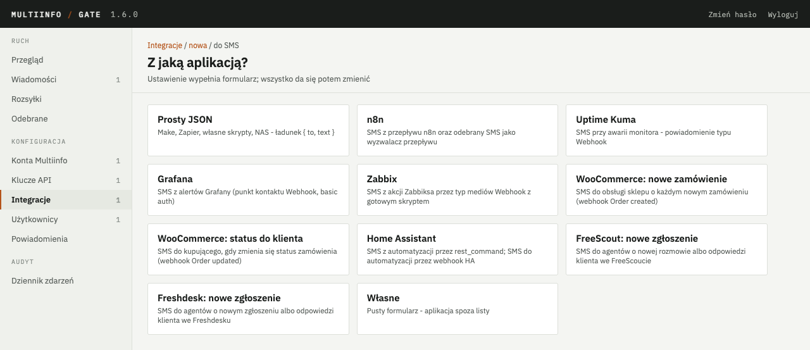
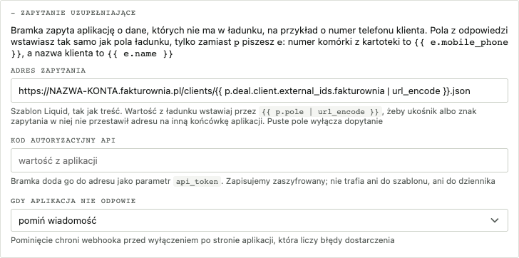
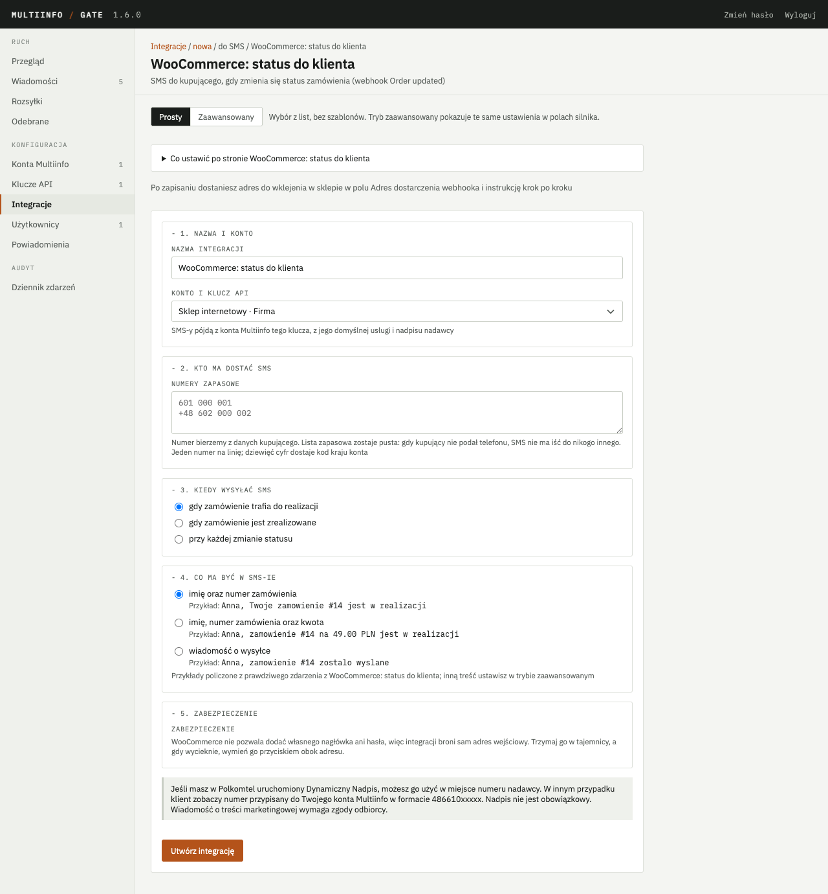
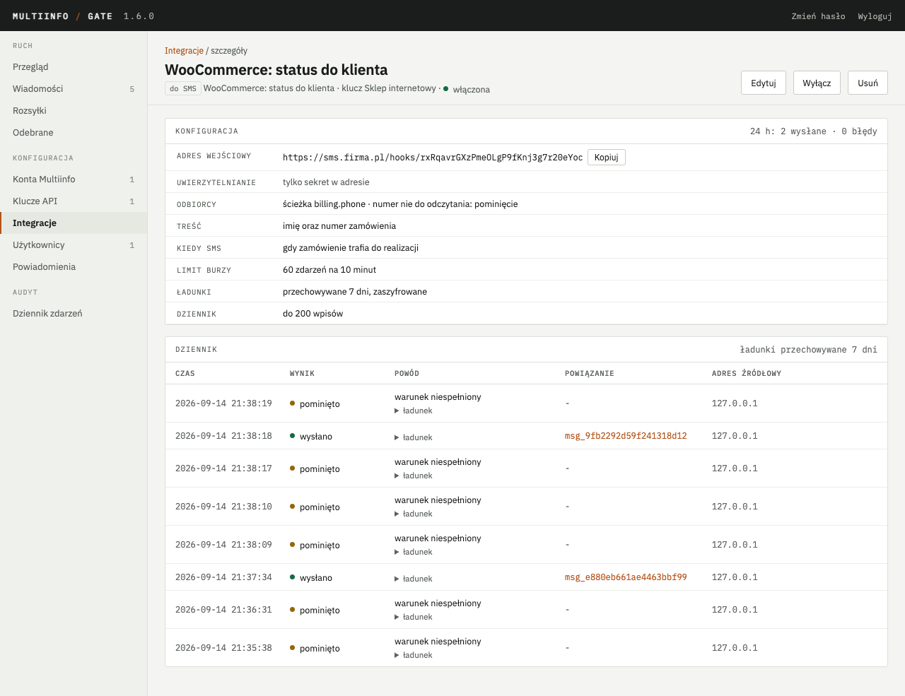
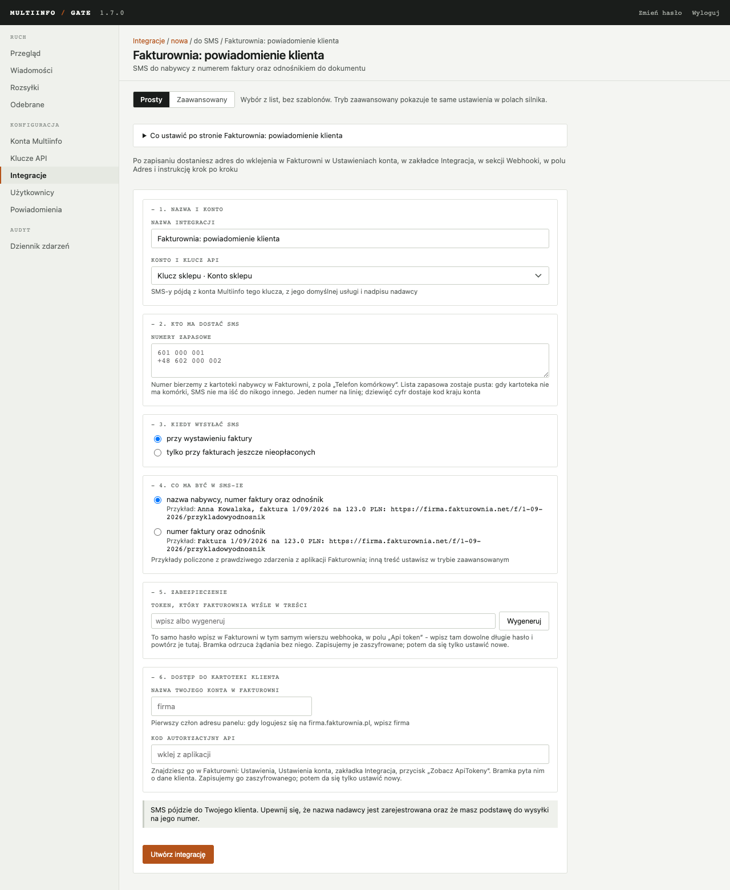
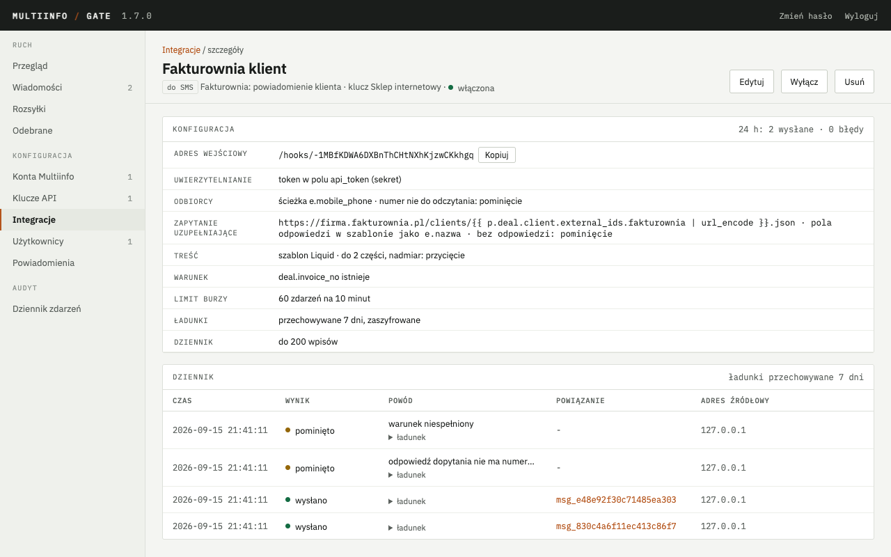
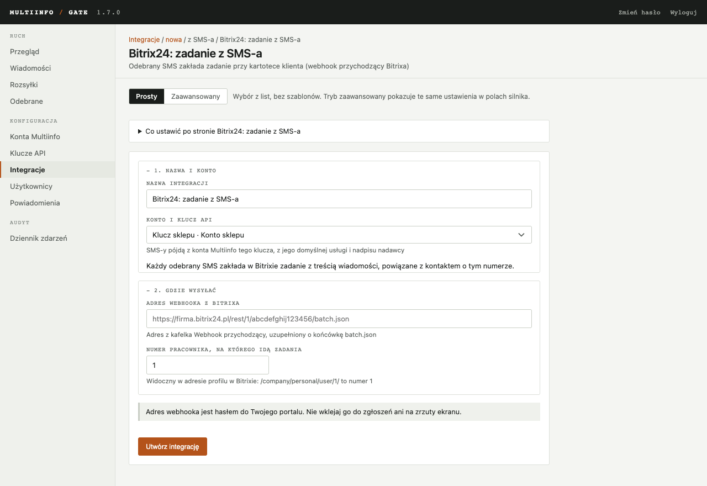

# Integracje z aplikacjami

Od wersji 1.5 bramka rozmawia także z aplikacjami, które mają własny, narzucony format
komunikatów. Przyjmuje od nich zlecenia wysyłki SMS-a. W drugą stronę przekazuje im odebrane
SMS-y oraz statusy wysyłki w takim kształcie, jakiego oczekują. Służy do tego integracja. Jest to
obiekt konfigurowany w panelu i przypięty do klucza API. Ma adres wejściowy albo docelowy,
szablon i warunek.

Ten rozdział opisuje oba kierunki, język szablonów, gotowe ustawienia dla popularnych aplikacji,
dziennik integracji oraz powiadomienia dla administratora wysyłane mailem. Wysyłkę przez pełne
API z kluczem w nagłówku opisuje rozdział [API dla aplikacji](api.md). Integracje są dla
przypadków, w których aplikacja nie potrafi tego API użyć.

## 1. Czym jest integracja

Integracja działa w jednym z dwóch kierunków:

| Kierunek | W panelu | Co robi |
|---|---|---|
| do SMS | „Aplikacja wysyła SMS” | aplikacja woła adres wejściowy bramki `POST /hooks/<identyfikator>` własnym ładunkiem; bramka wyciąga z niego numer i treść, składa SMS i wysyła |
| z SMS-a | „SMS albo status trafia do aplikacji” | odebrany SMS albo status wysyłki bramka wysyła na adres aplikacji w formacie zapisanym w szablonie |

Każda integracja działa w imieniu jednego klucza API. Obowiązują więc konto Multiinfo tego
klucza, jego dozwolone usługi, nadpisy i limity, dokładnie tak jak przy wysyłce przez API.
Wiadomości wysłane przez integrację widać na ekranie „Wiadomości” z nazwą klucza i nazwą
integracji. Jeden klucz może mieć wiele integracji. Klucza z włączoną integracją nie da się
odwołać. Najpierw trzeba integrację wyłączyć albo usunąć.

Każde zdarzenie przechodzi przez ten sam potok. Na początku jest źródło: żądanie aplikacji albo
zdarzenie w bramce. Potem warunek, który rozstrzyga, czy w ogóle reagować. Dalej ochrona, czyli
idempotencja i limit burzy. Następnie szablony: numer, treść albo body żądania. Na końcu
wykonanie, czyli wysyłka SMS-a albo dostawa do aplikacji, oraz wpis w dzienniku integracji.
Każdy krok, który coś odrzuca, zostawia wpis z powodem. Niektóre odrzucenia wysyłają też mail do
administratora (rozdział 8).

## 2. Dodanie integracji w panelu

Ekran **Integracje** w grupie „Konfiguracja” pokazuje listę integracji. Przy każdej widać
kierunek, ustawienie, klucz, stan (włączona, wyłączona albo błąd w ostatniej dobie), ostatnie
zdarzenie i liczniki z ostatniej doby. Plakietka przy pozycji w menu liczy integracje, które
w ostatniej dobie miały błąd.


### 2.1. Adres bramki

Zanim dodasz pierwszą integrację, podaj raz **adres, pod którym aplikacje widzą bramkę**. Panel
prosi o niego na ekranie **Klucze API**, a dopóki go nie ma, także na liście integracji. To ten
sam adres, który aplikacje wpisują przed `/v1/messages`. Dla bramki pod domeną będzie to na
przykład `https://sms.firma.pl`. Dla kontenera na Proxmoxie dostępnego w sieci firmowej będzie
to adres kontenera z portem API, na przykład `http://10.10.10.159:8080`. Adres podaje się bez
ścieżki na końcu.

Od tej chwili panel pokazuje przy każdym kluczu gotowe wywołanie do wklejenia w terminalu. Przy
każdej integracji pokazuje pełny adres wejściowy zamiast samej ścieżki `/hooks/…`. Rozdział 3.1
opisuje, jaki adres wpisać zależnie od tego, w jakim środowisku została postawiona bramka.

### 2.2. Trzy kroki

Przycisk **Dodaj integrację** prowadzi przez trzy kroki:

1. Kierunek: „Aplikacja wysyła SMS” albo „SMS albo status trafia do aplikacji”.
2. Gotowe ustawienie: kafelek z nazwą aplikacji (rozdział 6) albo „Własne” dla aplikacji spoza
   listy.
3. Formularz. Gotowe ustawienie otwiera się w **trybie prostym**, „Własne” od razu
   w **zaawansowanym**. Przełącznik nad formularzem zmienia tryb w każdej chwili.



Niektóre ustawienia pokazują nad przyciskiem zapisu uwagę w ramce. Uwaga zbiera to, o czym warto
wiedzieć przed uruchomieniem integracji, a czego nie widać w samych polach formularza. Tak jest
przy ustawieniu „WooCommerce: status do klienta”, bo SMS idzie tam do klienta sklepu, a nie do
obsługi. Ramka mówi wtedy, jaki numer nadawcy zobaczy klient oraz że wiadomość o treści
marketingowej wymaga jego zgody. Pojawia się w obu trybach formularza. Niczego nie blokuje.

### 2.3. Tryb prosty

Tryb prosty nie wymaga znajomości ładunku aplikacji ani szablonów. Formularz ma pięć punktów.
Każdy z nich jest decyzją użytkownika, wyrażoną w jego języku:

1. **Nazwa i konto** - nazwa integracji i klucz API. SMS-y idą z konta Multiinfo tego klucza.
2. **Kto ma dostać SMS** - numery telefonów, jeden na linię. Gdy aplikacja sama przesyła numer
   (Zabbix, Prosty JSON), pole nazywa się „Numery zapasowe”, a zdanie pod nim mówi, skąd numer
   przychodzi.
3. **Kiedy wysyłać SMS** - lista wariantów przygotowanych dla tej aplikacji. W Uptime Kumie są
   to na przykład: „tylko gdy monitor przestanie działać”, „gdy przestanie działać i gdy wróci”,
   „zawsze, także przy przycisku Test”.
4. **Co ma być w SMS-ie** - dwa warianty treści. Panel pokazuje je jako gotowy SMS obliczony
   z prawdziwego ładunku tej aplikacji, na przykład „AWARIA: Strona firmowa - Request failed
   with status code 403”. Szablonu nie pokazuje.
5. **Zabezpieczenie** - jedno, takie, które dana aplikacja obsługuje. Jest to hasło, które
   wpisuje się też po stronie aplikacji. Przycisk **Wygeneruj** losuje bezpieczne hasło. Przy
   aplikacjach bez pola na hasło (FreeScout, Freshdesk) panel wyjaśnia jednym zdaniem, co
   zamiast hasła chroni adres.


Integracja z SMS-a w trybie prostym ma cztery grupy pól. Nazwa i konto działają jak wyżej.
Adres aplikacji ma podpowiedź, co tam wpisać, na przykład „adres Twojego FreeScouta z końcówką
/api/conversations”. Parametry aplikacji to na przykład numer skrzynki we FreeScoucie. Dostęp
do aplikacji to jej klucz API. Przy Freshdesku bramka sama zamienia klucz na wymagany nagłówek.

Po zapisaniu panel pokazuje jeden raz ramkę z **pełnym adresem do wklejenia**. Obok jest zdanie,
gdzie go wkleić, na przykład „w Uptime Kumie w polu Post URL powiadomienia typu Webhook”, oraz
instrukcja krok po kroku dla tej aplikacji.


Tryb prosty zapisuje dokładnie tę samą konfigurację, którą pokazuje tryb zaawansowany. Wybrany
wariant „kiedy” to warunek. Wariant treści to szablon. Hasło to nagłówek albo basic auth. Dopóki
konfiguracja mieści się w listach ustawienia, edycja otwiera tryb prosty z zaznaczonymi
wyborami. Gdy ktoś w trybie zaawansowanym wpisze własny szablon albo warunek, edycja otwiera
się w trybie zaawansowanym z komunikatem (jednym zdaniem dlaczego), a szczegóły integracji
pokazują warunek i szablon zamiast słów z list.

### 2.4. Tryb zaawansowany

Tryb zaawansowany pokazuje pola silnika, podzielone na sekcje:

- podstawy: nazwa, klucz, usługa, nadawca, włączona
- wejście albo wyjście: uwierzytelnianie i lista źródeł, a w drugim kierunku adres, metoda,
  nagłówki i zdarzenia
- warunek: reguły albo wyrażenie Liquid
- odbiorca: ścieżki numeru i identyfikatorów, lista zapasowa, odpowiedź na numer nie do odczytania
- treść albo żądanie: szablon Liquid albo pole z ładunku, a w drugim kierunku body
- ochrona i dziennik
- próbka

Rozdziały 3 i 4 opisują każde pole. Rozdział 5 opisuje język szablonów.

Pod formularzem są dwa przyciski. **Sprawdź szablon** niczego nie zapisuje i nie wysyła SMS-a.
Bierze próbkę ładunku z pola na dole (z ustawienia albo z dziennika) i pokazuje wynik: czy
warunek jest spełniony, jak wyglądają odbiorcy po normalizacji, jaka będzie treść i ile zajmie
części. Dla integracji z SMS-a pokazuje nagłówki (z zamaskowanymi sekretami) i body. **Utwórz
integrację** zapisuje. Zapis wymaga poprawnego szablonu i warunku. Błąd składni Liquida wraca
jako komunikat z numerem linii i kolumny.


Adres wejściowy widać w szczególe integracji i na stronie edycji. Tam też jest przycisk
**Wygeneruj nowy**. Stary adres przestaje działać natychmiast, więc trzeba go podmienić
w aplikacji.

Sekrety zapisują się zaszyfrowane kluczem głównym. Dotyczy to hasła z trybu prostego, tokenu
w nagłówku, hasła basic auth i sekretnych nagłówków integracji z SMS-a. Po zapisaniu nie da się
ich odczytać w panelu. W edycji puste pole sekretu zostawia dotychczasową wartość. Żeby zdjąć
warstwę w trybie zaawansowanym, wyczyść nazwę nagłówka albo login.

## 3. Aplikacja wysyła SMS

### 3.1. Adres wejściowy

Adres wejściowy to `POST /hooks/<identyfikator>` na porcie API bramki, czyli tym samym, na
którym działa `/v1/messages`. Przykład: `https://sms.firma.example/hooks/k9x…`. Identyfikator
ma 32 losowe znaki i sam w sobie jest sekretem. Kto go zna, może wysyłać SMS-y na koszt konta,
do wysokości limitów klucza i w granicach ochrony z rozdziału 3.7.

Bramka przyjmuje `Content-Type: application/json` oraz `application/x-www-form-urlencoded`.
Formularz zamienia na płaski obiekt, a powtórzone pole staje się tablicą. Ładunek może mieć do
256 KB. Większy dostaje kod 413, a niepoprawny JSON kod 400. Inne metody niż `POST` dostają 405.
Nieznany identyfikator i integracja wyłączona dostają 404, bez wpisu w dzienniku.

Panel pokazuje pełny adres, gdy zna adres bramki (rozdział 2.1). Bez niego pokazuje samą ścieżkę
`/hooks/<identyfikator>`. Ścieżkę dokleja się do adresu, pod jakim aplikacja widzi API bramki.
Ten adres zależy od środowiska bramki i od tego, skąd woła ją aplikacja:

| Środowisko bramki | Skąd woła aplikacja | Pełny adres do wpisania w aplikacji |
|---|---|---|
| Docker z odwrotnym proxy pod domeną (Caddy, nginx albo Traefik z rozdziału 6 Uruchomienia) | z internetu | `https://<TWOJA-DOMENA>/hooks/<identyfikator>` |
| Docker bez proxy (porty przypięte do `127.0.0.1`, jak w `docker-compose.yml`) | tylko z tego samego serwera | `http://127.0.0.1:8080/hooks/<identyfikator>`; aplikacja z innego komputera bramki nie dosięgnie, dopóki API nie zostanie wystawione według rozdziału 6 |
| Kontener LXC na Proxmoxie (rozdział 9 Uruchomienia) | z tej samej sieci co kontener (biuro, serwerownia) | `http://<ADRES-KONTENERA>:8080/hooks/<identyfikator>`, np. `http://10.10.10.159:8080/hooks/k9x…`; bez HTTPS, więc token wędruje siecią jawnym tekstem - do zaufanej sieci firmowej |
| Kontener LXC na Proxmoxie | z internetu (Grafana Cloud, Freshdesk, FreeScout u hostingodawcy, Zapier) | kontener nie ma publicznego adresu; potrzebne odwrotne proxy z HTTPS pod publiczną domeną, kierowane na `http://<ADRES-KONTENERA>:8080` (punkt 9.6 Uruchomienia) |

Weryfikacja ścieżki: z komputera albo serwera, na którym stoi aplikacja, wywołaj
`curl <ADRES-BEZ-ŚCIEŻKI>/healthz`, na przykład `curl https://sms.firma.example/healthz`.
Prawidłowa odpowiedź to `{"status":"ok"}`. Odpowiedź `Connection refused` albo przekroczony
czas oznaczają, że sieć nie prowadzi do bramki. Żadne ustawienie integracji tego nie naprawi.
W drugą stronę, gdy to bramka woła aplikację (rozdział 4), obowiązuje reguła z punktu 4.3
o adresach w sieci wewnętrznej.

### 3.2. Uwierzytelnianie

Bramka ma pięć warstw uwierzytelniania. Pierwsza działa zawsze. Pozostałe włącza się
w sekcji „Wejście”:

| Warstwa | Jak działa | Kiedy używać |
|---|---|---|
| sekret w adresie | identyfikator z adresu wejściowego | zawsze |
| nagłówek z tokenem | nazwa nagłówka i wartość z konfiguracji, np. `Authorization: Bearer …`, porównanie w stałym czasie | aplikacje z polem na nagłówki: Uptime Kuma, Zabbix, automaty |
| sekret w polu ładunku | ścieżka do pola i wartość z konfiguracji, porównanie w stałym czasie | aplikacje bez pola na nagłówki, które wkładają token do treści żądania: Fakturownia |
| basic auth | login i hasło z konfiguracji | Grafana i inne z gotowym polem „Basic Authentication” |
| lista źródeł | adresy IP, zakresy CIDR (IPv4 i IPv6) albo nazwy hostów rozwiązywane przy żądaniu z buforem 60 s | aplikacje ze stałym adresem albo NAS z DDNS |

Nieudane uwierzytelnienie daje kod 401 (token, sekret w polu ładunku, basic auth) albo 403
(źródło). W dzienniku powstaje wpis `odrzucono` z adresem źródłowym, bez ładunku. Administrator dostaje mail,
grupowany. Niezależnie od limitów klucza adres `/hooks/` ma własny limit: 120 żądań na minutę
z jednego adresu źródłowego. Nadmiar dostaje kod 429.

Adresem źródłowym jest adres gniazda. Gdy bramka stoi za odwrotnym proxy (Caddy, nginx,
Traefik), adresem gniazda jest adres proxy. Żeby lista źródeł i dziennik widziały adres klienta,
podaj adresy proxy w zmiennej `MIG_TRUSTED_PROXIES` ([Uruchomienie](uruchomienie.md), rozdział
7.7). Bramka zaufa nagłówkowi `X-Forwarded-For` tylko od tych zdefiniowanych adresów.

Sekret podany w polu ładunku bramka wycina z treści żądania od razu po sprawdzeniu. W dzienniku,
w podglądzie ładunku oraz w szablonie w jego miejscu stoi słowo `(sekret)`. Nazwa pola zostaje,
bo pomaga rozpoznać żądanie.

### 3.3. Odbiorcy i normalizacja

Numer odbiorcy bramka bierze z trzech źródeł, w tej kolejności:

1. Ze ścieżki w ładunku (sekcja „Odbiorca”), na przykład `phone` albo `to`. Wartość może być
   tekstem z numerami po przecinku albo tablicą.
2. Od nadawcy odebranego SMS-a, do którego pasuje identyfikator zgłoszenia z ładunku
   (rozdział 3.9). To droga dla własnych integracji, w których aplikacja przesyła identyfikator
   zgłoszenia założonego z SMS-a, ale nie przesyła numeru.
3. Z listy zapasowej w konfiguracji, jeden numer na linię. Tak działają Uptime Kuma i Grafana,
   które numerów nie przesyłają.

Normalizacja przyjmuje zapisy ludzkie. Usuwa spacje, myślniki, nawiasy i kropki. Zdejmuje
wiodący `+` albo `00`. Zdejmuje też wiodące zero, czyli krajowy prefiks międzymiastowy, którym
kupujący wpisuje numer w formularzu zamówienia. Numer dziewięciocyfrowy uzupełnia kodem kraju
konta. W efekcie `+48 601 000 001`, `601-000-001`, `(48) 601.000.001`, `0048601000001`
oraz `0601 000 001` dają to samo: `48601000001`. Wynik przechodzi ten sam walidator, co numery
w API. Jedno żądanie może mieć do 50 odbiorców. Każdy dostaje osobną wiadomość z tą samą
treścią. Więcej odbiorców daje wpis `błąd` bez wysyłki.

Pole „Gdy numeru z ładunku nie da się odczytać” rozstrzyga, co bramka odpowiada aplikacji
źródłowej. Domyślnie zgłasza błąd. Aplikacja dostaje kod 422, administrator dostaje maila,
a w dzienniku zostaje wpis `błąd`. Druga możliwość to „pomiń zdarzenie”. Wtedy aplikacja dostaje
kod 200, maila nie ma, a w dzienniku zostaje wpis `pominięto`.

Pominięcie jest dla sklepów. Sklep liczy każdą odpowiedź inną niż `2xx` jako nieudane
dostarczenie. Po kilku takich pod rząd sam wyłącza webhook, czyli przestaje wysyłać cokolwiek.
Jedno zamówienie z telefonem wpisanym po ludzku potrafi w ten sposób zatrzymać całą integrację.
Dlatego gotowe ustawienie „WooCommerce: status do klienta” ma tu wybrane pominięcie.

Przełącznik dotyczy wyłącznie numeru wziętego z ładunku. Zły numer na liście zapasowej zostaje
błędem, bo listę wpisuje administrator w tym samym formularzu i pomyłka ma być widoczna. Brak
numeru w ogóle także zostaje błędem. Przełącznik nie zmienia tego, kto dostaje SMS.

### 3.4. Zapytanie uzupełniające

Niektóre aplikacje wysyłają powiadomienie bez numeru telefonu. Fakturownia przy wystawieniu
faktury przysyła dane dokumentu oraz nazwę nabywcy. Numeru w tym powiadomieniu nie ma, bo numer
stoi w kartotece klienta. Zapytanie uzupełniające służy do tego, żeby bramka sama po niego
sięgnęła.

Przebiega to tak. Bramka odbiera powiadomienie. Odczytuje z niego identyfikator klienta. Pyta
aplikację o kartotekę tego klienta. Z odpowiedzi bierze numer telefonu i dopiero wtedy składa
SMS-a. Pyta raz na jedno powiadomienie. Nie ponawia zapytania ani nie pyta o nic więcej.

Odpowiedź aplikacji trafia do szablonu pod nazwą `e`. Ładunek powiadomienia zostaje pod `p`.
Numer komórkowy z kartoteki zapiszesz więc jako `e.mobile_phone`, a nazwę klienta jako `e.name`.
Tej samej nazwy użyj w sekcji „Odbiorca”. Wpisz tam `e.mobile_phone`, żeby SMS poszedł na numer
z kartoteki.

Zapytanie ustawia się w sekcji „Zapytanie uzupełniające”. Potrzebne są dwie rzeczy. Pierwsza to
adres, pod którym aplikacja udostępnia kartoteki. Druga to kod autoryzacyjny do jej API. Kod
zapisujemy zaszyfrowany. Bramka dokleja go do adresu jako parametr `api_token`. Nie trafia ani
do szablonu, ani do dziennika.



Adres jest szablonem, tak samo jak treść SMS-a. Identyfikator klienta wstawia się do niego
z ładunku:

```liquid
https://firma.fakturownia.pl/clients/{{ p.deal.client.external_ids.fakturownia | url_encode }}.json
```

Filtr `url_encode` jest tutaj obowiązkowy. Wartość wstawiana do adresu pochodzi od aplikacji,
która wysłała powiadomienie. Bez filtru mogłaby zawierać ukośnik albo znak zapytania i tak
przestawić adres na inne miejsce w aplikacji.

Bramka pilnuje tego niezależnie od filtru. Zapamiętuje nazwę serwera oraz początek ścieżki
wpisane wprost, czyli wszystko przed pierwszym miejscem ze zmienną. Gdy złożony adres z tego
miejsca wychodzi, zapytania nie będzie. Nazwę serwera wpisuj więc zawsze wprost. Pola z ładunku
wstawiaj dopiero dalej, w ścieżce.

Bramka nie pyta aplikacji w sieci wewnętrznej. Obowiązuje ta sama zasada, co przy integracjach
wychodzących. Gdy aplikacja stoi w tej samej sieci co bramka, ustaw `MIG_WEBHOOK_ALLOW_PRIVATE`
([Uruchomienie](uruchomienie.md), rozdział 7.7).

Aplikacja może nie odpowiedzieć. Może też odpowiedzieć kartoteką bez numeru telefonu. Pole „Gdy
aplikacja nie odpowie” rozstrzyga, co bramka zrobi w takim razie.

Domyślnie zgłasza błąd. Aplikacja dostaje kod 422, administrator dostaje maila, a w dzienniku
zostaje wpis `błąd`. Kod 422 jest prośbą o ponowienie żądania. Ponowione powiadomienie przejdzie
przez bramkę zwyczajnie, nawet przy włączonej ochronie przed duplikatami z rozdziału 3.8.

Druga możliwość to „pomiń wiadomość”. Aplikacja dostaje wtedy kod 200, maila nie ma, a w
dzienniku zostaje wpis `pominięto`. Wybieraj ją w aplikacjach, które liczą nieudane dostarczenia
i po kilku z rzędu wyłączają webhook. Tak robi Fakturownia, dlatego oba jej gotowe ustawienia
mają tutaj pominięcie.

Zapytanie odchodzi dopiero wtedy, gdy powiadomienie przejdzie warunek, ochronę przed duplikatami
oraz limit burzy. Powiadomienie odsiane po drodze nie zajmuje aplikacji.

Podgląd „Sprawdź szablon” o nic aplikacji nie pyta. Gotowe ustawienia mają przykładową odpowiedź
i podgląd podstawia właśnie ją. Własne ustawienie takiej próbki nie ma, więc pola spod `e`
zostaną w podglądzie puste. Bramka mówi o tym pod podglądem.

### 3.5. Treść

Treść SMS-a pochodzi z jednego z dwóch miejsc. Pierwsze to szablon Liquid (rozdział 5),
w którym ładunek jest dostępny pod nazwą `p`. Drugie to pole z ładunku wskazane ścieżką, gdy
aplikacja przysyła gotowy tekst. Do tego dochodzi limit części (od 1 do 9, domyślnie 1)
i zachowanie przy nadmiarze: „przytnij z wielokropkiem” albo „odrzuć zdarzenie”. Części liczy
ten sam kod, który dzieli wiadomości w API. Polskie znaki skracają więc część do 70 znaków.
Filtr `gsm` zamienia je na łacińskie i przywraca 160.

### 3.6. Warunek

Sekcja „Warunek” decyduje, czy zdarzenie ma iść dalej. Ma dwa tryby. W trybie reguł wpisuje
się wiersze „ścieżka, operator, wartość”, łączone spójnikiem „i”. Operatory to: równe, różne od,
zawiera, zaczyna się od, pasuje do wyrażenia regularnego, istnieje, nie istnieje, większe niż
i mniejsze niż. Dwa ostatnie porównują liczbowo, gdy obie strony są liczbami. W trybie
wyrażenia Liquid wpisuje się jedno wyrażenie. Jego wynik po przycięciu oznacza „wyślij”, jeżeli
jest różny od pustego ciągu, `false` i `0`. Bez reguł każde zdarzenie idzie dalej. Zdarzenie
odrzucone warunkiem dostaje wpis `pominięto` i odpowiedź 200 bez SMS-a.

Typowe reguły: `heartbeat.status równe 0` (Uptime Kuma tylko przy awarii), `status równe firing`
(Grafana bez powiadomienia o powrocie), `status równe PROBLEM` (Zabbix).

### 3.7. Ochrona przed burzą

Sekcja „Ochrona i dziennik” ma limit burzy: liczbę zdarzeń w oknie minut, domyślnie 10 w 10
minut. Okno liczy się od pierwszego zdarzenia. Nadmiar dostaje wpis `limit` i odpowiedź 200 bez
SMS-a. Administrator dostaje jeden mail na okno, nie na każde zdarzenie. Przykład: monitoring,
który przy awarii łącza wysyła alert o każdym z 40 hostów, kosztuje wtedy 10 SMS-ów, nie 40.

### 3.8. Idempotencja

Ścieżka „identyfikator zdarzenia” (sekcja „Odbiorca”) chroni przed podwójnym SMS-em. Aplikacja
czasem ponawia żądanie po przekroczeniu czasu. Ten sam identyfikator w ciągu doby dostaje wtedy
wpis `duplikat` i odpowiedź 200. Zabbix ma `{EVENT.ID}`. Skrypt z rozdziału 6.5 dokleja do niego
status, bo rozwiązanie problemu dostaje ten sam identyfikator co problem. Prosty JSON ma pole
`eventId`. Klucz grupy Grafany nie nadaje się na identyfikator, bo jest stały dla grupy alertów.

### 3.9. Odpowiedź w wątku

Ścieżka „identyfikator zgłoszenia” łączy oba kierunki w integracjach własnych. Scenariusz
wygląda tak. Integracja z SMS-a założyła w aplikacji zgłoszenie z odebranego SMS-a i odczytała
jego identyfikator (rozdział 4.4). Potem aplikacja woła adres wejściowy z tym identyfikatorem.
Bramka wysyła wtedy SMS do nadawcy tamtej wiadomości jako odpowiedź w wątku, tak jak
`inReplyTo` w [API](api.md), rozdział 5a.3. Gdy ładunek podaje też numer, wątek powstaje tylko
wtedy, gdy to numer nadawcy. Odpowiedź widać przy odebranej wiadomości. Bez dopasowania idzie
zwykły SMS na numer z ładunku albo z listy zapasowej. Gdy nie ma ani jednego, ani drugiego,
powstaje wpis `błąd` z numerem zgłoszenia w powodzie.

### 3.10. Kody odpowiedzi

Bramka odpowiada po zapisaniu wpisu i zakolejkowaniu wysyłki. Nie czeka na Multiinfo:

| Sytuacja | Kod | Body |
|---|---|---|
| wysyłka zakolejkowana | 202 | `{ "accepted": true, "messageIds": ["msg_…"] }` |
| warunek niespełniony | 200 | `{ "accepted": false, "reason": "condition" }` |
| limit burzy | 200 | `{ "accepted": false, "reason": "throttled" }` |
| duplikat | 200 | `{ "accepted": false, "reason": "duplicate" }` |
| numer z ładunku nie do odczytania, gdy ustawienie każe pomijać | 200 | `{ "accepted": false, "reason": "invalid_recipient" }` |
| aplikacja nie odpowiedziała na zapytanie uzupełniające, gdy ustawienie każe pomijać | 200 | `{ "accepted": false, "reason": "enrich" }` |
| aplikacja nie odpowiedziała na zapytanie uzupełniające, gdy ustawienie każe zgłosić błąd | 422 | `{ "accepted": false, "reason": "enrich", "detail": "…" }` |
| pusta treść, brak numeru, zły numer, nadmiar z opcją „odrzuć”, ponad 50 odbiorców | 422 | `{ "accepted": false, "reason": "…", "detail": "…" }` |
| błąd szablonu w czasie wykonania | 422 | jak wyżej |
| zły token, basic auth, źródło spoza listy | 401 albo 403 | `{ "accepted": false, "reason": "unauthorized" }` |
| ładunek za duży, niepoprawny JSON | 413 albo 400 | komunikat serwera |
| za dużo żądań z adresu | 429 | `{ "accepted": false, "reason": "rate_limited" }` |
| klucz odwołany albo przeterminowany, konto wstrzymane | 503 | `{ "accepted": false, "reason": "unavailable", "detail": "…" }` |
| nieznany identyfikator, integracja wyłączona | 404 | `{ "accepted": false, "reason": "unknown" }` |

Kody 200 przy odrzuceniu są celowe. Aplikacje monitorujące traktują je jako sukces i nie
ponawiają żądania. Odmowa Multiinfo po przyjęciu (na przykład błąd certyfikatu) nie zmienia już
odpowiedzi. Wiadomość dostaje wtedy status `failed`, widoczny na ekranie „Wiadomości”, a konto
powiadomienie według reguł z rozdziału 8.

## 4. SMS albo status trafia do aplikacji

### 4.1. Zdarzenia i warunek

Integracja z SMS-a wybiera zdarzenia, na które reaguje: `message.received` (odebrany SMS) oraz
statusy wysyłki `message.sent`, `message.delivered` i `message.failed`. Reaguje tylko na
zdarzenia z usług, do których klucz ma dostęp. Włączona integracja nasłuchująca
`message.received` sama uruchamia odbiór z usług klucza. Nie trzeba zaznaczać odbioru przy
kluczu ani podawać adresu webhooka.

Warunek działa jak w rozdziale 3.6, tylko na polach zdarzenia. Przykłady: `from zaczyna się od
48601`, `text zaczyna się od POMOC`, `serviceId równe 24138`, `status równe failed`. Dwie
integracje z różnymi warunkami rozdzielają ruch. SMS-y z prefiksem `POMOC` idą do helpdesku,
a reszta na telefon przez ntfy.

### 4.2. Żądanie

Sekcja „Wyjście” ma adres, metodę (`POST`, `PUT`, `PATCH`) i nagłówki jako listę par
nazwa-wartość. Wartość jawna może być szablonem, na przykład `Title: SMS od {{ from }}`. Wartość
oznaczona jako sekret jest szyfrowana i maskowana w panelu. Bramka podstawia ją po
renderowaniu, poza silnikiem szablonów. Body to szablon Liquid w jednym z trzech trybów:

| Tryb | Nagłówek `Content-Type` | Uwagi |
|---|---|---|
| JSON z szablonu | `application/json` | wynik musi się parsować; pola tekstowe wstawiaj filtrem `json`, np. `{{ text \| json }}`, który dodaje cudzysłowy i ucieczki |
| formularz | `application/x-www-form-urlencoded` | lista pól, każde z własnym szablonem |
| surowy tekst | `text/plain` | np. ntfy |

Body, które po podstawieniu nie jest poprawnym JSON-em, daje wpis z błędem bez wysyłki
i generuje mail do administratora.

Podpis HMAC bramki (`X-MIG-Signature`, [API](api.md), rozdział 6.1) dołącza się tylko po
zaznaczeniu „Podpisuj żądania”. Wymaga sekretu webhooka klucza, który powstaje razem z adresem
webhooka klucza. Gotowe aplikacje podpisu nie znają, więc pole jest domyślnie wyłączone.

### 4.3. Dostawa i ponowienia

Dostawa idzie tym samym mechanizmem, co webhook klucza. Aplikacja ma 10 sekund na odpowiedź.
Odpowiedź `2xx` to sukces. Odpowiedź `4xx` kończy dostawę bez ponowień. Odpowiedź `5xx` i błędy
sieci uruchamiają ponowienia po 1, 5 i 15 minutach oraz po 1 i 6 godzinach. Po wyczerpaniu
ponowień powstaje wpis `niedostarczone`, idzie mail do administratora, a w dzienniku integracji
pojawia się przycisk „Ponów”.

Adresy w sieci wewnętrznej bramka odrzuca. Wyjątkiem jest środowisko ze zmienną
`MIG_WEBHOOK_ALLOW_PRIVATE=1`. Dotyczy to aplikacji na tym samym serwerze albo w sieci firmowej,
na przykład własnego skryptu albo automatyzacji domowej. W Dockerze zmienną wpisuje się
w `docker/.env`, po czym wykonuje `docker compose up -d`. W kontenerze LXC z Proxmoxa wpisuje
się ją w pliku `/etc/multiinfo-gate/env`, po czym wykonuje `systemctl restart multiinfo-gate`.
Bez tej zmiennej panel odrzuca taki adres już przy zapisie integracji. Komunikat mówi wtedy, że
adres jest w sieci wewnętrznej.

### 4.4. Odczyt odpowiedzi

Pole „ścieżka identyfikatora w odpowiedzi” (na przykład `id` we FreeScoucie i Freshdesku) każe
bramce odczytać z odpowiedzi JSON aplikacji identyfikator założonego zgłoszenia. Dla
`message.received` identyfikator zapisuje się przy odebranej wiadomości. W jej szczególe widać
wiersz „Zgłoszenie: 4821 (FreeScout)”. Integracje własne mogą użyć tego identyfikatora do
odpowiedzi w wątku z rozdziału 3.9. Gdy ścieżka jest wskazana, a w odpowiedzi nie ma wartości,
dostawa jest udana, ale wpis dostaje ostrzeżenie.

### 4.5. Wiele integracji i webhook klucza

Jedno zdarzenie może trafić do wielu integracji. Każda ma własną dostawę i własne ponowienia.
Dotychczasowy webhook klucza z rozdziału 6 [API](api.md) działa niezależnie. Nadal wysyła pełne
zdarzenia w formacie bramki, z podpisem.

## 5. Szablony Liquid

### 5.1. Składnia w pigułce

Szablony renderuje [LiquidJS](https://liquidjs.com/), odmiana języka Liquid znanego ze Shopify
i Jekylla. Najważniejsze konstrukcje:

| Konstrukcja | Zapis | Przykład |
|---|---|---|
| wartość | `{{ … }}` | `{{ p.monitor.name }}` |
| filtr | `{{ … \| filtr: argument }}` | `{{ p.msg \| sms_truncate: 100 }}` |
| warunek | ` …  …  … ` | `ALARMOK` |
| pętla | ` … ` | `{{ a.labels.alertname }}` |
| zmienna pomocnicza | ` … ` | `SMS od {{ from }}: {{ text }}` |
| przypisanie | `` | `` |

Silnik pracuje w trybie ścisłym dla filtrów: nieznany filtr to błąd przy zapisie. Dla zmiennych
pracuje w trybie łagodnym: brak pola w ładunku daje pusty ciąg, nie błąd. Szablon nie ma
dostępu do plików ani do innych szablonów, więc `include` i `render` są odrzucane. Limity to
100 ms na renderowanie i 4096 znaków wyniku. Przekroczenie daje wpis `błąd`.

### 5.2. Zmienne

W szablonie dostępne są te zmienne:

| Zmienna | Gdzie | Znaczenie |
|---|---|---|
| `p` | oba kierunki | cały ładunek aplikacji (do SMS) albo całe zdarzenie bramki (z SMS-a); dostęp kropką i indeksem: `p.alerts[0].labels.alertname` |
| `e` | do SMS | odpowiedź na zapytanie uzupełniające, gdy integracja je ma (rozdział 3.4); nazwę można zmienić w ustawieniach zaawansowanych |
| `now` | oba | chwila renderowania, ISO 8601 |
| `integration.name` | oba | nazwa integracji |
| `event`, `at`, `id` | z SMS-a | rodzaj zdarzenia, czas, identyfikator wiadomości |
| `from`, `to`, `text` albo `hex`, `kind`, `receivedAt`, `serviceId`, `relatedMessageId` | `message.received` | jak w rozdziale 6.2 [API](api.md) |
| `status`, `to`, `parts`, `error`, `miStatus`, `miSubstatus`, `providerCode`, `inReplyTo` | statusy | jak w rozdziale 6.2 API; pola zdarzenia leżą też na wierzchu, więc `{{ text }}` i `{{ p.text }}` to to samo |

### 5.3. Filtry bramki

Ponad standardowe filtry Liquida (`upcase`, `strip`, `strip_html`, `truncate`, `append`, `json`
i inne z dokumentacji LiquidJS) bramka dodaje pięć własnych:

| Filtr | Działanie | Przykład |
|---|---|---|
| `sms_truncate: N` | utnij do N znaków z wielokropkiem | `{{ p.heartbeat.msg \| sms_truncate: 100 }}` |
| `gsm` | zamień polskie znaki na łacińskie, żeby część SMS-a mieściła 160 zamiast 70 znaków | `{{ p.text \| gsm }}` |
| `phone` | znormalizuj numer jak w rozdziale 3.3 | `{{ p.contact.phone \| phone }}` |
| `date_pl` | czas w strefie polskiej jako `DD.MM.RRRR GG:MM` | `{{ receivedAt \| date_pl }}` |
| `html_text` | HTML helpdesku na tekst: koniec akapitu i `<br>` jako spacja, bez znaczników, encje odkodowane, białe znaki zbite; samo `strip_html` skleja słowa z sąsiednich bloków | `{{ p.text \| html_text }}` |

### 5.4. Przykłady

SMS o awarii z Uptime Kumy. Zawiera nazwę monitora i skrócony komunikat. Gdy ładunek nie ma
`heartbeat` (tak wygląda ładunek z przycisku „Test”), SMS zawiera sam komunikat:

```liquid
AWARIAOK: {{ p.monitor.name }} - {{ p.heartbeat.msg | sms_truncate: 100 }}{{ p.msg | sms_truncate: 140 }}
```

Lista alertów z Grafany: do trzech nazw, a dalej liczba pozostałych:

```liquid
ALARMOK: {{ a.labels.alertname }},  (+{{ p.alerts.size | minus: 3 }})
```

Body JSON dla aplikacji, która przyjmuje `{"text": "…"}`, na przykład webhooka przychodzącego
Slacka. Szablon składa tekst z odebranego SMS-a przez `capture`, a filtr `json` zamienia go
w poprawny ciąg JSON:

```liquid
SMS od {{ from }}: {{ text }}{"text": {{ msg | json }}}
```

Zgłoszenie we FreeScoucie z numerem klienta i treścią:

```liquid
{"type": "phone", "mailboxId": 1, "subject": {{ "SMS od " | append: from | json }}, "customer": {"firstName": "SMS", "lastName": {{ from | json }}, "phone": {{ from | json }}}, "threads": [{"type": "customer", "text": {{ text | json }}}]}
```

## 6. Gotowe ustawienia

Gotowe ustawienie wypełnia formularz szablonem, warunkiem, ścieżkami, metodą uwierzytelnienia
i nagłówkami właściwymi dla aplikacji. Obok szablonu pokazuje listę pól jej ładunku oraz
instrukcję „co ustawić w aplikacji”. Lista obejmuje: narzędzia do automatyzacji (Prosty JSON,
n8n), narzędzia do monitoringu (Uptime Kuma, Grafana, Zabbix), aplikacje eCommerce (WooCommerce
w dwóch wariantach), fakturowanie (Fakturownia w dwóch wariantach), zarządzanie inteligentnym
domem (Home Assistant), systemy Help Desk (FreeScout, Freshdesk), CRM (Bitrix24) oraz
notyfikacje (Slack, ntfy). Wartości przykładowe w tym rozdziale (adresy, numery, identyfikatory)
są fikcyjne.

| Ustawienie | Do SMS | Z SMS-a | Uwierzytelnienie do SMS |
|---|---|---|---|
| Prosty JSON | tak | tak | opcjonalny nagłówek |
| n8n | tak | tak | nagłówek `Authorization` |
| Uptime Kuma | tak | nie | nagłówek `Authorization` |
| Grafana | tak | nie | basic auth |
| Zabbix | tak | nie | nagłówek `Authorization` |
| WooCommerce: nowe zamówienie | tak | nie | sam adres wejściowy |
| WooCommerce: status do klienta | tak | nie | sam adres wejściowy |
| Fakturownia: powiadomienie obsługi | tak | nie | sekret w polu ładunku |
| Fakturownia: powiadomienie klienta | tak | nie | sekret w polu ładunku |
| Home Assistant | tak | tak | opcjonalny nagłówek |
| FreeScout: nowe zgłoszenie | tak | nie | lista źródeł |
| FreeScout: zgłoszenie z SMS-a | nie | tak | nie dotyczy |
| Freshdesk: nowe zgłoszenie | tak | nie | sekret w adresie |
| Freshdesk: zgłoszenie z SMS-a | nie | tak | nie dotyczy |
| Slack | nie | tak | nie dotyczy |
| ntfy | nie | tak | nie dotyczy |
| Bitrix24: zadanie z SMS-a | nie | tak | nie dotyczy |
| Własne | tak | tak | dowolne |

### 6.1. Prosty JSON

Ustawienie dla Make, Zapiera, własnych skryptów i NAS-ów. Nadaje się dla wszystkiego, co
potrafi wysłać żądanie HTTP z dowolnym JSON-em. n8n ma własny kafelek (rozdział 6.2).

**Do SMS.** Aplikacja wysyła `POST` na adres wejściowy z nagłówkiem
`Content-Type: application/json` i takim ładunkiem:

```json
{ "to": "48601000001", "text": "Treść wiadomości" }
```

Pole `to` może być tekstem z numerami po przecinku albo tablicą, do 50 numerów. Numery
w zapisie ludzkim są normalizowane. Pole `inReplyTo` z identyfikatorem zgłoszenia wysyła SMS
jako odpowiedź w wątku. Pole `eventId` chroni przed podwójną wysyłką przy ponowieniu żądania.
Ustawienie bierze treść wprost z pola `text` (tryb „pole z ładunku”), do trzech części,
a nadmiar odrzuca. Jeżeli aplikacja ma pole na nagłówki, dodaj w bramce nagłówek z tokenem.

**Z SMS-a.** Bramka wysyła pełne zdarzenie w formacie z rozdziału 6.2 API (`event`, `at`, `id`,
`serviceId`, `from`, `to`, `kind`, `text`, `receivedAt`, `relatedMessageId`). Szablon body to
`{{ p | json }}`.

### 6.2. n8n

SMS z przepływu n8n oraz odebrany SMS jako wyzwalacz przepływu. Ustawienie działa w obie strony.

**Do SMS.** W przepływie dodaj węzeł **HTTP Request**. **Method** ustaw na `POST`, a **URL** to
adres wejściowy integracji. Włącz **Send Body** i ustaw **Body Content Type** na `JSON`. W ciele
podaj dwa pola:

```json
{ "to": "48601000001", "text": "Zadanie zakonczone bledem" }
```

Wartość z poprzedniego węzła wstawisz wyrażeniem, na przykład `{{ $json.telefon }}`. Pole `to`
przyjmuje jeden numer, tekst z numerami po przecinku albo tablicę. Pole `eventId` chroni przed
podwójną wysyłką, gdy n8n ponowi krok. Hasło ustaw w **Authentication → Generic Credential
Type → Header Auth**: nazwa `Authorization`, wartość `Bearer <hasło z bramki>`.

**Z SMS-a.** W przepływie dodaj węzeł **Webhook** i ustaw **HTTP Method** na `POST`. Skopiuj
z węzła adres produkcyjny i wklej go jako adres integracji wychodzącej. Przepływ musi być
zapisany i aktywny, bo adres testowy działa tylko przy otwartym oknie edytora.

Bramka wysyła pełne zdarzenie w tym samym formacie, co przy Prostym JSON-ie. Węzeł Webhook
wkłada je do pola `body`, więc w kolejnych węzłach czytasz je wyrażeniami `{{ $json.body.from }}`
i `{{ $json.body.text }}`.

n8n stoi zwykle w sieci prywatnej, a bramka domyślnie nie woła adresów prywatnych. Ustaw zmienną
`MIG_WEBHOOK_ALLOW_PRIVATE=1` albo wystaw n8n pod adresem publicznym.

### 6.3. Uptime Kuma

SMS przy awarii monitora. W Uptime Kumie otwórz **Ustawienia → Powiadomienia → Dodaj
powiadomienie** i wybierz typ **Webhook**. Wypełnij:

- **Post URL**: adres wejściowy integracji z panelu bramki
- **Request Body**: `application/json`
- **Additional Headers**: `{ "Authorization": "Bearer <token>" }`, gdzie token to wartość
  z pola „Nagłówek z tokenem” w bramce

Uptime Kuma nie przesyła numerów. Wpisz je w bramce w liście zapasowej. Tak wygląda ładunek
z Uptime Kumy 2.5.3, przycięty do pól, które coś znaczą (pełny ma około 90 pól monitora):

```json
{
  "heartbeat": { "monitorID": 54, "status": 0, "time": "2026-09-02 17:05:33.920", "msg": "Request failed with status code 403",
                 "important": true, "retries": 2, "timezone": "Europe/Warsaw", "localDateTime": "2026-09-02 19:05:33" },
  "monitor": { "id": 54, "name": "Strona firmowa", "pathName": "Strona firmowa", "url": "https://firma.example", "type": "http", "interval": 60 },
  "msg": "[Strona firmowa] [🔴 Down] Request failed with status code 403"
}
```

Domyślny szablon rozróżnia awarię od powrotu po `heartbeat.status`: 0 to awaria, 1 to powrót.
Przycisk „Test” w Uptime Kumie wysyła ładunek bez `heartbeat`. Wtedy idzie samo `msg`:

```liquid
AWARIAOK: {{ p.monitor.name }} - {{ p.heartbeat.msg | sms_truncate: 100 }}{{ p.msg | sms_truncate: 140 }}
```

Żeby SMS szedł tylko przy awarii, dodaj warunek `heartbeat.status równe 0`. Bez warunku
przyjdzie też SMS o powrocie i SMS z przycisku „Test”.

### 6.4. Grafana

SMS z alertów Grafany. W Grafanie otwórz **Alerting → Contact points → Add contact point**
i wybierz integrację **Webhook**. W polu **URL** wpisz adres wejściowy integracji, a w **HTTP
Method** wybierz `POST`. W **Basic Authentication** podaj login `grafana` i hasło wpisane
w bramce w polu „Basic auth”. Numer odbiorcy wpisz w bramce w liście zapasowej.

Grafana wysyła jedno żądanie na grupę alertów. Tak wygląda ładunek z Grafany 13.2 przy jednym
alercie, przycięty o adresy wyciszania i `valueString`:

```json
{
  "receiver": "sms", "status": "firing",
  "alerts": [
    {
      "status": "firing",
      "labels": { "alertname": "CPU high", "grafana_folder": "Alerty", "instance": "web-1", "severity": "critical" },
      "annotations": { "description": "Serwer web-1 jest przeciążony", "summary": "CPU ponad 90% od 5 minut" },
      "startsAt": "2026-09-02T18:56:50Z", "endsAt": "0001-01-01T00:00:00Z",
      "fingerprint": "41980c48991e89ca", "ruleUID": "efx2f25h4uf40b", "values": { "B": 100, "C": 1 }
    }
  ],
  "groupLabels": { "alertname": "CPU high", "grafana_folder": "Alerty" },
  "commonAnnotations": { "description": "Serwer web-1 jest przeciążony", "summary": "CPU ponad 90% od 5 minut" },
  "groupKey": "{}:{alertname=\"CPU high\", grafana_folder=\"Alerty\"}", "appVersion": "13.2.0",
  "title": "[FIRING:1] CPU high Alerty (web-1 critical)", "state": "alerting",
  "message": "**Firing**\n\nValue: B=100, C=1\nLabels:\n - alertname = CPU high\n…"
}
```

Powrót przychodzi w tym samym kształcie. Różni się polem `status` równym `resolved`, tytułem
`[RESOLVED] …`, wypełnionym `endsAt` i `values` równym `null`. Domyślny szablon wypisuje do
trzech nazw alertów i liczbę pozostałych (rozdział 5.4). Klucz grupy `groupKey` jest stały dla
grupy, więc nie nadaje się na identyfikator zdarzenia. SMS o alarmie przychodzi po czasie
**Group wait** polityki powiadomień (domyślnie 30 s). SMS o powrocie przychodzi po **Group
interval** (domyślnie 5 min). Żeby dostawać SMS tylko o alarmie, dodaj warunek `status równe
firing`.

### 6.5. Zabbix

SMS z akcji Zabbiksa przez typ mediów Webhook. W Zabbiksie otwórz **Alerts → Media types →
Create media type** i wybierz typ **Webhook**. Dodaj parametry: `url` (adres wejściowy
integracji), `token` (ten sam, co w bramce w polu „Nagłówek z tokenem”, z przedrostkiem
`Bearer`), `to` = `{ALERT.SENDTO}`, `subject` = `{ALERT.SUBJECT}`, `message` = `{ALERT.MESSAGE}`,
`eventId` = `{EVENT.ID}`, `status` = `{EVENT.STATUS}`. W zakładce **Message templates** dodaj
szablony dla problemu i dla rozwiązania. Przycisk **Add** podpowiada domyślne. Skrypt typu
mediów:

```js
var p = JSON.parse(value), req = new HttpRequest();
req.addHeader('Content-Type: application/json');
req.addHeader('Authorization: ' + p.token);
var body = { to: p.to, subject: p.subject, message: p.message, eventId: p.eventId + ':' + p.status, status: p.status };
var res = req.post(p.url, JSON.stringify(body));
if (req.getStatus() >= 400) throw 'Bramka odpowiedziała ' + req.getStatus() + ': ' + res;
return 'OK';
```

Przy użytkowniku ustaw medium tego typu z numerem w polu **Send to**. W akcji (**Alerts →
Actions → Trigger actions**) dodaj operację i operację przywracania z tym typem mediów. Tak
wygląda ładunek, który skrypt wysyła (Zabbix 7.4, domyślne szablony wiadomości):

```json
{
  "to": "48601000001",
  "subject": "Problem: High CPU utilization on web-1",
  "message": "Problem started at 18:56:37 on 2026.09.02\r\nProblem name: High CPU utilization on web-1\r\nHost: web-1\r\nSeverity: High\r\nOperational data: 97 %\r\nOriginal problem ID: 26\r\n",
  "eventId": "26:PROBLEM",
  "status": "PROBLEM"
}
```

Rozwiązanie przychodzi z tematem `Resolved in 1m 1s: High CPU utilization on web-1`, polem
`eventId` równym `26:RESOLVED` i `status` równym `RESOLVED`. Domyślny szablon to
`{{ p.subject }}`. Numer pochodzi ze ścieżki `to`, a identyfikator zdarzenia ze ścieżki
`eventId`. Skrypt skleja `{EVENT.ID}` ze statusem, bo Zabbix nadaje rozwiązaniu ten sam
identyfikator co problemowi. Dzięki temu ponowienie tej samej wysyłki bramka odrzuca jako
powtórkę, a SMS o rozwiązaniu przechodzi. Żeby nie dostawać SMS-a o rozwiązaniu, dodaj warunek
`status równe PROBLEM`.

### 6.6. WooCommerce: nowe zamówienie

SMS do obsługi sklepu o każdym nowym zamówieniu. W sklepie wybierz **WooCommerce → Ustawienia →
Zaawansowane → Webhooki → Dodaj webhook**. **Status** ustaw na `Aktywny`, **Temat** na `Order
created`, a w polu **Adres dostarczenia** wklej adres wejściowy integracji. **Wersję API**
zostaw najnowszą z listy. Pole **Klucz** służy do podpisywania żądań. Bramka będzie go sprawdzać
od wersji 1.8, więc na razie zostaw wygenerowaną wartość.

Zamówienie nie niesie numerów obsługi. Wpisz je w bramce w liście odbiorców.

Adres bramki musi kończyć się portem 443, 80 albo 8080. WordPress nie dostarcza webhooków na
inne porty i zapisuje wtedy w dzienniku sklepu „Podano nieprawidłowy adres URL”. Przy zwykłym
adresie z certyfikatem nie musisz nic robić, bo to jest port 443.

Tak wygląda ładunek z WooCommerce 11.1.0, przycięty do pól, które coś znaczą (pełny ma 47 pól
zamówienia):

```json
{
  "id": 14, "number": "14", "status": "processing", "currency": "PLN", "total": "49.00",
  "date_created": "2026-09-14T15:33:48", "payment_method_title": "Płatność przy odbiorze",
  "billing": { "first_name": "Anna", "last_name": "Kowalska", "phone": "+48 601 000 001", "email": "anna.kowalska@example.test", "city": "Warszawa" },
  "line_items": [{ "id": 3, "name": "Kubek testowy", "quantity": 1, "total": "49.00" }]
}
```

Domyślny szablon składa numer zamówienia, kwotę i kupującego. Filtr `gsm` zdejmuje polskie znaki
z imienia oraz nazwiska, żeby SMS zmieścił się w jednej części:

```liquid
Nowe zamowienie #{{ p.number }} na {{ p.total }} {{ p.currency }} od {{ p.billing.first_name | gsm }} {{ p.billing.last_name | gsm }}
```

Z ładunku wyżej wychodzi „Nowe zamowienie #14 na 49.00 PLN od Anna Kowalska”. Dwa pozostałe
warianty treści dokładają sposób płatności albo liczbę pozycji.

Warunek ustawienia sprawdza, czy ładunek ma pole `id`. Zaraz po zapisaniu webhooka sklep wysyła
pod ten adres żądanie próbne z ciałem `webhook_id=1`. Warunek je odsiewa, więc bramka odpowiada
kodem 200 i nie wysyła SMS-a. Bez tego warunku zamiast zamówienia poszedłby SMS bez treści,
a sklep pokazałby błąd zapisu.

Jeśli bramka będzie długo nieosiągalna, sklep sam wyłączy webhook po siódmej nieudanej próbie
z rzędu. Wtedy wróć do listy webhooków i przestaw **Status** z powrotem na `Aktywny`.

WooCommerce nie pozwala dodać własnego nagłówka ani hasła, więc integracji broni sam adres
wejściowy. Trzymaj go w tajemnicy, a gdy wycieknie, wymień go przyciskiem obok adresu.

### 6.7. WooCommerce: status do klienta

SMS do kupującego, gdy zmienia się status zamówienia. Webhook zakładasz tak samo, jak przy nowym
zamówieniu. Różnica jest jedna: **Temat** ustaw na `Order updated`.

Numer bierzemy z pola rozliczeniowego zamówienia, czyli z `billing.phone`. Lista zapasowa zostaje
pusta. Gdy kupujący nie podał telefonu, SMS nie ma iść do nikogo innego.

Sklep wysyła żądanie przy każdej zmianie zamówienia, nie tylko przy zmianie statusu. Dlatego
warunek zawęża wysyłkę do wybranego statusu. Domyślnie jest to `processing`, czyli „W trakcie
realizacji”. Bez warunku klient dostanie SMS także po poprawieniu adresu albo notatki.

Pole rozliczeniowe jest zwykłym tekstem, więc kupujący wpisuje w nim, co chce. Drugi warunek
ustawienia przepuszcza tylko to, co wygląda na numer telefonu:

```
billing.phone pasuje do wzorca ^[+(]?[0-9][0-9 ().-]{7,}[0-9]$
```

Wzorzec przyjmuje zapis ludzki: z plusem, ze spacjami, z myślnikami albo w nawiasach. Odsiewa
wpisy w rodzaju „brak” oraz dwa numery w jednym polu. Cyfr nie liczy, więc numer o złej długości
przez warunek przejdzie. Takiego numeru bramka nie odczyta. Dlatego ustawienie ma w sekcji
„Odbiorca” wybrane pominięcie zdarzenia (rozdział 3.3). Sklep dostaje wtedy kod 200 i nie liczy
tego jako nieudanego dostarczenia. Aby telefon był w każdym zamówieniu, ustaw go jako pole
wymagane w **WooCommerce → Ustawienia → Ogólne**.

Sklep wysyła jedno żądanie na jedną zmianę, ale kilka zmian pod rząd potrafi zlać w jedno. Gdy
w ciągu kilkunastu sekund przestawisz zamówienie z „W trakcie realizacji” na „Zrealizowane”, do
bramki dojdzie tylko stan końcowy. Jeśli klient ma dostać obie wiadomości, zmieniaj status
dopiero wtedy, gdy naprawdę się zmienia.

Ładunek ma ten sam kształt, co przy nowym zamówieniu. Zamiast `date_created` niesie
`date_modified` z czasem zmiany. Domyślny szablon zwraca się do kupującego po imieniu:

```liquid
{{ p.billing.first_name | gsm }}, Twoje zamowienie #{{ p.number }} jest w realizacji
```

Z ładunku z poprzedniego podrozdziału wychodzi „Anna, Twoje zamowienie #14 jest w realizacji”.

To jedyne ustawienie w katalogu, które pisze do klienta sklepu, a nie do obsługi. Dlatego
formularz pokazuje nad przyciskiem zapisu uwagę o numerze nadawcy oraz o zgodzie na treści
marketingowe (rozdział 2.2).



Dziennik integracji pokazuje każde żądanie ze sklepu. Zamówienie ze statusem spoza warunku oraz
zamówienie bez telefonu dostają wpis `pominięto`, a sklep odpowiedź z kodem 200. Zamówienie,
które przeszło warunek, dostaje wpis `wysłano` wraz z odnośnikiem do wiadomości.



### 6.8. Fakturownia: powiadomienie obsługi

SMS na Twój numer, gdy w Fakturowni powstaje nowa faktura.

Fakturownia ma własny dodatek do wysyłki SMS. Działa inaczej niż ta integracja. Tamten wysyła
wiadomości z zegarem, w oknie od 8:00 do 18:00, a liczbę dni przed terminem ustala system.
Bramka wysyła od razu po wystawieniu faktury oraz z treścią, którą ułożysz sam.

**Webhook.** W Fakturowni wejdź w **Ustawienia**, potem **Ustawienia konta** i zakładkę
**Integracja**. Na dole strony znajdziesz sekcję **Webhooki**. W pierwszym wolnym wierszu ustaw
**Rodzaj** na `invoice:create`. W polu **Adres** wklej adres wejściowy integracji. Zaznacz
**Aktywny** oraz zapisz stronę.

Rodzaj wybierz dokładnie `invoice:create`. Fakturownia wysyła webhooki także dla klientów oraz
produktów. Te zdarzenia mają zupełnie inny kształt. Warunek ustawienia sprawdza, czy ładunek ma
numer faktury, więc bramka je pominie.

**Hasło.** Fakturownia nie ma pola na własny nagłówek. Ma za to pole **Api token** w tym samym
wierszu webhooka. Wpisz w nim dowolne długie hasło. To samo hasło podaj w bramce. Fakturownia
wyśle je w treści żądania, a bramka porówna z zapisanym (rozdział 3.2).

Tak wygląda ładunek zdarzenia `invoice:create`, przycięty do pól, które coś znaczą:

```json
{
  "id": 564047351,
  "deal": {
    "name": "Usluga testowa", "price": "123.0", "paid": false, "date": "2026-09-15",
    "invoice_no": "1/09/2026", "kind": "vat", "status": "issued", "currency": "PLN",
    "url": "https://firma.fakturownia.net/f/1-09-2026/przykladowyodnosnik",
    "client": { "name": "Anna Kowalska", "external_ids": { "fakturownia": 276200905 } }
  },
  "app_name": "fakturownia", "locale": "pl"
}
```

Domyślny szablon składa numer faktury, kwotę oraz nazwę nabywcy:

```liquid
Faktura {{ p.deal.invoice_no }} na {{ p.deal.price }} {{ p.deal.currency }} dla {{ p.deal.client.name | gsm | sms_truncate: 40 }}
```

Z ładunku wyżej wychodzi „Faktura 1/09/2026 na 123.0 PLN dla Anna Kowalska”. Drugi wariant treści
podaje numer faktury wraz z odnośnikiem do dokumentu.

Faktura nie niesie numeru telefonu nabywcy. Dlatego to ustawienie wysyła SMS na numery wpisane
w bramce, w liście odbiorców. Wpisz tam swój numer albo numery obsługi. Żeby powiadamiać klienta,
użyj następnej integracji.

Webhook przychodzi z opóźnieniem do minuty od zapisania faktury. Limit burzy jest ustawiony na
60 wiadomości na 10 minut, bo faktury wychodzą seriami. Przy fakturowaniu miesięcznym powstaje
ich naraz kilkadziesiąt.

### 6.9. Fakturownia: powiadomienie klienta

SMS do nabywcy z numerem faktury oraz odnośnikiem do dokumentu.

Webhook zakładasz tak samo, jak w poprzednim ustawieniu. Rodzaj, adres oraz pole **Api token**
wypełniasz identycznie. Różnica jest w tym, skąd bramka bierze numer telefonu.

**Numer klienta.** Webhook faktury niesie tylko identyfikator nabywcy. Numer telefonu stoi
w kartotece klienta. Bramka pyta więc Fakturownię o tę kartotekę i bierze z niej pole **Telefon
komórkowy**. Nazywa się to zapytaniem uzupełniającym (rozdział 3.4).

Do zapytania potrzebne są dwie rzeczy. Pierwsza to nazwa Twojego konta w Fakturowni. Jest nią
pierwszy człon adresu panelu. Gdy logujesz się na `firma.fakturownia.pl`, nazwą konta jest
`firma`. Druga to kod autoryzacyjny API. Znajdziesz go w tym samym miejscu, co webhooki:
**Ustawienia**, **Ustawienia konta**, zakładka **Integracja**, przycisk **Zobacz ApiTokeny**.
Wklej go w bramce. Zapiszemy go zaszyfrowany.

W trybie prostym wpisujesz obie wartości w formularzu. Bramka sama składa z nich adres zapytania.
W trybie zaawansowanym adres widać wprost. Zawiera wtedy znacznik `NAZWA-KONTA`, który podmieniasz
na nazwę swojego konta:

```liquid
https://NAZWA-KONTA.fakturownia.pl/clients/{{ p.deal.client.external_ids.fakturownia | url_encode }}.json
```

Numer bierzemy wyłącznie z pola **Telefon komórkowy**. Numer z pola **Telefon** jest pomijany, bo
bywa stacjonarny, a SMS na niego nie dojdzie. Lista zapasowa zostaje pusta. Gdy kartoteka nie ma
komórki, SMS nie ma iść do nikogo innego.

Kartoteka bez numeru komórkowego oznacza pominięcie faktury. W dzienniku zostaje wpis
`pominięto`, a Fakturownia dostaje kod 200. Odpowiedź z kodem 200 jest tutaj istotna. Fakturownia
liczy nieudane dostarczenia i po serii niepowodzeń wyłącza webhook.

Domyślny szablon zwraca się do nabywcy jego nazwą z kartoteki:

```liquid
{{ p.deal.client.name | gsm | sms_truncate: 30 }}, faktura {{ p.deal.invoice_no }} na {{ p.deal.price }} {{ p.deal.currency }}: {{ p.deal.url }}
```

Wychodzi z tego „Anna Kowalska, faktura 1/09/2026 na 123.0 PLN: https://firma.fakturownia.net/f/1-09-2026/przykladowyodnosnik”.

To ustawienie pisze do Twojego klienta, a nie do obsługi. Dlatego formularz pokazuje nad
przyciskiem zapisu uwagę o numerze nadawcy oraz o podstawie do wysyłki na numer klienta
(rozdział 2.2).



Dziennik integracji pokazuje każde powiadomienie z Fakturowni. Faktura dla klienta z numerem
komórkowym w kartotece dostaje wpis `wysłano` wraz z odnośnikiem do wiadomości. Faktura dla
klienta bez tego numeru dostaje wpis `pominięto` z powodem. Zdarzenie, które nie jest fakturą,
odsiewa warunek.



### 6.10. Home Assistant

SMS z automatyzacji Home Assistanta oraz odebrany SMS jako wyzwalacz automatyzacji.

**Do SMS.** W pliku `configuration.yaml` dodaj blok:

```yaml
rest_command:
  sms:
    url: "https://bramka.example/hooks/<identyfikator>"
    method: post
    content_type: "application/json"
    payload: '{"to": {{ to | to_json }}, "text": {{ text | to_json }}}'
```

Filtr `to_json` sam zakłada cudzysłowy. Dzięki temu treść z cudzysłowem albo z przełamaniem
wiersza nie psuje ładunku. W `to` wolno wtedy podać jeden numer albo listę numerów.

Po dodaniu bloku uruchom Home Assistanta od nowa. Samo przeładowanie konfiguracji YAML nie
wystarczy, bo nie wczytuje nowej integracji. Późniejsze zmiany w bloku przeładujesz już akcją
`rest_command.reload`.

W automatyzacji wywołaj akcję `rest_command.sms` z danymi `to` oraz `text`. Jeśli chcesz
uwierzytelniać nagłówkiem, dopisz do bloku `headers: { Authorization: "Bearer <token>" }`
i wpisz ten sam token w bramce.

**Z SMS-a.** W automatyzacji dodaj wyzwalacz **Webhook** z własnym identyfikatorem. Adresem
integracji wychodzącej jest wtedy `https://<ha>/api/webhook/<identyfikator>`. Bramka wysyła trzy
pola:

```json
{ "from": "48601000001", "text": "Pomocy, nie działa", "receivedAt": "2026-09-02T10:00:00.000Z" }
```

W akcjach automatyzacji sięgasz po nie wyrażeniem `{{ trigger.json.text }}`.

Wyzwalacz webhooka ma domyślnie zaznaczone **Tylko z sieci lokalnej**. Jeśli bramka stoi poza
siecią Home Assistanta, odznacz to pole albo dopisz do wyzwalacza `local_only: false`. Bez tego
Home Assistant odpowiada kodem 200, a automatyzacja się nie uruchamia. W dzienniku integracji
zobaczysz wtedy „dostarczono”, choć nic się nie wydarzyło.

Home Assistant stoi zwykle w sieci lokalnej, a bramka domyślnie nie woła takich adresów. Ustaw
zmienną `MIG_WEBHOOK_ALLOW_PRIVATE=1` albo wystaw Home Assistanta pod adresem publicznym.

### 6.11. FreeScout: nowe zgłoszenie

SMS do agentów, gdy we FreeScoucie pojawia się nowa rozmowa albo klient odpowiada. Wymaga
modułu **API & Webhooks**. Otwórz Zarządzaj → API & Webhooks → Webhooks → Dodaj. Jako URL wpisz
adres wejściowy integracji, a jako zdarzenia zaznacz `convo.created`
i `convo.customer.reply.created`. Numery agentów wpisz w bramce w liście zapasowej. FreeScout
1.8 wysyła całą rozmowę. Ładunek przycięty:

```json
{
  "id": 45, "number": 10143, "threadsCount": 0, "type": "email", "status": "active", "subject": "[Zgłoszenie] Nie działa logowanie",
  "preview": "Dzień dobry, od rana nie mogę się zalogować do panelu klienta.", "mailboxId": 3,
  "customer": { "id": 8, "type": "customer", "firstName": "Anna", "lastName": "Nowak", "email": "anna@example" },
  "source": { "type": "email", "via": "customer" },
  "_embedded": { "threads": [{ "id": 100, "type": "customer", "body": "<p>Dzień dobry, …</p>" }] }
}
```

Domyślny szablon rozróżnia nową rozmowę od odpowiedzi po liczbie wątków. Filtr `gsm` na całości
zdejmuje polskie znaki, żeby SMS mieścił 160 znaków:

```liquid
Odpowiedź klienta w #{{ p.number }}Nowe zgłoszenie #{{ p.number }} od {{ p.customer.firstName }} {{ p.customer.lastName }}: {{ p.subject | sms_truncate: 90 }}{{ t | gsm }}
```

Warunek `mailboxId równe 3` ogranicza SMS-y do jednej skrzynki. FreeScout nie ma pola na
nagłówki. Zamiast tokenu wpisz więc listę źródeł z adresem serwera FreeScouta. Obiekt
`customer` w webhooku nie zawiera telefonów, nawet gdy kontakt ma numer.

### 6.12. FreeScout: zgłoszenie z SMS-a

Odebrany SMS zakłada rozmowę w skrzynce. Adres to `https://<freescout>/api/conversations`.
Klucz API (moduł API & Webhooks, zakładka **API Keys**) wpisz jako sekret nagłówka
`X-FreeScout-API-Key`. W body zamiast `1` wpisz numer swojej skrzynki `mailboxId`. Domyślne body
zakłada rozmowę typu „phone” z klientem „SMS <numer>” i treścią SMS-a (rozdział 5.4). Klient
ma takie imię, bo FreeScout wymaga imienia albo e-maila klienta, a sam numer odrzuca kodem 400.
FreeScout odpowiada kodem 201 i obiektem rozmowy z polem `id`. Ten identyfikator widać przy
odebranej wiadomości w panelu. Agent widzi rozmowę i oddzwania albo odpisuje własnym kanałem.
Bramka nie wysyła odpowiedzi z FreeScouta SMS-em.

### 6.13. Freshdesk: nowe zgłoszenie

SMS do agentów o nowym zgłoszeniu albo odpowiedzi klienta. We Freshdesku otwórz Admin →
Workflows → Automations i załóż dwie reguły. Obie mają akcję „Uruchom element webhook”
z metodą POST, adresem wejściowym integracji, opcją „Szyfrowanie JSON” i treścią
„Zaawansowane”. Ładunek definiuje treść reguły. Pole `event` wpisuje się na stałe, żeby szablon
odróżnił oba zdarzenia.

Pierwsza reguła: Tworzenie zgłoszeń → Nowa reguła, z warunkiem „Źródło jest” obejmującym
wszystkie źródła. Freshdesk nie zapisuje reguły bez warunku:

```json
{ "event": "nowe", "ticket_id": "{{ticket.id}}", "subject": "{{ticket.subject}}", "phone": "{{ticket.contact.phone}}", "mobile": "{{ticket.contact.mobile}}", "text": "{{ticket.description}}" }
```

Druga reguła: Aktualizacja zgłoszeń → Nowa reguła, zdarzenie „Wysłano odpowiedź” wykonane
przez Zgłaszającego:

```json
{ "event": "odpowiedz", "ticket_id": "{{ticket.id}}", "subject": "{{ticket.subject}}", "phone": "{{ticket.contact.phone}}", "mobile": "{{ticket.contact.mobile}}", "text": "{{ticket.latest_public_comment}}" }
```

Z żywej instancji przy tworzeniu zgłoszenia przyszło:

```json
{ "event": "nowe", "ticket_id": "6541", "phone": "", "mobile": "601000001", "text": "<div>Dzień dobry, od rana nie mogę się zalogować do panelu klienta.</div>\n\n" }
```

Odpowiedź klienta z e-maila niesie w `latest_public_comment` cytowaną korespondencję. Cytat
zaczyna się po znaczniku „----- Original message -----” w bloku `blockquote`. Domyślny szablon
ucina cytat, zdejmuje HTML filtrem `html_text`, dokłada temat, gdy reguła go przesyła, a polskie
znaki zamienia filtrem `gsm`:

```liquid
Odpowiedź klienta w #{{ p.ticket_id }}Nowe zgłoszenie #{{ p.ticket_id }}: {{ p.subject }} - {{ tresc | html_text | sms_truncate: 100 }}{{ t | gsm }}
```

Numery agentów wpisz w liście zapasowej. Freshdesk nie ma pola na nagłówki, a żądania
przychodzą z różnych adresów chmury AWS. Uwierzytelnieniem zostaje więc sekret w adresie
i limit burzy.

### 6.14. Freshdesk: zgłoszenie z SMS-a

Odebrany SMS zakłada zgłoszenie. Adres to `https://<firma>.freshdesk.com/api/v2/tickets`.
Freshdesk uwierzytelnia przez basic auth: kluczem API jako loginem i literą `X` jako hasłem.
W sekrecie nagłówka `Authorization` wpisz gotową wartość `Basic <base64 z „klucz:X”>`. Klucz
API znajdziesz pod awatarem → Ustawienia profilu. Domyślne body zakłada zgłoszenie ze źródłem
„Telefon”, tematem „SMS od <numer>”, treścią SMS-a i telefonem kontaktu. Freshdesk odpowiada
kodem 201 i obiektem zgłoszenia z polem `id`. Ten identyfikator widać przy odebranej wiadomości
w panelu.

Freshdesk dopasowuje kontakt po dokładnym zapisie numeru. Kontakt z telefonem `48601000001`
zostanie rozpoznany, a z `601000001` nie. W drugim przypadku powstanie nowy kontakt bez
e-maila. Agent widzi zgłoszenie i oddzwania albo odpisuje własnym kanałem. Bramka nie wysyła
odpowiedzi z Freshdeska SMS-em.

### 6.15. Slack

Odebrany SMS jako wiadomość na kanale Slacka. Bramka korzysta z webhooka przychodzącego, czyli
z adresu, który Slack wydaje twojej własnej aplikacji.

**Aplikacja.** Wejdź na **api.slack.com/apps** i kliknij **Create New App**. Wybierz **From
a manifest**, wskaż przestrzeń i wklej gotowy opis aplikacji:

```yaml
display_information:
  name: Multiinfo Gate
  description: SMS odebrane przez bramkę trafiają na kanał
features:
  bot_user:
    display_name: Multiinfo Gate
    always_online: false
oauth_config:
  scopes:
    bot:
      - incoming-webhook
settings:
  org_deploy_enabled: false
  socket_mode_enabled: false
  token_rotation_enabled: false
```

Manifest wnosi zakres `incoming-webhook`, więc funkcja webhooków jest od razu włączona. Jeśli
wolisz bez manifestu, wybierz **Blank app** oraz włącz ją sam w **Features → Incoming Webhooks**.

**Webhook.** W **Features → Incoming Webhooks** kliknij **Add New Webhook to Workspace**. Wybierz
kanał i potwierdź przyciskiem **Allow**. Adres `https://hooks.slack.com/services/…` wklej jako
adres integracji wychodzącej. Jeden adres obsługuje jeden kanał. Na drugi kanał zrób drugi
webhook tym samym przyciskiem.

Body ma jedno pole `text`:

```liquid
SMS od {{ from }}: {{ text }}{"text": {{ msg | json }}}
```

Na kanale widać wtedy „SMS od 48601000001: Pomocy, nie działa”. Slack przyjmuje też bloki
(`blocks`), jeśli zmienisz szablon. Nazwę i obrazek, pod którymi bramka pisze na kanale,
ustawisz w **Basic Information → Display Information**.

Pozostałych danych z sekcji **App Credentials** bramka nie potrzebuje. Client Secret oraz Signing
Secret służą do ruchu w drugą stronę, czyli wtedy, gdy to Slack wysyła żądania do twojej
aplikacji.

Adres webhooka sam w sobie jest hasłem. Kto go ma, ten pisze na kanale. Trzymaj go wyłącznie
w bramce, a gdy wycieknie, skasuj webhook w ustawieniach aplikacji i zrób nowy.

W przestrzeni firmowej bywa włączone **Require approved apps**. Wtedy aplikację instaluje osoba
z rolą App Manager, czyli właściciel przestrzeni albo ktoś wskazany przez administratora. Zwykły
członek może jedynie poprosić o zatwierdzenie. Jeśli nie masz tej roli, poproś administratora
Slacka o założenie aplikacji oraz o adres webhooka.

W katalogu aplikacji Slacka jest też gotowa pozycja **Incoming WebHooks**. Daje ten sam adres,
ale to stara integracja. Slack odradza jej zakładanie i zapowiada wycofanie, więc rób własną
aplikację.

### 6.16. ntfy

Odebrany SMS jako powiadomienie push na telefon. Adres to serwer i nazwa tematu, na przykład
`https://ntfy.sh/firma-sms`. Body jest surowym tekstem `{{ text }}`. Tytuł i priorytet idą
nagłówkami `Title: SMS od {{ from }}` i `Priority: default`. Dla tematu chronionego dodaj
nagłówek `Authorization` z tokenem `Bearer tk_…` jako sekretem. W aplikacji ntfy zasubskrybuj
temat.

### 6.17. Bitrix24: zadanie z SMS-a

Odebrany SMS zakłada w Bitrixie zadanie powiązane z kartoteką klienta. Bramka korzysta
z webhooka przychodzącego, czyli z adresu, który Bitrix wydaje Twojemu portalowi.

**Webhook.** W Bitrixie wejdź w **Aplikacje**, potem **Zasoby dla programistów** i wybierz
kafelek **Webhook przychodzący**.

**Uprawnienia.** Zaznacz wyłącznie dwa: **CRM (crm)** oraz **Zadania (task)**. Pierwsze pozwala
odnaleźć kontakt po numerze. Drugie pozwala założyć zadanie. Więcej uprawnień nie jest potrzebne.
Każde dodatkowe rozszerza to, co może zrobić ten, kto zdobędzie adres.

**Adres.** Bitrix pokaże adres w postaci `https://firma.bitrix24.pl/rest/1/abcdefghij123456/`.
Dopisz na jego końcu `batch.json`. Jest to nazwa wywołania, które przyjmuje paczkę poleceń. Pełny
adres wygląda tak:

```
https://firma.bitrix24.pl/rest/1/abcdefghij123456/batch.json
```

**Numer pracownika.** Zadania trafiają na jedną osobę. Jej numer zobaczysz w adresie profilu
w Bitrixie. Przy `/company/personal/user/1/` numerem jest 1. Wpisz go w formularzu bramki.

Bramka wysyła w jednym żądaniu dwa polecenia. Pierwsze szuka kontaktu po numerze nadawcy. Drugie
zakłada zadanie i wiąże je z tym kontaktem. Bitrix nie ma jednego wywołania, które zrobiłoby oba
kroki naraz. Osobne żądanie z bramki nie miałoby skąd wziąć numeru kontaktu:

```liquid
{"halt":0,"cmd":{
"znajdz":"crm.duplicate.findbycomm?entity_type=CONTACT&type=PHONE&values[0]={{ from | prepend: "+" | url_encode }}",
"zadanie":"tasks.task.add?fields[TITLE]={{ "SMS od " | append: from | url_encode }}&fields[DESCRIPTION]={{ text | url_encode }}&fields[RESPONSIBLE_ID]=1&fields[UF_CRM_TASK][0]=C_$result[znajdz][CONTACT][0]"
}}
```

Zapis `$result[znajdz]` jest poleceniem dla Bitrixa. Oznacza wynik pierwszego wywołania. Dzięki
niemu drugie wywołanie zna numer znalezionego kontaktu.

**Czego się spodziewać.** Zadanie ma w tytule numer nadawcy, w opisie treść SMS-a, a w polu CRM
powiązanie z kontaktem. Gdy numer nie pasuje do żadnego kontaktu, zadanie powstaje bez powiązania
oraz czeka na liście zadań pracownika.

**Numery w kartotekach muszą mieć kod kraju.** Bitrix szuka kontaktu po numerze w takim zapisie,
w jakim go dostaje. Bramka podaje numer z kodem kraju, czyli `+48601000001`. Kontakt zapisany jako
`+48 601 000 001` zostanie znaleziony, bo Bitrix pomija spacje. Kontakt z samym `601 000 001`
znaleziony nie będzie. Zadanie powstanie wtedy bez powiązania z kartoteką.



Adres webhooka jest hasłem. Kto go ma, ten czyta CRM oraz zakłada zadania. Trzymaj go wyłącznie
w bramce. Gdy wycieknie, skasuj webhook w Bitrixie oraz zrób nowy.

Powiadomienia wychodzące z Bitrixa, w tym przypomnienia o rezerwacjach, przyjdą w późniejszym
wydaniu bramki.

### 6.18. Własne

Pusty formularz dla aplikacji spoza listy. Do SMS: wskaż ścieżką pole z numerem albo wpisz
numery w liście zapasowej. Treść podaj jako ścieżkę albo jako szablon z ładunkiem pod `p`.
Wklej przykładowy ładunek aplikacji w polu próbki i użyj przycisku „Sprawdź szablon”. Z SMS-a:
podaj adres, metodę i nagłówki aplikacji. Body napisz jako JSON, formularz albo surowy tekst ze
zmiennymi z rozdziału 5.2.

## 7. Dziennik i próbki

Nazwa integracji na liście prowadzi do ekranu ze szczegółami. Ekran opisuje konfigurację
słowami, a pod nią pokazuje dziennik. Każdy wpis dziennika ma czas, wynik, powód, powiązaną
wiadomość (odnośnik do wysłanej albo odebranej) i adres źródłowy. Przy nieudanej dostawie jest
przycisk **Ponów**.


| Wynik | Znaczenie |
|---|---|
| wysłano | SMS zakolejkowany albo dostawa zakolejkowana |
| pominięto | warunek niespełniony albo numer z ładunku nie do odczytania przy ustawieniu „pomiń” |
| duplikat | identyfikator zdarzenia już był w ciągu doby |
| limit | nadmiar ponad limit burzy |
| odrzucono | nieudane uwierzytelnienie (z adresem źródłowym) |
| błąd | pusta treść, brak numeru, błąd szablonu, body nie jest JSON-em, klucz albo konto niedostępne |
| dostarczono | aplikacja odpowiedziała `2xx` |
| niedostarczone | ponowienia wyczerpane albo odpowiedź `4xx` |

Dziennik ma stały rozmiar, domyślnie 200 wpisów. Rozmiar ustawia się w sekcji „Ochrona
i dziennik”. Starsze wpisy znikają przy zapisie nowych. Domyślnie bramka nie przechowuje
ładunków, tylko wynik, powód i adres. Po włączeniu „Przechowuj ładunki” wpis dostaje rozwijany
blok z ładunkiem i odpowiedzią aplikacji. Dostaje też odnośnik **Użyj jako próbki**, który
otwiera edycję z tym ładunkiem w polu próbki. To najszybsza droga do dopasowania szablonu do
prawdziwego formatu aplikacji. Ładunki są zaszyfrowane kluczem głównym i znikają po siedmiu
dniach. Ładunki bywają wrażliwe, dlatego przechowywanie warto włączać tylko na czas strojenia.

Ślady integracji widać też na innych ekranach. Szczegóły wiadomości mają wiersz
„Integracja”. Szczegóły odebranej wiadomości mają wiersz „Zgłoszenie” z identyfikatorem oraz
dostawy pod nazwą integracji. Przegląd ma kafelek „Integracje z błędami” z ostrzeżeniem. Edycja klucza pokazuje
listę jego integracji.

## 8. Powiadomienia administratora

Bramka wysyła mailem powiadomienia o błędach integracji, niedostarczonych webhookach,
certyfikatach, kontach, odbiorze i nowych wydaniach bramki. Ekran **Powiadomienia** w grupie „Konfiguracja” ma dwie
zakładki: **Konfiguracja** z formularzem SMTP i **Reguły** z tabelą zdarzeń.


### 8.1. SMTP

Formularz ma pola: host, port, szyfrowanie, login i hasło, adres i nazwę wyświetlaną nadawcy,
odbiorców, nazwę instancji i adres panelu. Szyfrowanie to TLS (zwykle port 465), STARTTLS
(zwykle 587) albo brak szyfrowania. Ostatnia opcja wymaga potwierdzenia, że hasło pójdzie
jawnie. Puste hasło przy kolejnym zapisie zostawia dotychczasowe. Odbiorców wpisuje się po
jednym adresie na linię, do 20. Nazwa instancji trafia do tematu każdego maila, żeby odróżnić
bramki. Adres panelu jest opcjonalny. Bramka zaszywa go w powiadomieniach jako odnośnik do
właściwego ekranu. Hasło jest zaszyfrowane kluczem głównym.

Po zapisaniu użyj przycisku **Wyślij mail testowy**. Wynik pojawia się na pasku u góry. Przy
błędzie widać pełny komunikat serwera SMTP. Z niego wynika, czy zawiniło hasło, port czy
certyfikat. Bez zapisanego SMTP tabela reguł jest wyszarzona, a zgłoszone zdarzenia czekają
w kolejce do 30 dni.

Maile wysyła worker zadaniem `mail`. Przy błędzie ponawia po 1, 5 i 15 minutach. Potem porzuca
wysyłkę z wpisem w logu bramki.

### 8.2. Reguły

| Zdarzenie | Domyślnie | Maks. na godzinę | Grupowanie | Parametry |
|---|---|---|---|---|
| Błąd integracji (pusta treść, brak numeru, błąd szablonu, odrzucone uwierzytelnienie, błąd ładunku) | włączone | 5 | co 1 h | - |
| Limit burzy przekroczony | włączone | 5 | brak | - |
| Webhook niedostarczony po wszystkich ponowieniach | włączone | 5 | co 1 h | - |
| Certyfikat konta wygasa | włączone | 1 | brak | dni przed wygaśnięciem: 30, 14, 7, 1 |
| Konto Multiinfo odrzuca wysyłkę (certyfikat, uwierzytelnienie, wstrzymanie) | włączone | 1 | brak | - |
| Awaria odbioru (odpytywanie usługi kończy się błędem dłużej niż podany czas) | włączone | 1 | brak | po minutach: 15 |
| Podsumowanie dzienne (SMS-y, błędy, stan integracji i kont z ostatniej doby) | wyłączone | 1 | brak | godzina: 8 |
| Nowe wydanie bramki (na GitHubie jest nowsze wydanie niż zainstalowane) | włączone | 1 | brak | - |

Każdą regułę można wyłączyć, zmienić jej limit na godzinę i grupowanie. Limit burzy zgłasza się
raz na okno na integrację (rozdział 3.7). Certyfikat, konto i odbiór zgłaszają się raz na
przyczynę: ten sam próg dni albo ta sama trwająca awaria nie dają drugiego maila. Nowe wydanie
zgłasza się raz na numer wydania. Mail zawiera numer nowego i zainstalowanego wydania,
odnośnik do opisu zmian i do instrukcji aktualizacji (rozdział 7.4 [Uruchomienia](uruchomienie.md)).
Gdy jest nowsze wydanie, wspomina o nim także podsumowanie dzienne.


### 8.3. Grupowanie i limity

Reguła z grupowaniem zbiera zdarzenia w kolejce. Co minutę worker sprawdza, czy od ostatniego
maila tej reguły minęło zadane X godzin. Jeżeli tak, wysyła jeden mail z listą: do 100 pozycji,
a reszta jako liczba. Reguła bez grupowania wysyła mail od razu, nie więcej niż N na godzinę.
Nadmiar jest liczony i wspomniany w następnym mailu („pominięto 37 podobnych”). Liczniki są
w bazie, więc restart bramki ich nie gubi.

### 8.4. Treść maila

Mail to zwykły tekst po polsku, bez HTML. Temat zawiera nazwę instancji, na przykład
`[Multiinfo Gate Firma] Błędy integracji: 3`. Do maila trafia nazwa integracji albo konta,
rodzaj błędu, czas i identyfikator wiadomości. Gdy podano adres panelu, trafia też odnośnik do
właściwego ekranu. Nigdy nie trafia treść SMS-a, ładunek aplikacji, sekret ani pełny numer
telefonu.

## 9. Bezpieczeństwo

- Szablony nie mają dostępu do sekretów konta, klucza ani integracji. Sekretne nagłówki są
  podstawiane po renderowaniu, poza silnikiem, a w podglądzie maskowane
- Ścieżki w ładunku to prosty zapis `a.b[0].c` bez wyrażeń. Nieznane pole daje pusty ciąg
- Ładunki w dzienniku są domyślnie wyłączone. Włączone leżą zaszyfrowane kluczem głównym
  i znikają po siedmiu dniach
- Sekrety integracji i hasło SMTP są zaszyfrowane kluczem głównym. Nie trafiają do dziennika,
  audytu, maili, logu ani odpowiedzi HTTP
- Adresy integracji z SMS-a w sieci wewnętrznej wymagają `MIG_WEBHOOK_ALLOW_PRIVATE=1`, tak samo
  jak adresy webhooków kluczy
- Adres `/hooks/` ma limit 120 żądań na minutę na adres źródłowy, niezależny od limitów klucza.
  Adres klienta zza odwrotnego proxy bramka bierze z `X-Forwarded-For` tylko od adresów
  z `MIG_TRUSTED_PROXIES`
- Dziennik audytu panelu zapisuje utworzenie, zmianę (z listą zmienionych pól), włączenie,
  wyłączenie i usunięcie integracji, wygenerowanie nowego adresu, zmiany SMTP i reguł oraz
  odłożenie wydania, bez sekretów
- Kopia zapasowa bazy obejmuje integracje, dziennik, ustawienia SMTP i kolejkę powiadomień
