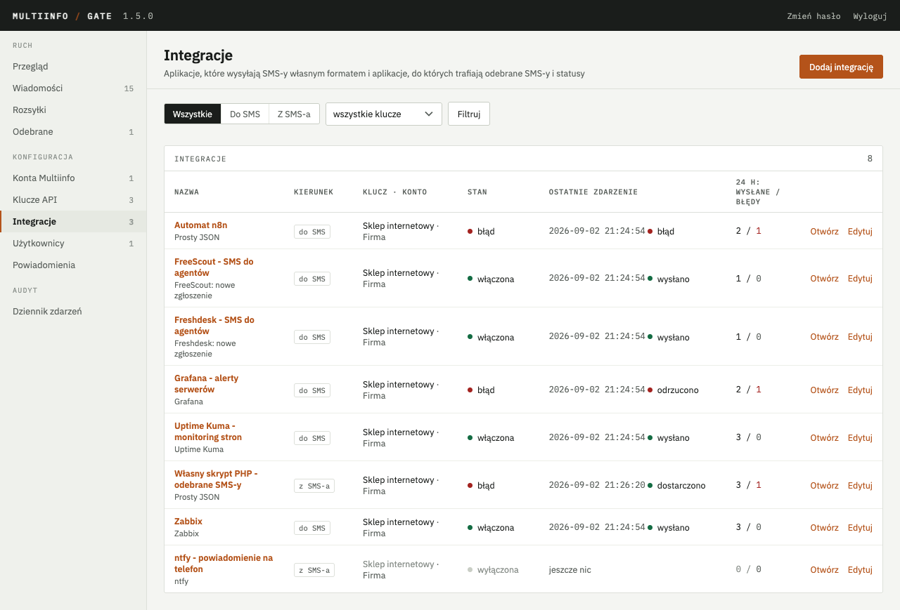
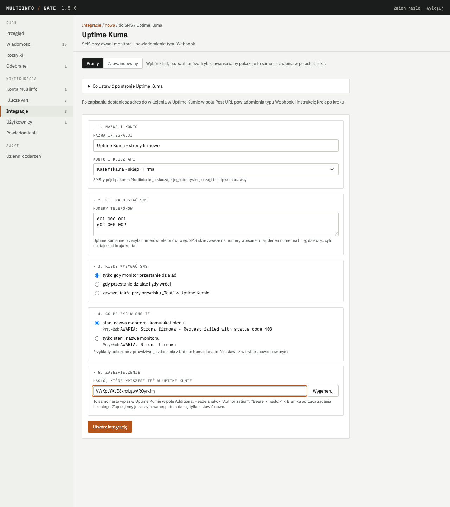
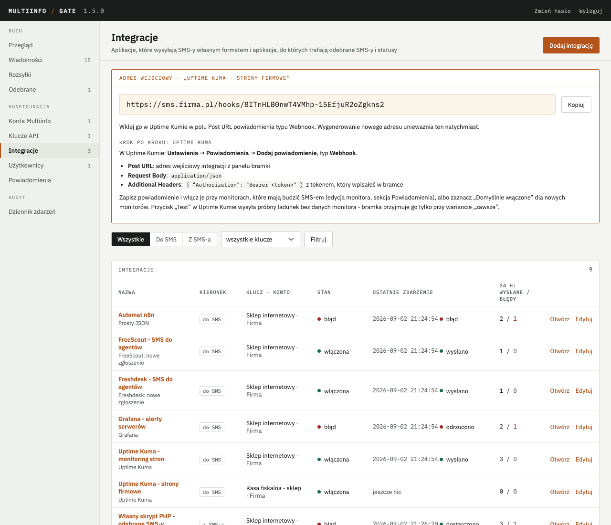
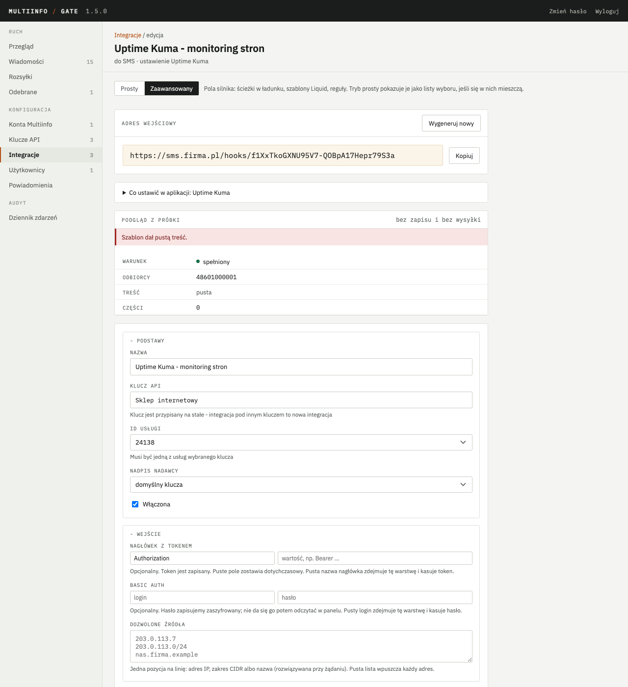
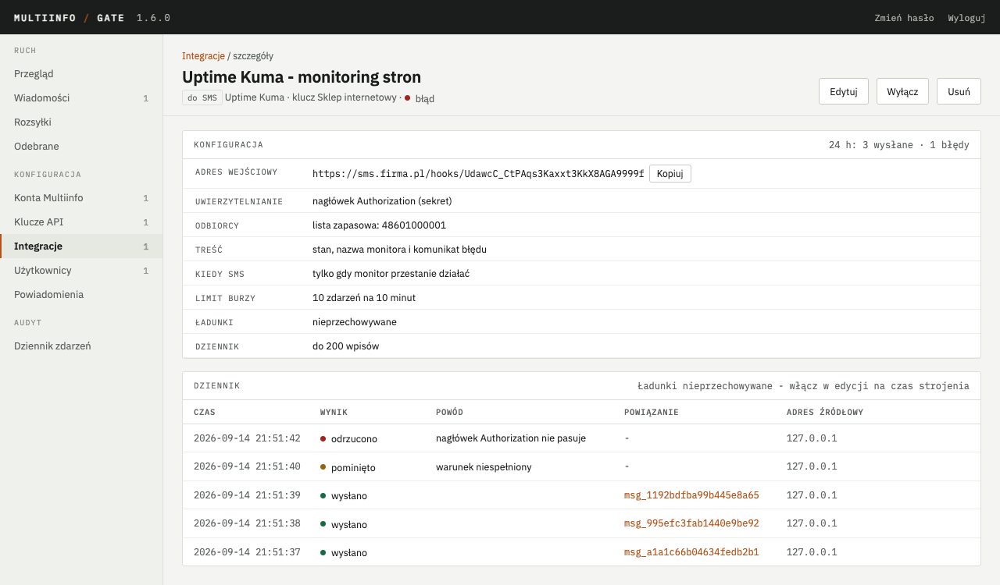
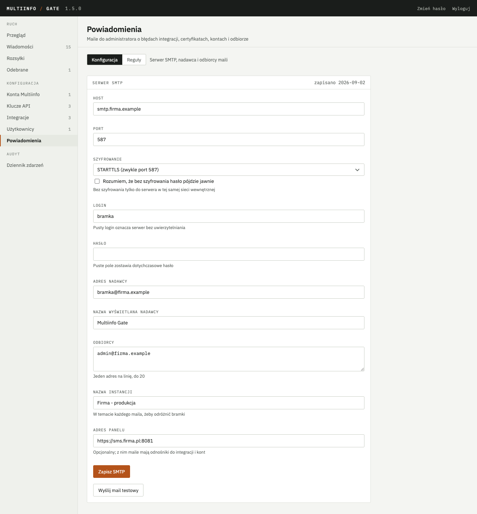
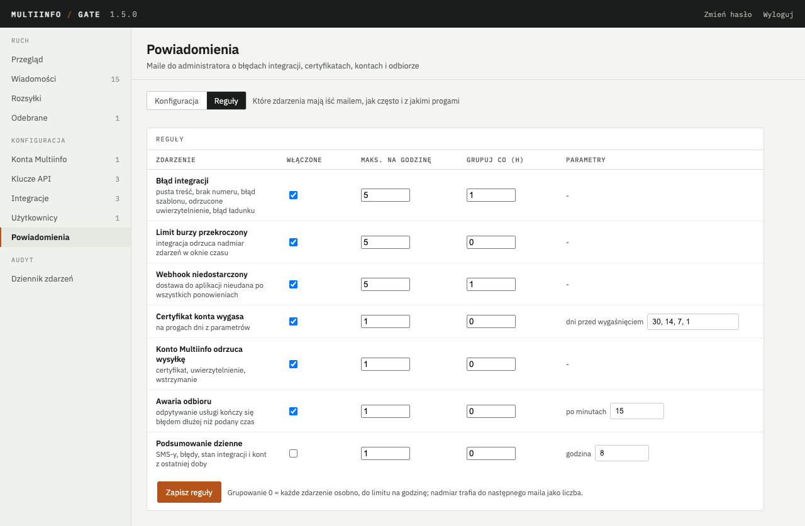

# Integracje z aplikacjami

Od wersji 1.5 bramka przyjmuje wiadomości od aplikacji, których formatu nie da się zmienić, i
przekazuje odebrane SMS-y oraz statusy wysyłki do aplikacji w ich własnym formacie. Służy do tego
integracja: obiekt konfigurowany w panelu, przypięty do klucza API, z adresem wejściowym albo
docelowym, szablonem i warunkiem. Rozdział opisuje oba kierunki, język szablonów, gotowe
ustawienia dla popularnych aplikacji, dziennik integracji oraz powiadomienia administratora
wysyłane mailem. Wysyłkę przez pełne API z kluczem w nagłówku opisuje [API dla aplikacji](api.md);
integracje są dla przypadków, w których aplikacja nie potrafi tego API użyć.

## 1. Czym jest integracja

Integracja ma jeden z dwóch kierunków:

| Kierunek | W panelu | Co robi |
|---|---|---|
| do SMS | „Aplikacja wysyła SMS” | aplikacja woła adres wejściowy bramki `POST /hooks/<identyfikator>` własnym ładunkiem; bramka wyciąga z niego numer i treść, składa SMS i wysyła |
| z SMS-a | „SMS albo status trafia do aplikacji” | odebrany SMS albo status wysyłki bramka wysyła na adres aplikacji w formacie zapisanym w szablonie |

Każda integracja działa w imieniu jednego klucza API: konto Multiinfo, dozwolone usługi, nadpisy
i limity klucza obowiązują tak samo jak przy wysyłce przez API, a wiadomości wysłane przez
integrację widać na ekranie „Wiadomości” z nazwą klucza i integracji. Klucz może mieć wiele
integracji; klucza z włączoną integracją nie da się odwołać, dopóki integracja nie zostanie
wyłączona albo usunięta.

Każde zdarzenie przechodzi ten sam potok: źródło (żądanie aplikacji albo zdarzenie bramki),
warunek (czy w ogóle reagować), ochrona (idempotencja i limit burzy), szablony (numer, treść albo
body żądania), wykonanie (wysyłka SMS-a albo dostawa do aplikacji) i wpis w dzienniku integracji.
Każdy krok, który coś odrzuca, zostawia wpis z powodem, a niektóre wysyłają mail do administratora
(rozdział 8).

## 2. Dodanie integracji w panelu

Ekran **Integracje** w grupie „Konfiguracja” pokazuje listę z kierunkiem, ustawieniem, kluczem,
stanem (włączona, wyłączona, błąd w ostatniej dobie), ostatnim zdarzeniem i licznikami z doby.
Plakietka przy pozycji w menu liczy integracje z błędem w ostatniej dobie.



### 2.1. Adres bramki

Zanim dodasz pierwszą integrację, podaj raz **adres, pod którym aplikacje widzą bramkę** - panel
prosi o niego na ekranie **Klucze API** (i na liście integracji, dopóki go nie ma). To ten sam
adres, który aplikacje wpisują przed `/v1/messages`: przy bramce pod domeną `https://sms.firma.pl`,
przy kontenerze na Proxmoxie dostępnym w sieci firmowej `http://10.10.10.159:8080` (adres
kontenera i port API). Bez ścieżki na końcu. Od tej chwili panel pokazuje przy każdym kluczu gotowe
wywołanie do wklejenia w terminalu, a przy każdej integracji pełny adres wejściowy zamiast samej
ścieżki `/hooks/…`. Rozdział 3.1 opisuje, jaki adres wpisać zależnie od tego, jak bramka stoi.

### 2.2. Trzy kroki

Przycisk **Dodaj integrację** prowadzi przez trzy kroki:

1. Kierunek: „Aplikacja wysyła SMS” albo „SMS albo status trafia do aplikacji”.
2. Gotowe ustawienie: kafelek z nazwą aplikacji (rozdział 6) albo „Własne” dla aplikacji spoza
   listy.
3. Formularz. Gotowe ustawienie otwiera się w **trybie prostym**; „Własne” od razu
   w **zaawansowanym**. Przełącznik nad formularzem zmienia tryb w każdej chwili.

### 2.3. Tryb prosty

Tryb prosty nie wymaga znajomości ładunku aplikacji ani szablonów. Formularz ma pięć punktów,
każdy jest decyzją użytkownika w jego języku:

1. **Nazwa i konto** - nazwa integracji i klucz API (SMS-y idą z konta Multiinfo tego klucza).
2. **Kto ma dostać SMS** - numery telefonów, jeden na linię. Gdy aplikacja sama przesyła numer
   (Zabbix, Prosty JSON), pole nazywa się „Numery zapasowe” i zdanie pod nim mówi, skąd numer
   przychodzi.
3. **Kiedy wysyłać SMS** - lista wariantów przygotowanych dla tej aplikacji, np. w Uptime Kumie
   „tylko gdy monitor przestanie działać”, „gdy przestanie działać i gdy wróci”, „zawsze, także
   przy przycisku Test”.
4. **Co ma być w SMS-ie** - dwa warianty treści pokazane jako gotowy SMS obliczony z prawdziwego
   ładunku tej aplikacji (np. „AWARIA: Strona firmowa - Request failed with status code 403”),
   nie jako szablon.
5. **Zabezpieczenie** - jedno, które dana aplikacja obsługuje: hasło do wpisania też po stronie
   aplikacji (przycisk **Wygeneruj** losuje bezpieczne), a przy aplikacjach bez takiego pola
   (FreeScout, Freshdesk) zdanie, co chroni adres zamiast hasła.



Integracja z SMS-a w trybie prostym ma nazwę i konto, adres aplikacji z podpowiedzią, co tam
wpisać (np. „adres Twojego FreeScouta z końcówką /api/conversations”), parametry aplikacji (numer
skrzynki we FreeScoucie) i dostęp do aplikacji (klucz API; przy Freshdesku bramka sama zamienia
klucz na wymagany nagłówek).

Po zapisaniu panel pokazuje raz ramkę z **pełnym adresem do wklejenia**, zdaniem, gdzie go wkleić
(np. „w Uptime Kumie w polu Post URL powiadomienia typu Webhook”) i instrukcją krok po kroku dla
tej aplikacji.



Tryb prosty zapisuje dokładnie tę samą konfigurację, którą pokazuje tryb zaawansowany: wybrany
wariant „kiedy” to warunek, wariant treści to szablon, hasło to nagłówek albo basic auth. Dopóki
konfiguracja mieści się w listach ustawienia, edycja otwiera tryb prosty z zaznaczonymi wyborami.
Gdy ktoś w trybie zaawansowanym wpisze własny szablon albo warunek, edycja otwiera się
w zaawansowanym z jednym zdaniem dlaczego, a szczegół integracji pokazuje warunek i szablon zamiast
słów z list.

### 2.4. Tryb zaawansowany

Tryb zaawansowany pokazuje pola silnika w sekcjach: podstawy (nazwa, klucz, usługa, nadawca,
włączona), wejście albo wyjście (uwierzytelnianie, lista źródeł; adres, metoda, nagłówki,
zdarzenia), warunek (reguły albo wyrażenie Liquid), odbiorca (ścieżki numeru i identyfikatorów,
lista zapasowa), treść albo żądanie (szablon Liquid albo pole z ładunku; body), ochrona
i dziennik, próbka. Rozdziały 3 i 4 opisują każde pole, rozdział 5 język szablonów.

Pod formularzem są dwa przyciski. **Sprawdź szablon** nie zapisuje niczego i nie wysyła SMS-a:
bierze próbkę ładunku z pola na dole (z ustawienia albo z dziennika) i pokazuje wynik warunku,
odbiorców po normalizacji, treść i liczbę części, a dla integracji z SMS-a nagłówki (sekrety
zamaskowane) i body. **Utwórz integrację** zapisuje; zapis wymaga poprawnego szablonu i warunku,
a błąd składni Liquida wraca jako komunikat z numerem linii i kolumny.



Adres wejściowy widać w szczególe i na stronie edycji, gdzie jest przycisk **Wygeneruj nowy**:
stary adres przestaje działać natychmiast i trzeba go podmienić w aplikacji.

Sekrety (hasło z trybu prostego, token w nagłówku, hasło basic auth, sekretne nagłówki
integracji z SMS-a) zapisują się zaszyfrowane kluczem głównym i nie da się ich potem odczytać
w panelu. W edycji puste pole sekretu zostawia dotychczasowy; żeby zdjąć warstwę w trybie
zaawansowanym, wyczyść nazwę nagłówka albo login.

## 3. Aplikacja wysyła SMS

### 3.1. Adres wejściowy

Adres to `POST /hooks/<identyfikator>` na porcie API bramki (tym samym, na którym działa
`/v1/messages`), np. `https://sms.firma.example/hooks/k9x…`. Identyfikator ma 32 znaki losowe
i sam w sobie jest sekretem: kto go zna, może wysyłać SMS-y na koszt konta, do wysokości limitów
klucza i ochrony z rozdziału 3.6. Bramka przyjmuje `Content-Type: application/json` oraz
`application/x-www-form-urlencoded` (formularz zamieniany na płaski obiekt; powtórzone pole staje
się tablicą). Ładunek do 256 KB; większy dostaje kod 413, niepoprawny JSON kod 400. Inne metody
niż `POST` dostają 405, nieznany identyfikator i integracja wyłączona 404 bez wpisu w dzienniku.

Panel pokazuje pełny adres, gdy zna adres bramki (rozdział 2.1); bez niego samą ścieżkę
`/hooks/<identyfikator>`, którą dokleja się do adresu, pod jakim aplikacja widzi API bramki.
Ten adres zależy od tego, jak bramka stoi i skąd woła ją aplikacja:

| Jak bramka stoi | Skąd woła aplikacja | Pełny adres do wpisania w aplikacji |
|---|---|---|
| Docker z odwrotnym proxy pod domeną (Caddy, nginx albo Traefik z rozdziału 6 Uruchomienia) | z internetu i skądkolwiek indziej | `https://<TWOJA-DOMENA>/hooks/<identyfikator>` |
| Docker bez proxy (porty przypięte do `127.0.0.1`, jak w `docker-compose.yml`) | tylko z tego samego serwera | `http://127.0.0.1:8080/hooks/<identyfikator>`; aplikacja z innego komputera bramki nie dosięgnie, dopóki API nie zostanie wystawione według rozdziału 6 |
| Kontener LXC na Proxmoxie (rozdział 9 Uruchomienia) | z tej samej sieci co kontener (biuro, serwerownia) | `http://<ADRES-KONTENERA>:8080/hooks/<identyfikator>`, np. `http://10.10.10.159:8080/hooks/k9x…`; bez HTTPS, więc token wędruje siecią jawnym tekstem - do zaufanej sieci firmowej |
| Kontener LXC na Proxmoxie | z internetu (Grafana Cloud, Freshdesk, FreeScout u hostingodawcy, Zapier) | kontener nie ma publicznego adresu; potrzebne odwrotne proxy z HTTPS pod publiczną domeną, kierowane na `http://<ADRES-KONTENERA>:8080` (punkt 9.6 Uruchomienia) |

Sprawdzenie drogi jest proste: z komputera albo serwera, na którym stoi aplikacja, wywołanie
`curl <ADRES-BEZ-ŚCIEŻKI>/healthz` (np. `curl https://sms.firma.example/healthz`) ma odpowiedzieć
`{"status":"ok"}`. Odpowiedź `Connection refused` albo przekroczony czas oznaczają, że sieć nie
prowadzi do bramki i żadne ustawienie integracji tego nie naprawi. W drugą stronę - gdy to
bramka woła aplikację (rozdział 4) - obowiązuje reguła z punktu 4.3 o adresach w sieci
wewnętrznej.

### 3.2. Uwierzytelnianie

Cztery warstwy; pierwsza działa zawsze, pozostałe włącza się w sekcji „Wejście”:

| Warstwa | Jak działa | Kiedy używać |
|---|---|---|
| sekret w adresie | identyfikator z adresu wejściowego | zawsze |
| nagłówek z tokenem | nazwa nagłówka i wartość z konfiguracji, np. `Authorization: Bearer …`, porównanie w stałym czasie | aplikacje z polem na nagłówki: Uptime Kuma, Zabbix, automaty |
| basic auth | login i hasło z konfiguracji | Grafana i inne z gotowym polem „Basic Authentication” |
| lista źródeł | adresy IP, zakresy CIDR (IPv4 i IPv6) albo nazwy hostów rozwiązywane przy żądaniu z buforem 60 s | aplikacje ze stałym adresem albo NAS z DDNS |

Nieudane uwierzytelnienie daje 401 (token, basic auth) albo 403 (źródło), wpis `odrzucono`
z adresem źródłowym bez ładunku i mail do administratora (grupowany). Niezależnie od limitów
klucza `/hooks/` ma własny limit 120 żądań na minutę na adres źródłowy; nadmiar dostaje 429.

Adresem źródłowym jest adres gniazda. Gdy bramka stoi za odwrotnym proxy (Caddy, nginx,
Traefik), adresem gniazda jest adres proxy - żeby lista źródeł i dziennik widziały adres klienta,
podaj adresy proxy w zmiennej `MIG_TRUSTED_PROXIES` ([Uruchomienie](uruchomienie.md), rozdział
7.7). Tylko od tych adresów bramka wierzy nagłówkowi `X-Forwarded-For`.

### 3.3. Odbiorcy i normalizacja

Numer bramka bierze z trzech źródeł, w tej kolejności:

1. Ścieżka w ładunku (sekcja „Odbiorca”), np. `phone` albo `to`. Wartość może być tekstem
   z numerami po przecinku albo tablicą.
2. Nadawca odebranego SMS-a, do którego pasuje identyfikator zgłoszenia z ładunku (rozdział 3.8).
   Dla własnych integracji, w których aplikacja przesyła identyfikator zgłoszenia założonego
   z SMS-a, ale nie numer.
3. Lista zapasowa z konfiguracji (jeden numer na linię) - tak działają Uptime Kuma i Grafana,
   które nie przesyłają numerów.

Normalizacja przyjmuje zapisy ludzkie: usuwa spacje, myślniki, nawiasy i kropki, zdejmuje
wiodący `+` albo `00`, a numer dziewięciocyfrowy uzupełnia kodem kraju konta. `+48 601 000 001`,
`601-000-001`, `(48) 601.000.001` i `0048601000001` dają `48601000001`. Wynik przechodzi ten sam
walidator, co numery w API. Do 50 odbiorców na żądanie, każdy jako osobna wiadomość z tą samą
treścią; więcej to wpis `błąd` bez wysyłki.

### 3.4. Treść

Treść to szablon Liquid (rozdział 5) z ładunkiem pod nazwą `p` albo pole z ładunku wskazane
ścieżką, gdy aplikacja przysyła gotowy tekst. Limit części (1-9, domyślnie 1) i zachowanie przy
nadmiarze: „przytnij z wielokropkiem” albo „odrzuć zdarzenie”. Części liczy ten sam kod, który
dzieli wiadomości w API, więc polskie znaki skracają część do 70 znaków; filtr `gsm` zamienia je
na łacińskie i przywraca 160.

### 3.5. Warunek

Sekcja „Warunek” decyduje, czy zdarzenie ma iść dalej. Tryb reguł: wiersze „ścieżka, operator,
wartość” łączone spójnikiem „i”; operatory to równe, różne od, zawiera, zaczyna się od, pasuje do
wyrażenia regularnego, istnieje, nie istnieje, większe niż i mniejsze niż (porównanie liczbowe,
gdy obie strony są liczbami). Tryb wyrażenia Liquid: jedno wyrażenie, którego wynik po przycięciu
różny od pustego ciągu, `false` i `0` oznacza „wyślij”. Bez reguł każde zdarzenie idzie dalej.
Zdarzenie odrzucone warunkiem dostaje wpis `pominięto` i odpowiedź 200 bez SMS-a.

Typowe reguły: `heartbeat.status równe 0` (Uptime Kuma tylko przy awarii), `status równe firing`
(Grafana bez maili o powrocie), `status równe PROBLEM` (Zabbix).

### 3.6. Ochrona przed burzą

Sekcja „Ochrona i dziennik” ma limit burzy: liczba zdarzeń w oknie minut, domyślnie 10 w 10
minut. Okno liczy się od pierwszego zdarzenia; nadmiar dostaje wpis `limit` i odpowiedź 200 bez
SMS-a, a administrator dostaje jeden mail na okno, nie na każde zdarzenie. Monitoring, który
przy awarii łącza wysyła alert o każdym z 40 hostów, kosztuje wtedy 10 SMS-ów, nie 40.

### 3.7. Idempotencja

Ścieżka „identyfikator zdarzenia” (sekcja „Odbiorca”) chroni przed podwójnym SMS-em, gdy
aplikacja ponawia żądanie po przekroczeniu czasu: ten sam identyfikator w ciągu doby dostaje wpis
`duplikat` i odpowiedź 200. Zabbix ma `{EVENT.ID}` (skrypt z rozdziału 6.4 dokleja status, bo
rozwiązanie dostaje ten sam identyfikator co problem), Prosty JSON pole `eventId`. Klucz grupy
Grafany nie nadaje się na identyfikator, bo jest stały dla grupy alertów.

### 3.8. Odpowiedź w wątku

Ścieżka „identyfikator zgłoszenia” łączy oba kierunki w integracjach własnych: gdy integracja
z SMS-a założyła w aplikacji zgłoszenie z odebranego SMS-a i odczytała jego identyfikator
(rozdział 4.4), a potem aplikacja woła adres wejściowy z tym identyfikatorem, bramka wysyła SMS
do nadawcy tamtej wiadomości jako odpowiedź w wątku (jak `inReplyTo` w [API](api.md), rozdział 5a.3). Gdy ładunek
podaje też numer, wątek powstaje tylko, jeśli to numer nadawcy. Odpowiedź widać przy odebranej
wiadomości. Bez dopasowania idzie zwykły SMS na numer z ładunku albo z listy zapasowej, a bez
nich wpis `błąd` z numerem zgłoszenia w powodzie.

### 3.9. Kody odpowiedzi

Bramka odpowiada po zapisaniu wpisu i zakolejkowaniu wysyłki, nie czeka na Multiinfo:

| Sytuacja | Kod | Body |
|---|---|---|
| wysyłka zakolejkowana | 202 | `{ "accepted": true, "messageIds": ["msg_…"] }` |
| warunek niespełniony | 200 | `{ "accepted": false, "reason": "condition" }` |
| limit burzy | 200 | `{ "accepted": false, "reason": "throttled" }` |
| duplikat | 200 | `{ "accepted": false, "reason": "duplicate" }` |
| pusta treść, brak numeru, zły numer, nadmiar z opcją „odrzuć”, ponad 50 odbiorców | 422 | `{ "accepted": false, "reason": "…", "detail": "…" }` |
| błąd szablonu w czasie wykonania | 422 | jak wyżej |
| zły token, basic auth, źródło spoza listy | 401 albo 403 | `{ "accepted": false, "reason": "unauthorized" }` |
| ładunek za duży, niepoprawny JSON | 413 albo 400 | komunikat serwera |
| za dużo żądań z adresu | 429 | `{ "accepted": false, "reason": "rate_limited" }` |
| klucz odwołany albo przeterminowany, konto wstrzymane | 503 | `{ "accepted": false, "reason": "unavailable", "detail": "…" }` |
| nieznany identyfikator, integracja wyłączona | 404 | `{ "accepted": false, "reason": "unknown" }` |

Kody 200 przy odrzuceniu są celowe: aplikacje monitorujące traktują je jako sukces i nie
ponawiają żądania. Odmowa Multiinfo po przyjęciu (np. błąd certyfikatu) nie zmienia odpowiedzi -
wiadomość dostaje status `failed`, widoczny na ekranie „Wiadomości”, a konto powiadomienie
według reguł z rozdziału 8.

## 4. SMS albo status trafia do aplikacji

### 4.1. Zdarzenia i warunek

Integracja z SMS-a wybiera zdarzenia: `message.received` (odebrany SMS) oraz statusy wysyłki
`message.sent`, `message.delivered` i `message.failed`. Reaguje tylko na zdarzenia z usług, do
których klucz ma dostęp. Włączona integracja nasłuchująca `message.received` sama uruchamia
odbiór z usług klucza - nie trzeba zaznaczać odbioru przy kluczu ani podawać adresu webhooka.

Warunek działa jak w rozdziale 3.5 na polach zdarzenia: `from zaczyna się od 48601`,
`text zaczyna się od POMOC`, `serviceId równe 24138`, `status równe failed`. Dwie integracje
z różnymi warunkami rozdzielają ruch: prefiks `POMOC` do helpdesku, reszta na telefon przez ntfy.

### 4.2. Żądanie

Sekcja „Wyjście” ma adres, metodę (`POST`, `PUT`, `PATCH`) i nagłówki jako listę nazwa-wartość.
Wartość jawna może być szablonem (`Title: SMS od {{ from }}`); wartość oznaczona jako sekret jest
szyfrowana, w panelu maskowana i podstawiana po renderowaniu, poza silnikiem szablonów. Body to
szablon Liquid w jednym z trzech trybów:

| Tryb | Nagłówek `Content-Type` | Uwagi |
|---|---|---|
| JSON z szablonu | `application/json` | wynik musi się parsować; pola tekstowe wstawiaj filtrem `json`, np. `{{ text \| json }}`, który dodaje cudzysłowy i ucieczki |
| formularz | `application/x-www-form-urlencoded` | lista pól, każde z własnym szablonem |
| surowy tekst | `text/plain` | np. ntfy |

Body, które po podstawieniu nie jest poprawnym JSON-em, daje wpis `błąd` bez wysyłki i mail do
administratora - lepiej tak niż pięć nieudanych dostaw do aplikacji.

Podpis HMAC bramki (`X-MIG-Signature`, [API](api.md), rozdział 6.1) dołącza
się tylko po zaznaczeniu „Podpisuj żądania”; wymaga sekretu webhooka klucza, który powstaje razem
z adresem webhooka klucza. Gotowe aplikacje podpisu nie znają, więc pole jest domyślnie wyłączone.

### 4.3. Dostawa i ponowienia

Dostawa idzie tym samym mechanizmem, co webhook klucza: 10 s na odpowiedź, `2xx` to sukces,
`4xx` koniec bez ponowień, `5xx` i błędy sieci z ponowieniami po 1, 5 i 15 minutach oraz 1 i 6
godzinach. Po wyczerpaniu ponowień wpis `niedostarczone`, mail do administratora i przycisk
„Ponów” w dzienniku integracji. Adresy w sieci wewnętrznej bramka odrzuca, chyba że w środowisku
jest `MIG_WEBHOOK_ALLOW_PRIVATE=1` - dotyczy to aplikacji na tym samym serwerze albo w sieci
firmowej, np. własnego skryptu albo automatyzacji domowej. W Dockerze zmienną wpisuje się
w `docker/.env` i wykonuje `docker compose up -d`; w kontenerze LXC z Proxmoxa w pliku
`/etc/multiinfo-gate/env`, po czym `systemctl restart multiinfo-gate`. Bez niej panel odrzuca
taki adres już przy zapisie integracji, z komunikatem, że adres jest w sieci wewnętrznej.

### 4.4. Odczyt odpowiedzi

Pole „ścieżka identyfikatora w odpowiedzi” (np. `id` we FreeScoucie i Freshdesku) każe bramce
odczytać z odpowiedzi JSON aplikacji identyfikator założonego zgłoszenia. Dla `message.received`
identyfikator zapisuje się przy odebranej wiadomości (wiersz „Zgłoszenie: 4821 (FreeScout)”
w szczególe), a integracje własne mogą go użyć do odpowiedzi w wątku z rozdziału 3.8. Gdy ścieżka jest wskazana, a
wartości w odpowiedzi brak, dostawa jest udana, wpis dostaje ostrzeżenie.

### 4.5. Wiele integracji i webhook klucza

Jedno zdarzenie może trafić do wielu integracji, każda z własną dostawą i ponowieniami.
Dotychczasowy webhook klucza z rozdziału 6 [API](api.md) działa
niezależnie i nadal wysyła pełne zdarzenia w formacie bramki z podpisem.

## 5. Szablony Liquid

### 5.1. Składnia w pigułce

Szablony renderuje [LiquidJS](https://liquidjs.com/), odmiana języka Liquid ze Shopify i Jekylla:

| Konstrukcja | Zapis | Przykład |
|---|---|---|
| wartość | `{{ … }}` | `{{ p.monitor.name }}` |
| filtr | `{{ … \| filtr: argument }}` | `{{ p.msg \| sms_truncate: 100 }}` |
| warunek | ` …  …  … ` | `ALARMOK` |
| pętla | ` … ` | `{{ a.labels.alertname }}` |
| zmienna pomocnicza | ` … ` | `SMS od {{ from }}: {{ text }}` |
| przypisanie | `` | `` |

Silnik pracuje w trybie ścisłym dla filtrów (nieznany filtr to błąd zapisu) i łagodnym dla
zmiennych (brak pola w ładunku daje pusty ciąg, nie błąd), bez dostępu do plików i innych
szablonów (`include` i `render` odrzucane). Limity: 100 ms na renderowanie, wynik do 4096 znaków;
przekroczenie daje wpis `błąd`.

### 5.2. Zmienne

| Zmienna | Gdzie | Znaczenie |
|---|---|---|
| `p` | oba kierunki | cały ładunek aplikacji (do SMS) albo całe zdarzenie bramki (z SMS-a); dostęp kropką i indeksem: `p.alerts[0].labels.alertname` |
| `now` | oba | chwila renderowania, ISO 8601 |
| `integration.name` | oba | nazwa integracji |
| `event`, `at`, `id` | z SMS-a | rodzaj zdarzenia, czas, identyfikator wiadomości |
| `from`, `to`, `text` albo `hex`, `kind`, `receivedAt`, `serviceId`, `relatedMessageId` | `message.received` | jak w rozdziale 6.2 [API](api.md) |
| `status`, `to`, `parts`, `error`, `miStatus`, `miSubstatus`, `providerCode`, `inReplyTo` | statusy | jak w rozdziale 6.2 API; pola zdarzenia leżą też na wierzchu, więc `{{ text }}` i `{{ p.text }}` to to samo |

### 5.3. Filtry bramki

Ponad standardowe filtry Liquida (`upcase`, `strip`, `strip_html`, `truncate`, `append`, `json`
i inne z dokumentacji LiquidJS) bramka dodaje pięć:

| Filtr | Działanie | Przykład |
|---|---|---|
| `sms_truncate: N` | utnij do N znaków z wielokropkiem | `{{ p.heartbeat.msg \| sms_truncate: 100 }}` |
| `gsm` | zamień polskie znaki na łacińskie, żeby część SMS-a mieściła 160 zamiast 70 znaków | `{{ p.text \| gsm }}` |
| `phone` | znormalizuj numer jak w rozdziale 3.3 | `{{ p.contact.phone \| phone }}` |
| `date_pl` | czas w strefie polskiej jako `DD.MM.RRRR GG:MM` | `{{ receivedAt \| date_pl }}` |
| `html_text` | HTML helpdesku na tekst: koniec akapitu i `<br>` jako spacja, bez znaczników, encje odkodowane, białe znaki zbite; samo `strip_html` skleja słowa z sąsiednich bloków | `{{ p.text \| html_text }}` |

### 5.4. Przykłady

SMS o awarii z Uptime Kumy z nazwą monitora i skróconym komunikatem, a dla ładunku bez
`heartbeat` (przycisk „Test”) sam komunikat:

```liquid
AWARIAOK: {{ p.monitor.name }} - {{ p.heartbeat.msg | sms_truncate: 100 }}{{ p.msg | sms_truncate: 140 }}
```

Lista alertów z Grafany, do trzech nazw i liczba pozostałych:

```liquid
ALARMOK: {{ a.labels.alertname }},  (+{{ p.alerts.size | minus: 3 }})
```

Body JSON dla aplikacji przyjmującej `{"text": "…"}` (np. webhook przychodzący Slacka)
z odebranym SMS-em; `capture` składa tekst, `json` robi z niego poprawny ciąg JSON:

```liquid
SMS od {{ from }}: {{ text }}{"text": {{ msg | json }}}
```

Zgłoszenie we FreeScoucie z numerem klienta i treścią:

```liquid
{"type": "phone", "mailboxId": 1, "subject": {{ "SMS od " | append: from | json }}, "customer": {"firstName": "SMS", "lastName": {{ from | json }}, "phone": {{ from | json }}}, "threads": [{"type": "customer", "text": {{ text | json }}}]}
```

## 6. Gotowe ustawienia

Ustawienie wypełnia formularz szablonem, warunkiem, ścieżkami, metodą uwierzytelnienia i
nagłówkami właściwymi dla aplikacji oraz pokazuje obok szablonu listę pól jej ładunku i
instrukcję „co ustawić w aplikacji”. Wartości przykładowe w tym rozdziale (adresy, numery,
identyfikatory) są fikcyjne.

| Ustawienie | Do SMS | Z SMS-a | Uwierzytelnienie do SMS |
|---|---|---|---|
| Prosty JSON | tak | tak | opcjonalny nagłówek |
| Uptime Kuma | tak | nie | nagłówek `Authorization` |
| Grafana | tak | nie | basic auth |
| Zabbix | tak | nie | nagłówek `Authorization` |
| FreeScout: nowe zgłoszenie | tak | nie | lista źródeł |
| FreeScout: zgłoszenie z SMS-a | nie | tak | nie dotyczy |
| Freshdesk: nowe zgłoszenie | tak | nie | sekret w adresie |
| Freshdesk: zgłoszenie z SMS-a | nie | tak | nie dotyczy |
| ntfy | nie | tak | nie dotyczy |
| Własne | tak | tak | dowolne |

### 6.1. Prosty JSON

Dla n8n, Make, Zapiera, własnych skryptów i NAS-ów - wszystkiego, co potrafi wysłać żądanie
HTTP z dowolnym JSON-em.

**Do SMS.** Aplikacja wysyła `POST` na adres wejściowy z nagłówkiem
`Content-Type: application/json` i ładunkiem:

```json
{ "to": "48601000001", "text": "Treść wiadomości" }
```

Pole `to` może być tekstem z numerami po przecinku albo tablicą (do 50 numerów); numery
w formacie ludzkim są normalizowane. Pole `inReplyTo` z identyfikatorem zgłoszenia wysyła SMS
jako odpowiedź w wątku, a `eventId` chroni przed podwójną wysyłką przy ponowieniu żądania.
Ustawienie bierze treść wprost z pola `text` (tryb „pole z ładunku”), do trzech części, nadmiar
odrzuca. Jeśli aplikacja ma pole na nagłówki, dodaj w bramce nagłówek z tokenem.

**Z SMS-a.** Bramka wysyła pełne zdarzenie w formacie z rozdziału 6.2 API (`event`, `at`, `id`,
`serviceId`, `from`, `to`, `kind`, `text`, `receivedAt`, `relatedMessageId`) - szablon body to
`{{ p | json }}`.

### 6.2. Uptime Kuma

SMS przy awarii monitora. W Uptime Kumie: **Ustawienia → Powiadomienia → Dodaj powiadomienie**,
typ **Webhook**:

- **Post URL**: adres wejściowy integracji z panelu bramki
- **Request Body**: `application/json`
- **Additional Headers**: `{ "Authorization": "Bearer <token>" }` z tokenem, który wpisałeś
  w bramce w polu „Nagłówek z tokenem”

Uptime Kuma nie przesyła numerów - wpisz je w bramce w liście zapasowej. Ładunek (Uptime Kuma
2.5.3, przycięty do pól, które coś znaczą; pełny ma około 90 pól monitora):

```json
{
  "heartbeat": { "monitorID": 54, "status": 0, "time": "2026-09-02 17:05:33.920", "msg": "Request failed with status code 403",
                 "important": true, "retries": 2, "timezone": "Europe/Warsaw", "localDateTime": "2026-09-02 19:05:33" },
  "monitor": { "id": 54, "name": "Strona firmowa", "pathName": "Strona firmowa", "url": "https://firma.example", "type": "http", "interval": 60 },
  "msg": "[Strona firmowa] [🔴 Down] Request failed with status code 403"
}
```

Domyślny szablon (`heartbeat.status` 0 to awaria, 1 to powrót; przycisk „Test” w Uptime Kumie
wysyła ładunek bez `heartbeat`, wtedy idzie samo `msg`):

```liquid
AWARIAOK: {{ p.monitor.name }} - {{ p.heartbeat.msg | sms_truncate: 100 }}{{ p.msg | sms_truncate: 140 }}
```

Żeby SMS szedł tylko przy awarii, dodaj warunek `heartbeat.status równe 0`; bez warunku
przyjdzie też SMS o powrocie i SMS z przycisku „Test”.

### 6.3. Grafana

SMS z alertów Grafany. W Grafanie **Alerting → Contact points → Add contact point**,
integracja **Webhook**: **URL** to adres wejściowy integracji, **HTTP Method** `POST`, **Basic
Authentication** z loginem `grafana` i hasłem wpisanym w bramce w polu „Basic auth”. Numer
odbiorcy wpisz w bramce w liście zapasowej.

Grafana wysyła jedno żądanie na grupę alertów. Ładunek z Grafany 13.2 przy jednym alercie
(przycięty o adresy wyciszania i `valueString`):

```json
{
  "receiver": "sms", "status": "firing",
  "alerts": [
    {
      "status": "firing",
      "labels": { "alertname": "CPU high", "grafana_folder": "Alerty", "instance": "web-1", "severity": "critical" },
      "annotations": { "description": "Serwer web-1 jest przeciążony", "summary": "CPU ponad 90% od 5 minut" },
      "startsAt": "2026-09-02T18:56:50Z", "endsAt": "0001-01-01T00:00:00Z",
      "fingerprint": "41980c48991e89ca", "ruleUID": "efx2f25h4uf40b", "values": { "B": 100, "C": 1 }
    }
  ],
  "groupLabels": { "alertname": "CPU high", "grafana_folder": "Alerty" },
  "commonAnnotations": { "description": "Serwer web-1 jest przeciążony", "summary": "CPU ponad 90% od 5 minut" },
  "groupKey": "{}:{alertname=\"CPU high\", grafana_folder=\"Alerty\"}", "appVersion": "13.2.0",
  "title": "[FIRING:1] CPU high Alerty (web-1 critical)", "state": "alerting",
  "message": "**Firing**\n\nValue: B=100, C=1\nLabels:\n - alertname = CPU high\n…"
}
```

Powrót przychodzi tym samym kształtem ze `status` `resolved`, `title` `[RESOLVED] …`,
wypełnionym `endsAt` i `values` równym `null`. Domyślny szablon wypisuje do trzech nazw alertów
i liczbę pozostałych (rozdział 5.4). Klucz grupy `groupKey` jest stały dla grupy, więc nie nadaje
się na identyfikator zdarzenia. SMS o alarmie przychodzi po czasie **Group wait** polityki
powiadomień (domyślnie 30 s), o powrocie po **Group interval** (domyślnie 5 min). Żeby dostawać
SMS tylko o alarmie, dodaj warunek `status równe firing`.

### 6.4. Zabbix

SMS z akcji Zabbiksa przez typ mediów Webhook. W Zabbiksie **Alerts → Media types → Create media
type**, typ **Webhook**, parametry: `url` (adres wejściowy integracji), `token` (ten sam, co
w bramce w polu „Nagłówek z tokenem”, z przedrostkiem `Bearer`), `to` = `{ALERT.SENDTO}`,
`subject` = `{ALERT.SUBJECT}`, `message` = `{ALERT.MESSAGE}`, `eventId` = `{EVENT.ID}`,
`status` = `{EVENT.STATUS}`. W zakładce **Message templates** dodaj szablony dla problemu
i rozwiązania (przycisk **Add** podpowiada domyślne). Skrypt typu mediów:

```js
var p = JSON.parse(value), req = new HttpRequest();
req.addHeader('Content-Type: application/json');
req.addHeader('Authorization: ' + p.token);
var body = { to: p.to, subject: p.subject, message: p.message, eventId: p.eventId + ':' + p.status, status: p.status };
var res = req.post(p.url, JSON.stringify(body));
if (req.getStatus() >= 400) throw 'Bramka odpowiedziała ' + req.getStatus() + ': ' + res;
return 'OK';
```

Przy użytkowniku ustaw medium tego typu z numerem w polu **Send to**, a w akcji (**Alerts →
Actions → Trigger actions**) operację i operację przywracania z tym typem mediów. Ładunek, który
skrypt wysyła (Zabbix 7.4, domyślne szablony wiadomości):

```json
{
  "to": "48601000001",
  "subject": "Problem: High CPU utilization on web-1",
  "message": "Problem started at 18:56:37 on 2026.09.02\r\nProblem name: High CPU utilization on web-1\r\nHost: web-1\r\nSeverity: High\r\nOperational data: 97 %\r\nOriginal problem ID: 26\r\n",
  "eventId": "26:PROBLEM",
  "status": "PROBLEM"
}
```

Rozwiązanie przychodzi z tematem `Resolved in 1m 1s: High CPU utilization on web-1`,
`eventId` `26:RESOLVED` i `status` `RESOLVED`. Domyślny szablon to `{{ p.subject }}`, numer ze
ścieżki `to`, identyfikator zdarzenia ze ścieżki `eventId`. Skrypt skleja `{EVENT.ID}` ze
statusem, bo Zabbix nadaje rozwiązaniu ten sam identyfikator co problemowi: ponowienie tej samej
wysyłki bramka odrzuca jako powtórkę, a SMS o rozwiązaniu przechodzi. Żeby nie dostawać SMS-a
o rozwiązaniu, dodaj warunek `status równe PROBLEM`.

### 6.5. FreeScout: nowe zgłoszenie

SMS do agentów, gdy we FreeScoucie pojawia się nowa rozmowa albo klient odpowiada. Wymaga modułu
**API & Webhooks**. Zarządzaj → API & Webhooks → Webhooks → Dodaj: URL to adres wejściowy
integracji, zdarzenia `convo.created` i `convo.customer.reply.created`. Numery agentów wpisz
w bramce w liście zapasowej. FreeScout 1.8 wysyła całą rozmowę (ładunek przycięty):

```json
{
  "id": 45, "number": 10143, "threadsCount": 0, "type": "email", "status": "active", "subject": "[Zgłoszenie] Nie działa logowanie",
  "preview": "Dzień dobry, od rana nie mogę się zalogować do panelu klienta.", "mailboxId": 3,
  "customer": { "id": 8, "type": "customer", "firstName": "Anna", "lastName": "Nowak", "email": "anna@example" },
  "source": { "type": "email", "via": "customer" },
  "_embedded": { "threads": [{ "id": 100, "type": "customer", "body": "<p>Dzień dobry, …</p>" }] }
}
```

Domyślny szablon rozróżnia nową rozmowę od odpowiedzi po liczbie wątków, a filtr `gsm` na
całości zdejmuje polskie znaki, żeby SMS mieścił 160 znaków:

```liquid
Odpowiedź klienta w #{{ p.number }}Nowe zgłoszenie #{{ p.number }} od {{ p.customer.firstName }} {{ p.customer.lastName }}: {{ p.subject | sms_truncate: 90 }}{{ t | gsm }}
```

Warunek `mailboxId równe 3` ogranicza SMS-y do jednej skrzynki. FreeScout nie ma pola na
nagłówki, więc zamiast tokenu wpisz listę źródeł z adresem serwera FreeScouta. Obiekt
`customer` w webhooku nie zawiera telefonów, także gdy kontakt ma numer.

### 6.6. FreeScout: zgłoszenie z SMS-a

Odebrany SMS zakłada rozmowę w skrzynce. Adres `https://<freescout>/api/conversations`, klucz
API (moduł API & Webhooks, zakładka **API Keys**) jako sekret nagłówka `X-FreeScout-API-Key`,
w body numer skrzynki `mailboxId` zamiast `1`. Domyślne body zakłada rozmowę typu „phone”
z klientem „SMS <numer>” (FreeScout wymaga imienia albo e-maila klienta, sam numer odrzuca
kodem 400) i treścią SMS-a (rozdział 5.4). FreeScout odpowiada kodem 201 i obiektem rozmowy
z polem `id`, które widać przy odebranej wiadomości w panelu. Agent widzi rozmowę i oddzwania
albo odpisuje własnym kanałem; bramka nie wysyła odpowiedzi z FreeScouta SMS-em.

### 6.7. Freshdesk: nowe zgłoszenie

SMS do agentów o nowym zgłoszeniu albo odpowiedzi klienta. We Freshdesku Admin → Workflows →
Automations, dwie reguły, obie z akcją Uruchom element webhook: POST, adres wejściowy
integracji, Szyfrowanie JSON, Treść „Zaawansowane”. Ładunek definiuje treść reguły; pole
`event` wpisuje się na stałe, żeby szablon odróżnił oba zdarzenia.

Tworzenie zgłoszeń → Nowa reguła, warunek „Źródło jest” ze wszystkimi źródłami (Freshdesk nie
zapisuje reguły bez warunku):

```json
{ "event": "nowe", "ticket_id": "{{ticket.id}}", "subject": "{{ticket.subject}}", "phone": "{{ticket.contact.phone}}", "mobile": "{{ticket.contact.mobile}}", "text": "{{ticket.description}}" }
```

Aktualizacja zgłoszeń → Nowa reguła, zdarzenie „Wysłano odpowiedź” wykonane przez
Zgłaszającego:

```json
{ "event": "odpowiedz", "ticket_id": "{{ticket.id}}", "subject": "{{ticket.subject}}", "phone": "{{ticket.contact.phone}}", "mobile": "{{ticket.contact.mobile}}", "text": "{{ticket.latest_public_comment}}" }
```

Z żywej instancji przy tworzeniu przyszło:

```json
{ "event": "nowe", "ticket_id": "6541", "phone": "", "mobile": "601000001", "text": "<div>Dzień dobry, od rana nie mogę się zalogować do panelu klienta.</div>\n\n" }
```

Odpowiedź klienta z e-maila niesie w `latest_public_comment` cytowaną korespondencję po
znaczniku „----- Original message -----” w bloku `blockquote`. Domyślny szablon ucina ją,
zdejmuje HTML filtrem `html_text`, dokłada temat, gdy reguła go przesyła i polskie znaki
zamienia filtrem `gsm`:

```liquid
Odpowiedź klienta w #{{ p.ticket_id }}Nowe zgłoszenie #{{ p.ticket_id }}: {{ p.subject }} - {{ tresc | html_text | sms_truncate: 100 }}{{ t | gsm }}
```

Numery agentów wpisz w liście zapasowej. Freshdesk nie ma pola na nagłówki, a żądania przychodzą
z różnych adresów chmury AWS, więc uwierzytelnieniem zostaje sekret w adresie i limit burzy.

### 6.8. Freshdesk: zgłoszenie z SMS-a

Odebrany SMS zakłada zgłoszenie. Adres `https://<firma>.freshdesk.com/api/v2/tickets`.
Freshdesk uwierzytelnia basic auth z kluczem API jako loginem i `X` jako hasłem: w sekrecie
nagłówka `Authorization` wpisz gotową wartość `Basic <base64 z „klucz:X”>`; klucz API jest pod
awatarem → Ustawienia profilu. Domyślne body zakłada zgłoszenie ze źródłem „Telefon”, tematem
„SMS od <numer>”, treścią SMS-a i telefonem kontaktu; Freshdesk odpowiada kodem 201 i obiektem
zgłoszenia z polem `id`, które widać przy odebranej wiadomości w panelu.

Freshdesk dopasowuje kontakt po dokładnym zapisie numeru: kontakt z telefonem `48601000001`
zostanie rozpoznany, `601000001` nie, więc powstanie nowy kontakt bez e-maila. Agent widzi
zgłoszenie i oddzwania albo odpisuje własnym kanałem; bramka nie wysyła odpowiedzi z Freshdeska
SMS-em.

### 6.9. ntfy

Odebrany SMS jako powiadomienie push na telefon. Adres to serwer i nazwa tematu, np.
`https://ntfy.sh/firma-sms`. Body jest surowym tekstem `{{ text }}`, tytuł i priorytet idą
nagłówkami `Title: SMS od {{ from }}` i `Priority: default`. Dla tematu chronionego dodaj nagłówek
`Authorization` z tokenem `Bearer tk_…` jako sekretem. W aplikacji ntfy zasubskrybuj temat.

### 6.10. Własne

Pusty formularz dla aplikacji spoza listy. Do SMS: wskaż ścieżką pole z numerem albo wpisz
numery w liście zapasowej, treść jako ścieżka albo szablon z ładunkiem pod `p`, wklej przykładowy
ładunek aplikacji w polu próbki i użyj „Sprawdź szablon”. Z SMS-a: adres, metoda i nagłówki
aplikacji, body jako JSON, formularz albo surowy tekst ze zmiennymi z rozdziału 5.2.

## 7. Dziennik i próbki

Szczegół integracji pokazuje konfigurację w słowach i dziennik: czas, wynik, powód, powiązana
wiadomość (odnośnik do wysłanej albo odebranej), adres źródłowy, a przy dostawie nieudanej
przycisk **Ponów**.



| Wynik | Znaczenie |
|---|---|
| wysłano | SMS zakolejkowany albo dostawa zakolejkowana |
| pominięto | warunek niespełniony |
| duplikat | identyfikator zdarzenia już był w ciągu doby |
| limit | nadmiar ponad limit burzy |
| odrzucono | nieudane uwierzytelnienie (z adresem źródłowym) |
| błąd | pusta treść, brak numeru, błąd szablonu, body nie jest JSON-em, klucz albo konto niedostępne |
| dostarczono | aplikacja odpowiedziała `2xx` |
| niedostarczone | ponowienia wyczerpane albo odpowiedź `4xx` |

Dziennik ma stały rozmiar (domyślnie 200 wpisów, ustawiane w sekcji „Ochrona i dziennik”);
starsze wpisy znikają przy zapisie nowych. Domyślnie bramka nie przechowuje ładunków - tylko
wynik, powód i adres. Po włączeniu „Przechowuj ładunki” wpis dostaje rozwijany blok z ładunkiem
i odpowiedzią aplikacji oraz odnośnik **Użyj jako próbki**, który otwiera edycję z tym ładunkiem
w polu próbki - najszybsza droga do dopasowania szablonu do prawdziwego formatu aplikacji.
Ładunki są zaszyfrowane kluczem głównym i znikają po siedmiu dniach; włącz przechowywanie na
czas strojenia, bo ładunki bywają wrażliwe.

Ślady integracji widać też na innych ekranach: szczegół wiadomości ma wiersz „Integracja”,
szczegół odebranej wiersz „Zgłoszenie” z identyfikatorem i dostawy pod nazwą integracji, przegląd
kafelek „Integracje z błędami” z ostrzeżeniem, a edycja klucza listę jego integracji.

## 8. Powiadomienia administratora

Bramka wysyła mailem powiadomienia o błędach integracji, niedostarczonych webhookach,
certyfikatach, kontach i odbiorze. Ekran **Powiadomienia** w grupie „Konfiguracja” ma dwie
zakładki: **Konfiguracja** z formularzem SMTP i **Reguły** z tabelą zdarzeń.



### 8.1. SMTP

Pola: host, port, szyfrowanie (TLS, zwykle port 465; STARTTLS, zwykle 587; bez szyfrowania,
wymaga potwierdzenia, że hasło pójdzie jawnie), login i hasło (puste hasło przy kolejnym zapisie
zostawia dotychczasowe), adres i nazwa wyświetlana nadawcy, odbiorcy (jeden adres na linię, do
20), nazwa instancji (w temacie każdego maila, żeby odróżnić bramki) i opcjonalny adres panelu,
zaszyty w powiadomieniach jako odnośnik do właściwego ekranu. Hasło jest zaszyfrowane kluczem
głównym.

Po zapisaniu użyj **Wyślij mail testowy**: wynik pojawia się na pasku u góry, a przy błędzie
pełny komunikat serwera SMTP - z niego wynika, czy zawiniło hasło, port czy certyfikat. Bez
zapisanego SMTP tabela reguł jest wyszarzona, a zgłoszone zdarzenia czekają w kolejce do 30 dni.

Maile wysyła worker zadaniem `mail`; przy błędzie ponawia po 1, 5 i 15 minutach, potem porzuca
z wpisem w logu bramki.

### 8.2. Reguły

| Zdarzenie | Domyślnie | Maks. na godzinę | Grupowanie | Parametry |
|---|---|---|---|---|
| Błąd integracji (pusta treść, brak numeru, błąd szablonu, odrzucone uwierzytelnienie, błąd ładunku) | włączone | 5 | co 1 h | - |
| Limit burzy przekroczony | włączone | 5 | brak | - |
| Webhook niedostarczony po wszystkich ponowieniach | włączone | 5 | co 1 h | - |
| Certyfikat konta wygasa | włączone | 1 | brak | dni przed wygaśnięciem: 30, 14, 7, 1 |
| Konto Multiinfo odrzuca wysyłkę (certyfikat, uwierzytelnienie, wstrzymanie) | włączone | 1 | brak | - |
| Awaria odbioru (odpytywanie usługi kończy się błędem dłużej niż podany czas) | włączone | 1 | brak | po minutach: 15 |
| Podsumowanie dzienne (SMS-y, błędy, stan integracji i kont z ostatniej doby) | wyłączone | 1 | brak | godzina: 8 |

Każdą regułę można wyłączyć, zmienić limit na godzinę i grupowanie. Limit burzy zgłasza się raz
na okno na integrację (rozdział 3.6), a certyfikat, konto i odbiór raz na przyczynę: ten sam
próg dni albo ta sama trwająca awaria nie dają drugiego maila.



### 8.3. Grupowanie i limity

Reguła z grupowaniem zbiera zdarzenia w kolejce; co minutę worker sprawdza, czy od ostatniego
maila tej reguły minęło zadane X godzin i wysyła jeden mail z listą (do 100 pozycji, reszta jako
liczba). Reguła bez grupowania wysyła mail od razu, nie więcej niż N na godzinę; nadmiar jest
liczony i wspomniany w następnym mailu („pominięto 37 podobnych”). Liczniki są w bazie, więc
restart bramki ich nie gubi.

### 8.4. Treść maila

Tekst zwykły po polsku, bez HTML. Temat z nazwą instancji, np.
`[Multiinfo Gate Firma] Błędy integracji: 3`. Do maila trafia nazwa integracji albo konta, rodzaj
błędu, czas i identyfikator wiadomości oraz odnośnik do ekranu panelu, gdy podano adres panelu.
Nigdy nie trafia treść SMS-a, ładunek aplikacji, sekret ani pełny numer telefonu.

## 9. Bezpieczeństwo

- Szablony nie mają dostępu do sekretów konta, klucza ani integracji; sekretne nagłówki są
  podstawiane po renderowaniu, poza silnikiem, a w podglądzie maskowane
- Ścieżki w ładunku to prosty zapis `a.b[0].c` bez wyrażeń; nieznane pole daje pusty ciąg
- Ładunki w dzienniku są domyślnie wyłączone, a włączone leżą zaszyfrowane kluczem głównym
  i znikają po siedmiu dniach
- Sekrety integracji i hasło SMTP są zaszyfrowane kluczem głównym; nie trafiają do dziennika,
  audytu, maili, logu ani odpowiedzi HTTP
- Adresy integracji z SMS-a w sieci wewnętrznej wymagają `MIG_WEBHOOK_ALLOW_PRIVATE=1`, jak
  adresy webhooków kluczy
- `/hooks/` ma limit 120 żądań na minutę na adres źródłowy, niezależny od limitów klucza; adres
  klienta zza odwrotnego proxy bramka bierze z `X-Forwarded-For` tylko od adresów z
  `MIG_TRUSTED_PROXIES`
- Dziennik audytu panelu zapisuje utworzenie, zmianę (z listą zmienionych pól), włączenie,
  wyłączenie i usunięcie integracji, wygenerowanie nowego adresu oraz zmiany SMTP i reguł, bez
  sekretów
- Kopia zapasowa bazy obejmuje integracje, dziennik, ustawienia SMTP i kolejkę powiadomień
