# Uruchomienie bramki krok po kroku

Instrukcja prowadzi od przygotowań po stronie Multiinfo, przez instalację bramki na serwerze
i pierwszą wysyłkę, do wystawienia API pod własną domeną. Zakłada, że czytelnik potrafi
zalogować się na serwer przez SSH i wkleić polecenie do terminala; wszystkie pozostałe pojęcia
(Docker, tunel SSH, odwrotne proxy, certyfikat HTTPS) są objaśnione w miejscu, w którym się
pojawiają.

Konwencje:

- Wartości do podstawienia zapisano w nawiasach ostrych: `<ADRES-SERWERA>`, `<TWOJA-DOMENA>`,
  `<TWOJ-KLUCZ>`. Pozostałą część polecenia należy wkleić bez zmian.
- Polecenia poprzedzone `sudo` wykonują się z uprawnieniami administratora; system może
  poprosić o hasło użytkownika
- Każdy krok podaje polecenie, oczekiwany wynik i sposób postępowania, gdy wynik jest inny

Czas wykonania: około godziny, nie licząc oczekiwania na podpisanie certyfikatu i uruchomienie
nadpisów przez Polkomtel (od kilku godzin do kilku dni).

## 1. Przygotowanie po stronie Multiinfo

Bramka korzysta z konta Multiinfo jak każda inna aplikacja kliencka: potrzebuje użytkownika
API z certyfikatem i identyfikatora usługi; opcjonalnie także nadpisów nadawcy. Wszystkie te
elementy są realizowane w panelu Multiinfo i z opiekunem technicznym Polkomtela, zanim bramka
zostanie zainstalowana. Bez podpisanego certyfikatu nie da się sprawdzić połączenia, więc obieg
certyfikatu warto rozpocząć jako pierwszy.

### 1.1. Użytkownik API

W panelu Multiinfo (administrator konta) należy utworzyć użytkownika API - osobnego od
użytkowników logujących się do panelu. Do bramki trafią jego login i hasło.

Login użytkownika API ma jedno dodatkowe znaczenie: certyfikat z punktu 1.2 musi mieć w polu
**CN (Common Name) dokładnie ten login**. Multiinfo porównuje oba pola przy każdym połączeniu
i przy niezgodności odrzuca wysyłkę kodem `-85`. Login warto więc ustalić przed wygenerowaniem
certyfikatu i nie zmieniać go później.

### 1.2. Certyfikat użytkownika API

Multiinfo uwierzytelnia aplikację certyfikatem klienckim, który wystawia Polkomtel. Obieg jest
następujący:

1. **Pobranie instrukcji.** W panelu bramki, na formularzu dodawania konta Multiinfo, znajduje
   się odnośnik do archiwum ZIP z instrukcjami Polkomtela (adres:
   `https://plk-assets.s3.pl-waw.scw.cloud/certyfikaty-multiinfo.zip`). Archiwum zawiera trzy
   równoważne instrukcje generowania certyfikatu - wystarczy jedna, dobrana do własnego
   środowiska:
   - `Multiinfo_-_Dokumentacja_Generowanie_certyfikatu_OpenSSL.txt` - z wiersza poleceń
     (Linux, macOS, Windows z zainstalowanym OpenSSL)
   - `Multiinfo_-_Dokumentacja_Generowanie_certyfikatu_Win10.pdf` - narzędziami systemu Windows 10
   - `Multiinfo_-_Dokumentacja_Generowanie_certyfikatu_XCA.pdf` - programem XCA z interfejsem
     graficznym
2. **Wygenerowanie certyfikatu.** Zgodnie z wybraną instrukcją generuje się klucz prywatny
   i certyfikat. W polu CN należy wpisać login użytkownika API z punktu 1.1, a w polu adresu
   e-mail - adres, na który Polkomtel ma odesłać podpisany certyfikat.
3. **Wysłanie do Polkomtela.** Wygenerowany certyfikat wysyła się pocztą elektroniczną na adres
   podany w instrukcji. Polkomtel podpisuje go swoim urzędem certyfikacji i odsyła na adres
   e-mail wpisany w certyfikacie.
4. **Utworzenie pliku `.p12` / `.pfx`.** Po otrzymaniu podpisanego certyfikatu należy - według
   dalszej części tej samej instrukcji - połączyć go z kluczem prywatnym w jeden plik chroniony
   hasłem. Instrukcje Polkomtela kończą się plikiem z rozszerzeniem `.p12`; jest to ten sam format
   co `.pfx` (PKCS#12) - różni się wyłącznie rozszerzeniem, żadna konwersja nie jest potrzebna.
   Bramka przyjmuje plik z obydwoma rozszerzeniami. Ten plik i hasło do niego wgrywa się do bramki
   (rozdział 4.2). Bramka odczytuje z pliku podmiot (CN), wystawcę, odcisk SHA-1 i daty ważności,
   a klucz prywatny zapisuje zaszyfrowany.

   Jeżeli z jakiegoś powodu potrzebny jest plik o rozszerzeniu `.pfx` (np. wymaga tego inne
   narzędzie), wystarczy zmienić nazwę - na Linuksie i macOS:

   ```bash
   cp certyfikat.p12 certyfikat.pfx
   ```

   a w systemie Windows przez zmianę nazwy pliku w Eksploratorze. Plik po zmianie nazwy otwiera
   się tym samym hasłem.
5. **Wpisanie danych certyfikatu w panelu Multiinfo.** Po wgraniu pliku do bramki należy
   zalogować się do panelu Multiinfo, otworzyć edycję użytkownika API i w zakładce
   **Uwierzytelnianie** wpisać trzy wartości odczytane przez bramkę: podmiot (CN), wystawcę
   i odcisk SHA-1. Data ważności uzupełnia się w panelu Multiinfo sama po pierwszym udanym
   połączeniu.

Do czasu wykonania punktu 5 każde połączenie bramki z Multiinfo kończy się jednym z kodów
`-80` do `-86` (certyfikat nierozpoznany). Bramka reaguje na to wstrzymaniem konta - opisano to
w rozdziale 7.

Certyfikat ma ograniczony okres ważności. Panel bramki ostrzega 30 dni przed jego upływem;
wymiana przebiega tym samym obiegiem (rozdział 7).

### 1.3. Identyfikator usługi

Każda wysyłka jest przypisana do usługi (`serviceId`) - liczby nadanej przez Polkomtel. Identyfikator
usługi można odczytać w panelu Multiinfo albo uzyskać od opiekuna technicznego Polkomtela. Jedno
konto może mieć kilka usług; bramka pozwala wpisać wszystkie i ogranicza każdy klucz API do
wybranych. Wysyłka z nieznanym identyfikatorem kończy się kodem `-24`.

### 1.4. Nadpisy nadawcy

Nadpis nadawcy to tekst wyświetlany na telefonie odbiorcy w miejscu numeru (np. `Firma Info`).
Nadpis jest opcjonalny: wiadomość wysłana bez nadpisu ma jako nadawcę numer przydzielony do konta
w Multiinfo. Bramka obsługuje oba przypadki - pole `orig` w żądaniu można pominąć, a konto i klucz
mogą nie mieć nadpisu domyślnego; bramka nie przekazuje wtedy parametru `orig` do Multiinfo.
O nadawcy widocznym na telefonie decyduje ostatecznie konfiguracja użytkownika API po stronie
Multiinfo (zakładka Nadpisy: „Domyślny nadpis” i „Wymuś wybrany nadpis”), która ma pierwszeństwo
przed parametrem `orig`. Nadawcę zapisanego przez operatora dla konkretnej wiadomości zwraca
`infosms.aspx` (wiersz „nadawca wiadomości”).

Nadpis nie jest ustawiany przez bramkę ani przez Polkomtel z własnej inicjatywy: **wniosek składa
klient**, z konta administratora w panelu Multiinfo, w zakładce przeznaczonej do wniosków
o nadpisy. Wniosków można składać wiele. Polkomtel po otrzymaniu wniosku uruchamia nadpis na
koncie klienta albo odmawia; do czasu uruchomienia wysyłka z takim nadpisem kończy się kodem
`-14`.

Uruchomiony nadpis musi być ponadto przypisany do użytkownika API, z którego korzysta bramka
(w panelu Multiinfo: edycja użytkownika API, zakładka Nadpisy - lista nadpisów użytkownika albo
opcja „Pozwalaj użytkownikowi na korzystanie ze wszystkich nadpisów”). Nadpis uruchomiony
u klienta, lecz nieprzypisany do użytkownika, Multiinfo odrzuca kodem `-14` z komunikatem
„Nie masz prawa ustawić takiego nadawcy”.

Multiinfo nie udostępnia listy uruchomionych nadpisów przez API. Bramka prowadzi więc własny
słownik nadpisów przy każdym koncie (rozdział 4.4), do którego wpisuje się wyłącznie nadpisy
już uruchomione przez Polkomtel. Żądanie z nadpisem spoza słownika bramka odrzuca sama, zanim
dotrze do Multiinfo.

### 1.5. Adres API: `api1` czy `api2`

Konta Multiinfo są obsługiwane pod jednym z dwóch adresów: `https://api1.multiinfo.plus.pl/Api61/`
albo `https://api2.multiinfo.plus.pl/Api61/`. Który dotyczy konkretnego konta, mówi umowa albo
opiekun techniczny. Adres wpisuje się w bramce jako adres bazowy konta (rozdział 4.2).

### 1.6. Wiadomości przychodzące

Każde konto Multiinfo ma numer (krótki albo długi), na który abonenci mogą odpisywać. Domyślnie
odebrane SMS-y są widoczne wyłącznie w panelu WWW Multiinfo. Jeżeli aplikacja ma je dostawać
przez bramkę, administrator Polkomtel musi ustawić na koncie kierowanie odebranych wiadomości do
API - wszystkich albo tylko zaczynających się od określonego prefiksu. Bez tego ustawienia bramka
pyta Multiinfo i zawsze dostaje pustą odpowiedź. Jak bramka odbiera i przekazuje wiadomości,
opisuje punkt 4.5 (włączenie przy kluczu) i 5.5 (pierwsza próba).

Multiinfo zamienia polskie znaki w odebranych wiadomościach na łacińskie odpowiedniki i skleja
wiadomości wieloczęściowe w jedną.

### 1.7. Co powinno być gotowe przed rozdziałem 2

- login i hasło użytkownika API
- plik `.p12` (albo `.pfx`) z podpisanym certyfikatem i kluczem prywatnym oraz hasło do pliku
- identyfikator usługi (jeden albo kilka)
- lista nadpisów uruchomionych przez Polkomtel, jeżeli mają być używane (bez nadpisu nadawcą jest
  numer przydzielony do konta w Multiinfo)
- adres API (`api1` albo `api2`)
- jeżeli aplikacja ma odbierać SMS-y od abonentów: kierowanie odebranych wiadomości do API
  ustawione na koncie (punkt 1.6)

Dane z zakładki Uwierzytelnianie (punkt 1.2, krok 5) uzupełnia się dopiero po wgraniu pliku
`.pfx` do bramki, bo to bramka odczytuje i pokazuje potrzebne wartości.

## 2. Serwer

Jeżeli zamiast serwera z Dockerem masz własny Proxmox VE, przejdź do rozdziału 9; rozdziały 2 i 3
Ciebie nie dotyczą.

### 2.1. Wymagania

- Ubuntu Server 24.04 LTS. Wystarczy najmniejsza maszyna wirtualna u dowolnego dostawcy
  (1 procesor, 1 GB pamięci, 10 GB dysku); bramka zużywa około 150 MB pamięci
- Publiczny adres IP i dostęp przez SSH na porcie 22
- Użytkownik systemowy z prawem do `sudo` (u dostawców chmurowych taki użytkownik jest tworzony
  razem z maszyną)
- Dostęp z serwera do internetu (pobranie obrazów Dockera i połączenia z Multiinfo)

Logowanie na serwer z własnego komputera:

```bash
ssh <TWOJ-UZYTKOWNIK>@<ADRES-SERWERA>
```

Wszystkie polecenia z rozdziałów 2, 3 i 7 wykonuje się w tej sesji, na serwerze.

### 2.2. Instalacja Dockera

Docker uruchamia bramkę w kontenerze - odizolowanym środowisku z własną kopią Node.js
i wszystkich bibliotek, niezależnym od pakietów zainstalowanych w systemie. Docker Compose to
narzędzie, które na podstawie pliku konfiguracyjnego (`docker-compose.yml`, dostarczonego
z bramką) buduje i uruchamia kontener z właściwymi portami, katalogiem na dane i zmiennymi
środowiskowymi.

Polecenie:

```bash
sudo apt update && sudo apt install -y docker.io docker-compose-v2 git
```

Oczekiwany wynik: instalacja kończy się bez komunikatu o błędzie, a `sudo docker --version`
wypisuje `Docker version 2x.x.x` (dokładny numer zależy od wersji pakietu w Ubuntu).

Domyślnie polecenia `docker` może wydawać tylko administrator. Żeby nie poprzedzać każdego
polecenia słowem `sudo`, należy dodać własnego użytkownika do grupy `docker`:

```bash
sudo usermod -aG docker $USER
```

Przynależność do grupy jest odczytywana przy logowaniu, więc zmiana zaczyna działać dopiero
w nowej sesji. Należy zakończyć bieżącą sesję i zalogować się ponownie:

```bash
exit
```

a następnie, z własnego komputera, ponownie:

```bash
ssh <TWOJ-UZYTKOWNIK>@<ADRES-SERWERA>
```

Sprawdzenie po ponownym zalogowaniu:

```bash
docker --version
docker compose version
```

Oczekiwany wynik: `Docker version 2x.x.x` oraz `Docker Compose version v2.x.x`, oba bez `sudo`.

Gdy wynik jest inny:

- `permission denied while trying to connect to the Docker daemon socket` - sesja nie została
  zakończona i rozpoczęta na nowo po `usermod`; należy wykonać `exit` i zalogować się ponownie
- `docker: command not found` - instalacja pakietów nie zakończyła się; należy powtórzyć
  `sudo apt install -y docker.io docker-compose-v2 git` i przeczytać komunikat błędu (najczęściej
  brak połączenia z internetem albo zablokowany `apt` przez inny proces aktualizacji, który
  trzeba odczekać)

## 3. Instalacja bramki

### 3.1. Pobranie plików

Bramka działa z gotowego obrazu kontenera publikowanego przy każdym wydaniu w GitHub Container
Registry pod adresem `ghcr.io/sqlik/multiinfo-gate` (dla procesorów x86-64 i ARM64). Z repozytorium
potrzebne są tylko pliki uruchomieniowe z katalogu `docker/` i dokumentacja; kodu nie trzeba
budować.

```bash
sudo apt install -y git
git clone https://github.com/sqlik/multiinfo-gate.git
cd multiinfo-gate/docker
```

Po wykonaniu poleceń pliki znajdują się w katalogu `~/multiinfo-gate`, a bieżącym katalogiem
jest `~/multiinfo-gate/docker`, skąd wydaje się wszystkie polecenia `docker compose`.

Kto woli uruchomić obraz zbudowany z kodu, który ma przed sobą (np. po własnych zmianach), dopisuje
w `docker/.env` wiersz `COMPOSE_FILE=docker-compose.yml:docker-compose.build.yml` i zamiast
`docker compose up -d` używa w dalszych krokach `docker compose up -d --build`. Budowanie trwa
od dwóch do czterech minut.

### 3.2. Klucz główny i plik `.env`

Bramka szyfruje wszystkie sekrety w swojej bazie danych - hasła do Multiinfo, klucze prywatne
certyfikatów, sekrety drugiego składnika, skróty kluczy API - jednym kluczem głównym, którego
w bazie nie ma. Konsekwencje:

- utrata klucza głównego oznacza, że bazy nie da się odczytać; wszystkie konta, certyfikaty
  i klucze API trzeba wpisać od nowa
- zmiana klucza głównego przy istniejącej bazie sprawia, że bramka odmawia startu
- kopia bazy razem z kluczem głównym jest równoważna kopii bez szyfrowania; klucz przechowuje
  się osobno od kopii (np. w menedżerze haseł), nigdy w repozytorium ani w tym samym katalogu

Klucz przekazuje się bramce w pliku `.env` w katalogu `docker/`. Jest to zwykły plik tekstowy
z wpisami `NAZWA=wartość`, po jednym w wierszu, który Docker Compose czyta przy każdym
uruchomieniu. Plik jest wpisany do `.gitignore`, więc nie trafi do repozytorium przy
aktualizacjach.

Polecenia (w katalogu `~/multiinfo-gate/docker`):

```bash
echo "MIG_MASTER_KEY=$(openssl rand -base64 32)" > .env
chmod 600 .env
cat .env
```

Pierwsze polecenie generuje 32 losowe bajty, zapisuje je w base64 i tworzy plik `.env`. Drugie
ogranicza dostęp do pliku do jego właściciela. Trzecie wypisuje zawartość - to moment na
skopiowanie klucza do menedżera haseł.

Oczekiwany wynik `cat .env`: jeden wiersz w postaci `MIG_MASTER_KEY=` i 44 znaki kończące się
znakiem `=`.

### 3.3. Uruchomienie

```bash
docker compose up -d
```

Polecenie pobiera obraz bramki (około minuty) i uruchamia ją w tle. Bez dodatkowych ustawień
pobierany jest najnowszy obraz z serii `1` - wersję da się przypiąć zmienną `MIG_WERSJA`
w `docker/.env` (rozdział 7.4). Sprawdzenie:

```bash
curl http://127.0.0.1:8080/healthz
```

Oczekiwany wynik: `{"status":"ok"}`.

Gdy wynik jest inny, dziennik bramki pokazuje przyczynę:

```bash
docker compose logs --tail 50
```

Najczęstsze przyczyny:

- `zmienna MIG_MASTER_KEY nie jest ustawiona` albo komunikat o złej długości klucza - błąd
  w pliku `.env` (brak wiersza, dodatkowe spacje, obcięta wartość); po poprawieniu ponownie
  `docker compose up -d`
- `address already in use` - port 8080 albo 8081 jest zajęty przez inny program na serwerze;
  należy zmienić `MIG_API_PORT` albo `MIG_ADMIN_PORT` w `docker-compose.yml` (tabela zmiennych
  w rozdziale 7.7) i pamiętać o nowym numerze w dalszych krokach
- `curl: (7) Failed to connect` - kontener jeszcze się uruchamia; po kilku sekundach powtórzyć

### 3.4. Pierwsze konto panelu

Konto administratora bramki zakłada się poleceniem wykonanym wewnątrz kontenera:

```bash
docker compose exec multiinfo-gate npm run admin:dodaj -- janek
```

`janek` to login, którym będzie się logować do panelu - należy podać własny. Login ma od 3 do
32 znaków: małe litery, cyfry, kropka, myślnik, podkreślenie. Polecenie wyświetla monit
`Hasło do panelu:` i czeka na wpisanie hasła (co najmniej dwanaście znaków). Hasło nie jest
wyświetlane podczas wpisywania i nie trafia do historii poleceń.

Oczekiwany wynik: komunikat o utworzeniu konta z informacją, że pierwsze logowanie wymaga
włączenia drugiego składnika.

Drugi składnik to jednorazowy sześciocyfrowy kod generowany przez aplikację na telefonie
(Google Authenticator, Microsoft Authenticator, Aegis, 1Password i każda inna zgodna ze
standardem TOTP), wymagany przy logowaniu obok hasła. Panel wymusza jego włączenie przy pierwszym
wejściu i pokazuje wtedy dziesięć jednorazowych kodów zapasowych - wyłącznie ten jeden raz.
Kody zapasowe zastępują aplikację, gdy telefon jest niedostępny; przechowuje się je w menedżerze
haseł albo w wydruku poza serwerem.

Panel ogranicza zgadywanie. Pięć błędnych kodów z rzędu unieważnia trwające logowanie: panel
wraca do ekranu hasła i wymaga podania go ponownie. Dziesięć nieudanych prób (hasła albo kodu)
z jednego adresu w ciągu kwadransa blokuje ten adres na kwadrans od ostatniej próby; panel
odpowiada wtedy komunikatem o zbyt wielu próbach (kod 429) także na poprawne hasło. Obie sytuacje
trafiają do dziennika zdarzeń jako `drugi_skladnik_zablokowany` i `logowanie_zablokowane`.

## 4. Panel

### 4.1. Dostęp przez tunel SSH

Panel nasłuchuje wyłącznie na adresie lokalnym serwera (`127.0.0.1:8081`) i nie jest osiągalny
z internetu - tak ma pozostać. Dostęp uzyskuje się przez tunel SSH: połączenie SSH, które oprócz
zwykłej sesji przekazuje ruch z wybranego portu na własnym komputerze do wybranego portu na
serwerze. Po zestawieniu tunelu adres `http://127.0.0.1:8081` otwarty w przeglądarce na własnym
komputerze prowadzi do panelu na serwerze, a cały ruch jest szyfrowany przez SSH.

Polecenie wykonuje się **na własnym komputerze**, w osobnym oknie terminala, które ma pozostać
otwarte na czas pracy z panelem:

```bash
ssh -N -L 8081:127.0.0.1:8081 <TWOJ-UZYTKOWNIK>@<ADRES-SERWERA>
```

Opcja `-N` oznacza, że sesja służy tylko do tunelu (bez uruchamiania powłoki), `-L` opisuje
tunel: port 8081 lokalnie → adres `127.0.0.1`, port 8081 na serwerze. Polecenie po zestawieniu
tunelu nie wypisuje nic - to stan prawidłowy. Tunel kończy się skrótem Ctrl+C w tym oknie.

Następnie w przeglądarce należy otworzyć `http://127.0.0.1:8081`, zalogować się loginem i hasłem
z rozdziału 3.4, zeskanować wyświetlony kod QR aplikacją uwierzytelniającą, wpisać kod z aplikacji
i zapisać kody zapasowe.

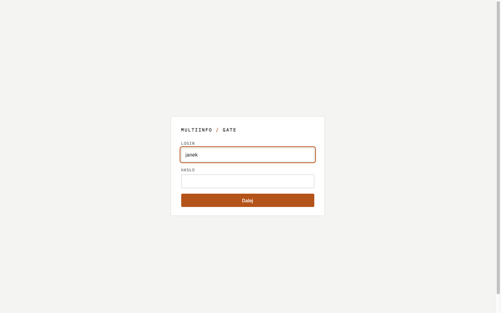

Gdy nie działa:

- przeglądarka zgłasza odmowę połączenia - okno z tunelem zostało zamknięte albo tunel nie
  zestawił się; należy uruchomić polecenie ponownie i przeczytać jego komunikat
- `bind [127.0.0.1]:8081: Address already in use` - port 8081 na własnym komputerze zajmuje
  inny program; należy użyć innego portu lokalnego, np. `-L 18081:127.0.0.1:8081` i adresu
  `http://127.0.0.1:18081`
- po wpisaniu kodu z aplikacji panel wraca do ekranu hasła z komunikatem „Logowanie trwało zbyt
  długo” - przeglądarka nie zapisała ciasteczka logowania; ciasteczka panelu mają znacznik
  `Secure`, który przez tunel (`http://127.0.0.1`) honorują Chrome i Firefox, ale nie Safari.
  Panel przez tunel należy otwierać w Chrome albo Firefoksie; pod własną domeną z HTTPS
  (rozdział 6) działa każda przeglądarka

### 4.2. Konto Multiinfo

W panelu: **Konta Multiinfo → Dodaj konto**. Pola formularza:

| Pole | Wartość |
|---|---|
| Nazwa w panelu | dowolna nazwa własna, np. `Firma` |
| Adres bazowy | `https://api2.multiinfo.plus.pl/Api61/` albo z `api1`, zgodnie z punktem 1.5 |
| Login | login użytkownika API (punkt 1.1); musi być zgodny z polem CN certyfikatu |
| Hasło konta Multiinfo | hasło użytkownika API |
| ID usług, jedno w wierszu | identyfikatory usług z punktu 1.3 |
| Domyślny kraj numerów | kod kraju dopisywany do numerów bez prefiksu, dla Polski `48` |
| Przechowywanie treści wiadomości | wyłączone: bramka przechowuje tylko identyfikatory, numery i statusy; włączone: także treść, widoczną w panelu i w API |
| Plik .pfx albo .p12 | plik z punktu 1.2, z dowolnym z tych dwóch rozszerzeń |
| Hasło do pliku .pfx | hasło nadane przy tworzeniu pliku |

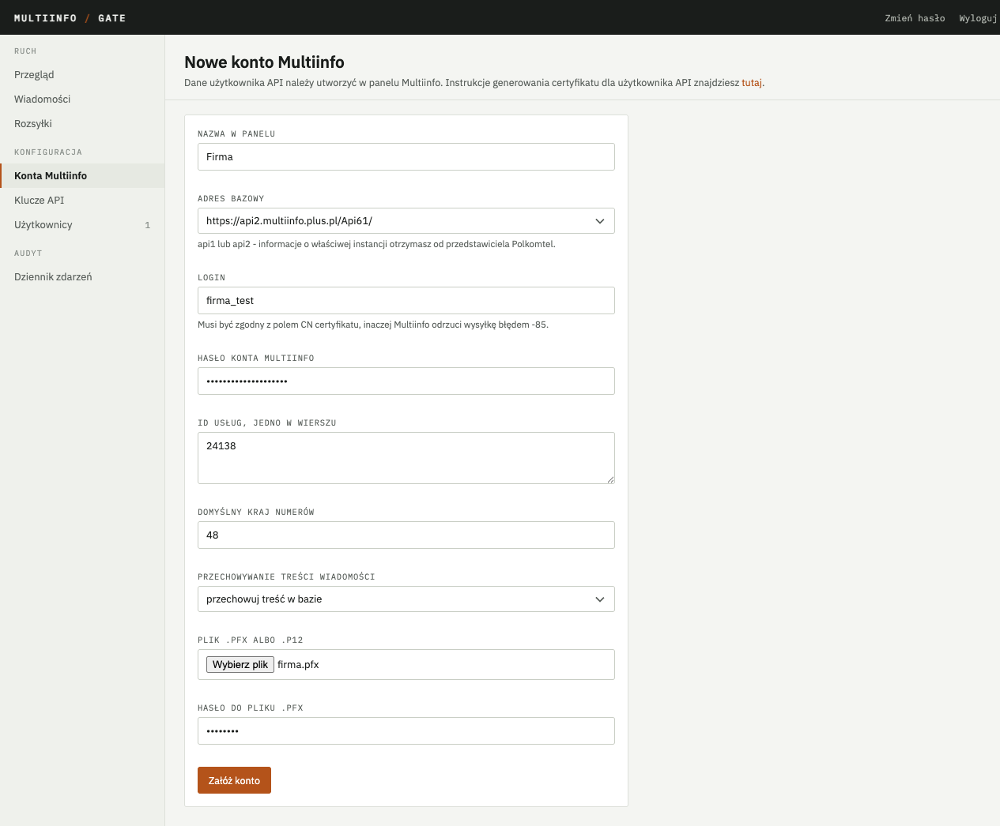

Po zapisaniu bramka otwiera kartę konta z sekcją **Odczytane dane certyfikatu**: podmiot (CN),
wystawca, odcisk SHA-1 i daty ważności. Te trzy pierwsze wartości należy teraz wpisać w panelu
Multiinfo, w edycji użytkownika API, w zakładce Uwierzytelnianie (punkt 1.2, krok 5). Jeżeli CN
różni się od loginu konta, karta pokazuje ostrzeżenie - w takim przypadku certyfikat został
wygenerowany z innym CN i trzeba go wystawić ponownie.

### 4.3. Sprawdzenie połączenia

Przycisk **Sprawdź połączenie** na karcie konta wysyła do Multiinfo zapytanie testowe
o nieistniejącą wiadomość. Wynik prawidłowy to kod **`-31`**: Multiinfo przyjęło certyfikat
i hasło, a odrzuciło jedynie treść zapytania. Inne kody:

| Kod | Znaczenie | Postępowanie |
|---|---|---|
| `-1` | złe hasło użytkownika API | poprawić hasło na karcie konta |
| `-80` | certyfikat nie został przedstawiony | plik `.pfx` nie został wgrany albo jest uszkodzony; wgrać ponownie |
| `-81` do `-84`, `-86` | certyfikat nierozpoznany przez Multiinfo | dane z zakładki Uwierzytelnianie w panelu Multiinfo nie zostały jeszcze wpisane albo różnią się od odczytanych przez bramkę |
| `-85` | CN certyfikatu nie zgadza się z loginem | wystawić certyfikat z CN równym loginowi |

Sprawdzenie wysyła jeszcze drugie zapytanie, na stronę diagnostyczną Multiinfo `test.aspx`,
która odpowiada tym, co serwer Polkomtela odczytał z przedstawionego certyfikatu: podmiotem,
wystawcą i datą ważności. Karta pokazuje te dane pod wynikiem sprawdzenia jako **Certyfikat
widziany przez Multiinfo** i porównuje CN z loginem konta. Różnica między tym, co bramka
odczytała z pliku `.pfx` (punkt 4.2), a tym, co widzi Multiinfo, wskazuje przyczynę kodów
`-80` do `-86` bez zgadywania: gdy strona odpowiada „Brak certyfikatu”, certyfikat nie dotarł
do serwera; gdy pokazuje inne CN niż login, plik pochodzi z innego wniosku. Strona nie sprawdza
loginu ani hasła, więc nie zastępuje wyniku `-31` - jest do niego uzupełnieniem.

Karta konta zachowuje ślad ostatniego sprawdzenia (oba żądania i odpowiedzi, z hasłem
zamaskowanym).

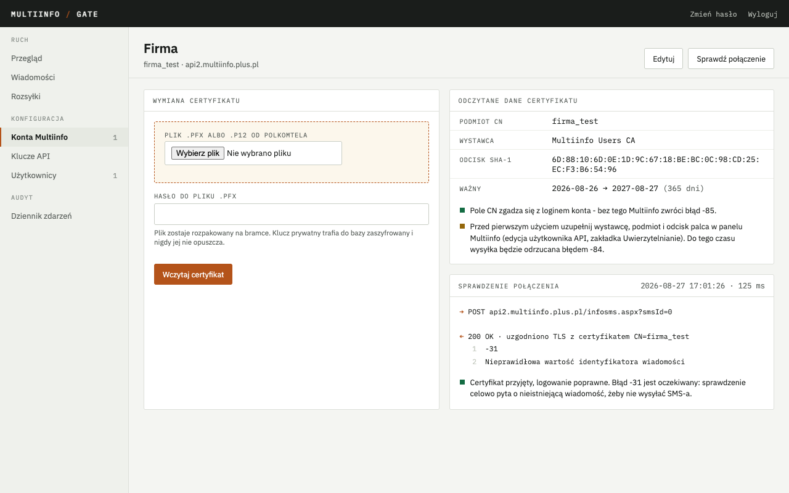

### 4.4. Słownik nadpisów

Na liście kont, przy każdym koncie, znajduje się formularz **Słownik nadpisów, jeden w wierszu**
oraz pole wartości domyślnej. Do słownika wpisuje się wyłącznie nadpisy uruchomione przez
Polkomtel (punkt 1.4). Bramka odrzuca żądanie z nadpisem spoza słownika kodem `403`, zanim
trafi ono do Multiinfo; nadpis wpisany do słownika, ale nieuruchomiony przez Polkomtel, przejdzie
przez bramkę i zostanie odrzucony przez Multiinfo kodem `-14` - wiadomość dostanie wtedy stan
`failed` z tym kodem.

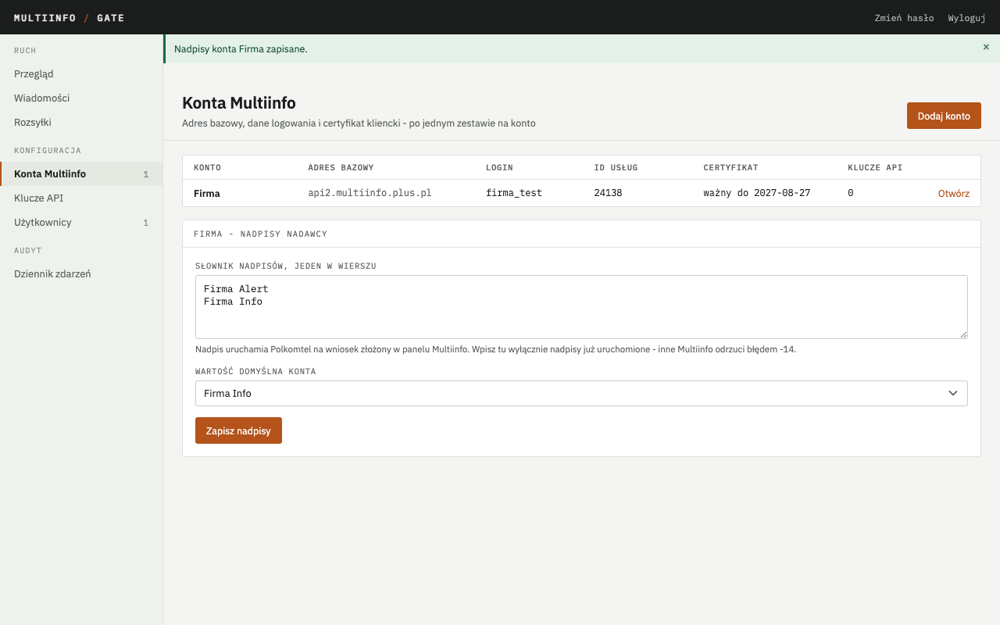

### 4.5. Klucz API

Klucz API identyfikuje aplikację kliencką. Jeden klucz odpowiada jednej aplikacji (albo jednemu
kontrahentowi); dzięki temu limit żądań, odwołanie i dziennik dotyczą jednej aplikacji, a nie
wszystkich.

W panelu: **Klucze API → Wygeneruj klucz**. Formularz pozwala wybrać konto Multiinfo, nadać
nazwę, ograniczyć klucz do wybranych usług i nadpisów, ustawić limit części jednej wiadomości
(1-9), limit żądań na minutę, datę ważności oraz adres webhooka - jeśli aplikacja ma otrzymywać
powiadomienia o doręczeniu (opis w `docs/api.md`, rozdział 6).

Pole **Odbiera wiadomości przychodzące** włącza dla klucza odbiór SMS-ów od abonentów: bramka
zaczyna pytać Multiinfo o wiadomości z usług klucza i przekazuje każdą powiadomieniem
`message.received` na adres webhooka (pole wymaga adresu webhooka). Kilka kluczy z dostępem do tej
samej usługi może odbierać naraz. Gdy ostatni odbierający klucz zostanie odwołany, wygaśnie albo
straci zaznaczenie, bramka przestaje pytać o tę usługę. Stan odbioru widać na karcie konta
w sekcji „Odbiór wiadomości”: czy jest aktywny, kiedy bramka ostatnio pytała i kiedy ostatnio
coś przyszło; usługa zatrzymana błędem Multiinfo (np. nieaktywna) pokazuje przyczynę i wraca do
pracy po zapisie dowolnej zmiany klucza albo konta.

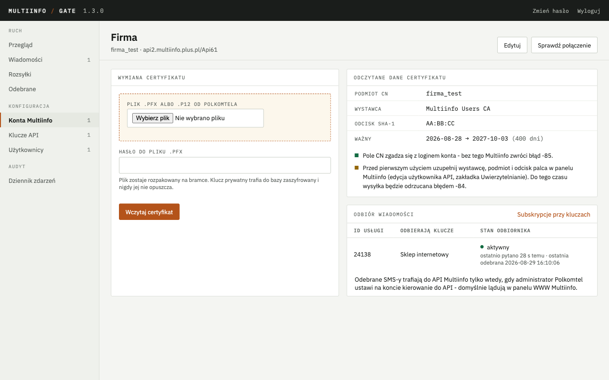

Po zapisaniu panel wyświetla jeden raz dwie wartości: **klucz** (`mig_live_...`) oraz - gdy
podano adres webhooka - **sekret webhooka**. W bazie bramki pozostaje tylko skrót klucza; panel
nie pokaże tych wartości ponownie. Należy je zapisać w menedżerze haseł i przekazać osobie
odpowiedzialnej za aplikację kliencką. Utracony klucz zastępuje się nowym (wygenerowanie
nowego, przekazanie aplikacji, odwołanie starego); utracony sekret webhooka wydaje ponownie
edycja klucza ze zmianą adresu webhooka.

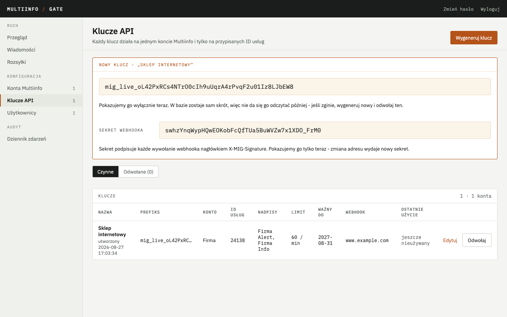

### 4.6. Użytkownicy panelu

Kolejne osoby otrzymują konta z ekranu **Użytkownicy → Dodaj użytkownika**. Formularz przyjmuje
login i hasło startowe; hasło przekazuje się tej osobie bezpośrednio, ponieważ panel nie
wyświetla go ponownie. Przy pierwszym logowaniu panel wymusza włączenie drugiego składnika, tak
jak dla pierwszego konta.

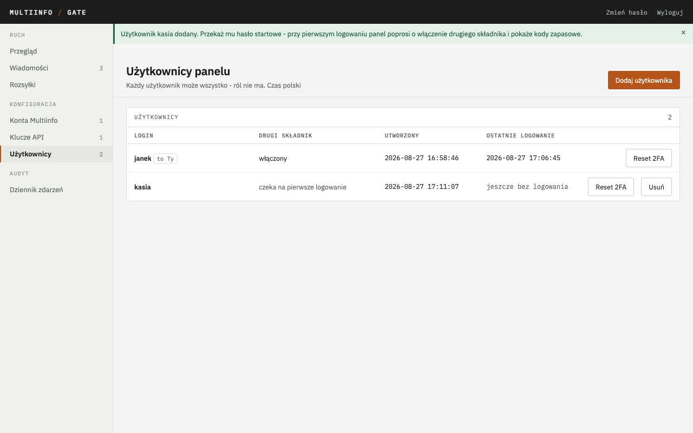

Na liście użytkowników dostępne są akcje:

- **Reset 2FA** - usuwa drugi składnik i kody zapasowe danego użytkownika; przy następnym
  logowaniu panel zażąda włączenia drugiego składnika od nowa. Stosowane po utracie telefonu
- **Usuń** - usuwa konto i natychmiast zamyka jego otwarte sesje. Ostatniego konta nie można
  usunąć
- **Zmień hasło** (odnośnik w prawym górnym rogu) - zmiana hasła własnego konta; po zapisaniu
  pozostałe sesje tego konta zostają zamknięte, bieżąca pozostaje

Panel nie ma ról: każdy użytkownik ma pełne uprawnienia. Pierwsze konto zakłada się zawsze
poleceniem z rozdziału 3.4, kolejne - z tego ekranu.

## 5. Pierwsza wysyłka

### 5.1. Tunel do API

Do czasu wystawienia API pod domeną (rozdział 6) port 8080 jest dostępny tylko z serwera.
Do testu z własnego komputera służy tunel jak w rozdziale 4.1, dla portu 8080 (można też dodać
drugą opcję `-L` do istniejącego tunelu):

```bash
ssh -N -L 8080:127.0.0.1:8080 <TWOJ-UZYTKOWNIK>@<ADRES-SERWERA>
```

### 5.2. Wysłanie wiadomości

Polecenie (na własnym komputerze; `<TWOJ-KLUCZ>` to klucz z rozdziału 4.5, numer należy
zastąpić własnym numerem testowym):

```bash
curl -s http://127.0.0.1:8080/v1/messages \
  -H "Authorization: Bearer <TWOJ-KLUCZ>" \
  -H "Content-Type: application/json" \
  -d '{"to":"48601000001","text":"Test bramki"}'
```

Oczekiwany wynik:

```json
{"id":"msg_3f9c2a7b1e4d8c6a5b2f","status":"queued","encoding":"gsm","parts":1,"characters":12,"slots":12,"slotsRemaining":148}
```

Status `queued` oznacza przyjęcie do kolejki; wysyłka następuje w tle, w ciągu sekundy.

### 5.3. Odczyt stanu

```bash
curl -s http://127.0.0.1:8080/v1/messages/<ID> -H "Authorization: Bearer <TWOJ-KLUCZ>"
```

gdzie `<ID>` to wartość `id` z poprzedniej odpowiedzi. Oczekiwany wynik: po kilku sekundach
`"status":"sent"`, po kilkunastu `"status":"delivered"` i wiadomość na telefonie. Ten sam stan
pokazuje panel na ekranie **Wiadomości**.

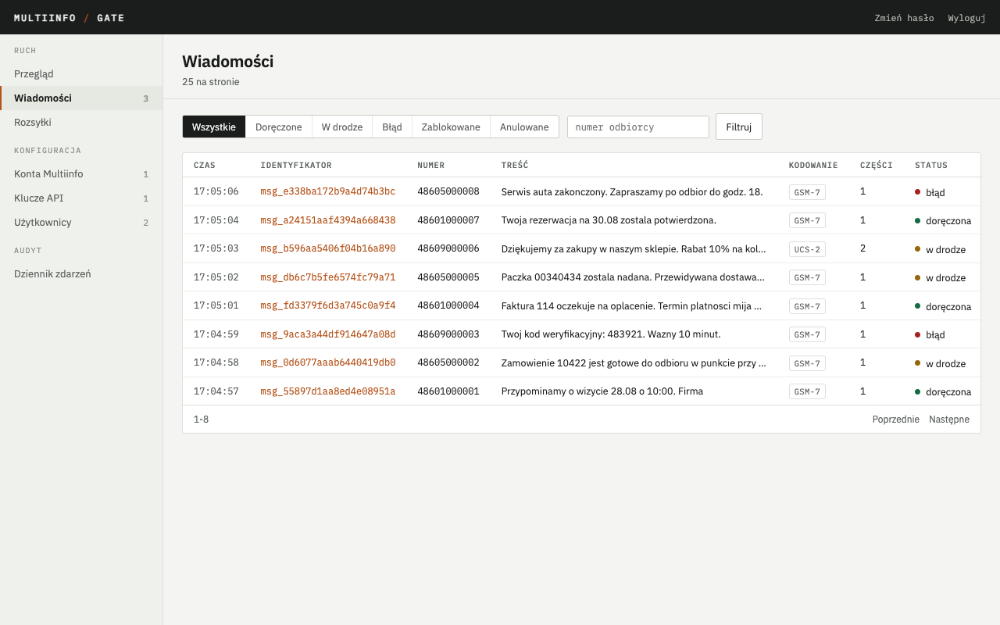

Szczegół wiadomości (odnośnik w kolumnie identyfikatora) pokazuje podgląd segmentów, przebieg
z czasami kolejnych zdarzeń oraz ślad protokołu: pełne żądanie do Multiinfo z zamaskowanym hasłem
i odpowiedź linia po linii.

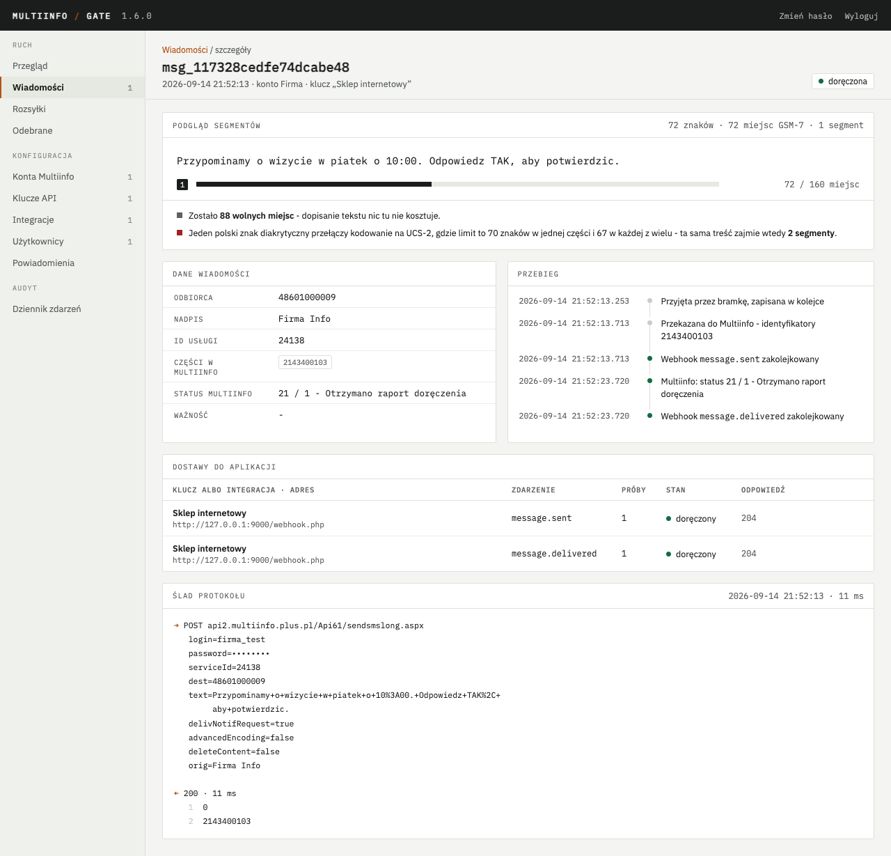

Gdy stan to `failed`, odpowiedź zawiera pola `providerCode` i `error` z powodem:

| `providerCode` | Znaczenie | Postępowanie |
|---|---|---|
| `-14` | nadpis nieuruchomiony przez Polkomtel | użyć nadpisu uruchomionego (punkt 1.4) albo pominąć pole `orig` |
| `-24` | nieznany identyfikator usługi | poprawić identyfikator na karcie konta |
| `-80` do `-86` | certyfikat odrzucony | konto zostało wstrzymane; postępowanie w rozdziale 7.5 |

Odpowiedź `401` na samo żądanie oznacza błędny albo odwołany klucz; `403 orig_not_allowed` -
nadpis spoza słownika konta albo uprawnień klucza.

### 5.4. Wysyłka z przykładowej aplikacji

Repozytorium zawiera w katalogu `examples/php/` przykładową aplikację w PHP: stronę z formularzem
pojedynczej wiadomości i rozsyłki, listą wysyłek oraz odbiornikiem webhooków. Służy jako narzędzie
testowe i jako wzorzec kodu do przeniesienia do własnej aplikacji. Instrukcja uruchomienia
znajduje się w `examples/php/README.md`.

### 5.5. Pierwsza wiadomość przychodząca

Po ustawieniu kierowania do API w Multiinfo (punkt 1.6) i zaznaczeniu odbioru przy kluczu
(punkt 4.5) wyślij z telefonu SMS-a na numer usługi. W ciągu kilku sekund wiadomość pojawi się
w panelu w zakładce **Odebrane** (ekran poniżej), a aplikacja dostanie powiadomienie
`message.received`. Szczegół wiadomości pokazuje, do których kluczy poszło powiadomienie i z jakim
skutkiem. Jeżeli lista pozostaje pusta, sprawdź na karcie konta sekcję „Odbiór wiadomości”: stan
„nieaktywny” oznacza brak odbierającego klucza, „zatrzymany” podaje kod błędu Multiinfo,
a „aktywny” z bieżącym czasem pytania oznacza, że bramka pyta, ale Multiinfo nic nie wydaje -
wtedy wiadomości najpewniej trafiają do panelu WWW Multiinfo zamiast do API.

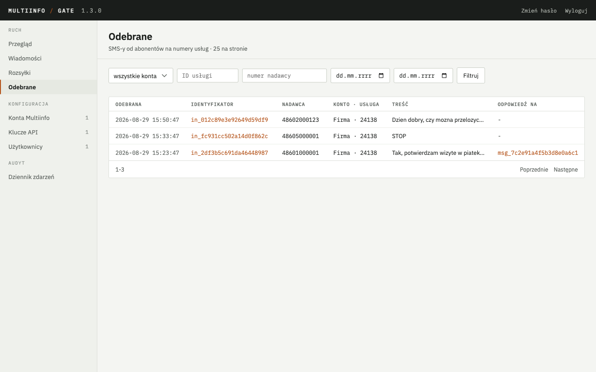

Szczegół odebranej wiadomości (odnośnik w kolumnie identyfikatora) pokazuje dane z Multiinfo
(numer nadawcy, numer usługi, identyfikator w Multiinfo, protokół), wiadomość wysłaną, na którą
abonent najpewniej odpowiada, odpowiedzi wysłane w wątku oraz ślad dostaw do aplikacji: który
klucz dostał powiadomienie, ile było prób i jaka była odpowiedź aplikacji.

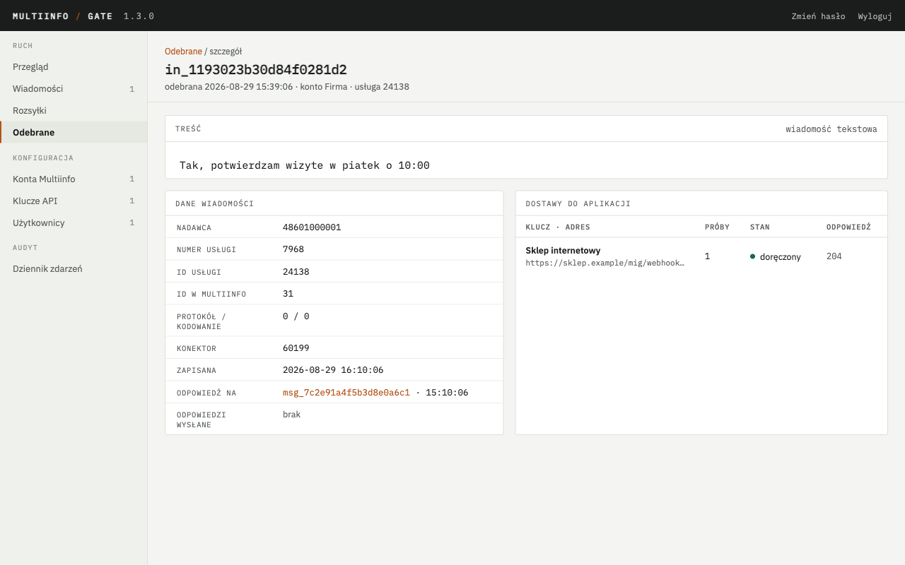

Odpowiedź na odebraną wiadomość wysyła się zwykłym `POST /v1/messages` z polem `inReplyTo`
(`docs/api.md`, rozdział 5a.3); przykładowa aplikacja ma do tego formularz w sekcji „Odebrane
SMS-y”, a wysłana w ten sposób wiadomość ma w panelu wiersz „Odpowiedź na” z odnośnikiem do
odebranej.

## 6. Wystawienie API pod własną domeną

Ten rozdział dotyczy sytuacji, w której aplikacja kliencka działa poza serwerem bramki - np.
w agencji obsługującej wysyłki albo w systemie hostowanym u innego dostawcy. Aplikacja otrzymuje
klucz API i łączy się z bramką przez internet. Panel pozostaje dostępny wyłącznie przez tunel
SSH; na zewnątrz wystawia się tylko API.

### 6.1. Pojęcia

**Odwrotne proxy** to serwer WWW ustawiony przed bramką. Przyjmuje połączenia z internetu na
portach 80 (HTTP) i 443 (HTTPS), obsługuje szyfrowanie i przekazuje żądania do bramki na port
8080, który pozostaje niedostępny z zewnątrz. Bramka nie musi znać domeny ani obsługiwać
certyfikatów HTTPS.

**HTTPS** szyfruje ruch między aplikacją a serwerem; bez niego klucz API byłby przesyłany
otwartym tekstem. Do HTTPS potrzebny jest certyfikat wystawiony dla domeny. **Let's Encrypt**
to urząd certyfikacji wydający takie certyfikaty bezpłatnie i automatycznie, pod warunkiem że
domena wskazuje na serwer, a port 80 jest otwarty - w ten sposób Let's Encrypt sprawdza, że
serwer należy do wnioskującego. Oba opisane niżej warianty odnawiają certyfikat samoczynnie.

### 6.2. Domena

U dostawcy domeny (w panelu, w którym domena została zarejestrowana) należy dodać rekord typu
`A` dla wybranej nazwy (np. `sms.twojafirma.pl`) wskazujący na publiczny adres IP serwera.
Zmiana jest widoczna po czasie od kilku minut do godziny. Sprawdzenie, z dowolnego komputera:

```bash
dig +short <TWOJA-DOMENA>
```

Oczekiwany wynik: adres IP serwera. Brak wyniku oznacza, że rekord jeszcze się nie rozpropagował
albo został wpisany pod inną nazwą.

### 6.3. Zapora

Do serwera muszą docierać połączenia na porty 80 i 443. U dostawców chmurowych porty otwiera
się w regułach sieciowych maszyny wirtualnej (w Azure: „Network security group”, reguła
przychodząca dla portów 80 i 443, protokół TCP, dowolne źródło; u innych dostawców pod nazwami
„firewall” albo „security group”). Jeżeli na serwerze działa dodatkowo zapora `ufw`:

```bash
sudo ufw allow 80,443/tcp
```

Portów 8080 i 8081 nie należy otwierać - mają pozostać dostępne wyłącznie z samego serwera.

### 6.4. Wybór wariantu

Poniżej trzy równoważne sposoby. Wariant A jest właściwy, gdy na serwerze nie działa inny serwer
WWW; wariant B - gdy nginx już jest zainstalowany albo administrator go zna; wariant C - gdy
serwer obsługuje już inne kontenery przez Traefik. Należy wykonać jeden z nich.

### 6.5. Wariant A: Caddy w kontenerze

Caddy to serwer WWW, który samodzielnie uzyskuje i odnawia certyfikat Let's Encrypt. Repozytorium
zawiera plik `docker/docker-compose.caddy.yml`, uruchamiający Caddy jako drugi kontener obok
bramki, oraz `docker/Caddyfile` z jego konfiguracją. Jedyną wartością do podania jest domena.

W pliku `docker/.env` (rozdział 3.2) należy dopisać dwa wiersze:

```
COMPOSE_FILE=docker-compose.yml:docker-compose.caddy.yml
MIG_DOMENA=<TWOJA-DOMENA>
```

Wiersz `COMPOSE_FILE` sprawia, że każde polecenie `docker compose` uwzględnia od tej pory także
plik Caddy - bez podawania go za każdym razem opcją `-f`. Jeżeli wiersz `COMPOSE_FILE` już
istnieje (budowanie ze źródeł z rozdziału 3.1), plik Caddy dopisuje się do niego po dwukropku,
zamiast dodawać drugi wiersz. Następnie, w katalogu `~/multiinfo-gate/docker`:

```bash
docker compose up -d
```

Caddy uzyskuje certyfikat w ciągu około minuty. Sprawdzenie z dowolnego komputera:

```bash
curl https://<TWOJA-DOMENA>/healthz
```

Oczekiwany wynik: `{"status":"ok"}`.

Gdy nie działa, dziennik Caddy wskazuje przyczynę:

```bash
docker compose logs caddy --tail 30
```

Typowe przyczyny: domena nie wskazuje jeszcze na serwer (sprawdzić `dig` z rozdziału 6.2),
port 80 zamknięty w zaporze (Let's Encrypt nie może potwierdzić domeny), literówka
w `MIG_DOMENA`.

### 6.6. Wariant B: nginx na serwerze

W tym wariancie nginx zainstalowany bezpośrednio w systemie przekazuje ruch do bramki, a certyfikat
uzyskuje i odnawia program certbot. Repozytorium zawiera gotowy plik konfiguracji nginx.

Polecenia (na serwerze; w dwóch ostatnich `twoja.domena.pl` należy zastąpić własną domeną):

```bash
sudo apt install -y nginx python3-certbot-nginx
sudo cp ~/multiinfo-gate/docker/nginx/multiinfo-gate.conf /etc/nginx/sites-available/multiinfo-gate
sudo sed -i 's/<TWOJA-DOMENA>/twoja.domena.pl/' /etc/nginx/sites-available/multiinfo-gate
sudo ln -s /etc/nginx/sites-available/multiinfo-gate /etc/nginx/sites-enabled/
sudo nginx -t && sudo systemctl reload nginx
sudo certbot --nginx -d twoja.domena.pl
```

Kolejno: instalacja nginx i certbota; skopiowanie pliku konfiguracji; wpisanie domeny w miejsce
`<TWOJA-DOMENA>`; włączenie konfiguracji; sprawdzenie składni (`nginx -t`) i przeładowanie;
uzyskanie certyfikatu. Certbot pyta o adres e-mail (na powiadomienia o wygasaniu certyfikatu)
i o zgodę na warunki usługi, po czym sam dopisuje obsługę HTTPS do pliku konfiguracji
i rejestruje zadanie odnawiania.

Oczekiwany wynik: `nginx -t` wypisuje `syntax is ok` oraz `test is successful`; certbot kończy
komunikatem `Successfully deployed certificate` (lub równoważnym). Sprawdzenie jak w wariancie A:
`curl https://<TWOJA-DOMENA>/healthz` → `{"status":"ok"}`.

Gdy nie działa: `nginx -t` wskazuje wiersz z błędem składni; odpowiedź `502 Bad Gateway`
oznacza, że bramka nie działa (`docker compose ps` w katalogu `docker/`); komunikat certbota
`Challenge failed` - domena nie wskazuje na serwer albo port 80 jest zamknięty.

### 6.7. Wariant C: Traefik już działający na serwerze

Traefik to odwrotne proxy dla kontenerów: obserwuje Dockera i buduje trasy z etykiet
(`labels`) na kontenerach, sam uzyskując certyfikaty Let's Encrypt. Ten wariant zakłada, że
Traefik jest już uruchomiony na serwerze i obsługuje inne usługi - repozytorium nie zawiera
jego instalacji, tylko plik `docker/docker-compose.traefik.yml`, który podłącza bramkę do
sieci Traefika i opisuje ją etykietami.

Z konfiguracji Traefika potrzebne są trzy nazwy, które administrator zna z jego uruchomienia:

| Wartość | Gdzie w konfiguracji Traefika | Domyślnie w bramce |
|---|---|---|
| sieć Dockera, w której Traefik szuka kontenerów | `--providers.docker.network` albo sekcja `networks` jego pliku Compose | `traefik` |
| punkt wejścia HTTPS | `--entrypoints.<nazwa>.address=:443` | `websecure` |
| resolver certyfikatów | `--certificatesresolvers.<nazwa>.acme...` | `letsencrypt` |

Gdy nazwy zgadzają się z domyślnymi, w `docker/.env` wystarczą dwa wiersze:

```
COMPOSE_FILE=docker-compose.yml:docker-compose.traefik.yml
MIG_DOMENA=<TWOJA-DOMENA>
```

Gdy się różnią, dochodzą `MIG_TRAEFIK_SIEC`, `MIG_TRAEFIK_WEJSCIE` i `MIG_TRAEFIK_RESOLVER`
z właściwymi nazwami (tabela w rozdziale 7.7). Istniejący wiersz `COMPOSE_FILE` uzupełnia się
jak w wariancie A. Następnie, w katalogu `~/multiinfo-gate/docker`:

```bash
docker compose up -d
```

Traefik wykrywa kontener w ciągu kilku sekund i uzyskuje certyfikat w ciągu około minuty.
Sprawdzenie jak w wariancie A: `curl https://<TWOJA-DOMENA>/healthz` → `{"status":"ok"}`.

Gdy nie działa: `network <nazwa> declared as external, but could not be found` przy
`docker compose up` oznacza złą nazwę sieci w `MIG_TRAEFIK_SIEC` (listę sieci daje
`docker network ls`); `404 page not found` z Traefika - trasa nie powstała, najczęściej przez
zły punkt wejścia albo domenę, którą Traefik obsługuje już dla innego kontenera; ostrzeżenie
o certyfikacie w przeglądarce (certyfikat `TRAEFIK DEFAULT CERT`) - zła nazwa resolvera albo
port 80 zamknięty; dziennik Traefika (`docker logs <kontener-traefika> --tail 30`) podaje
przyczynę w każdym z tych przypadków. Porty `127.0.0.1:8080` i `:8081` z `docker-compose.yml`
pozostają na pętli zwrotnej hosta - Traefik dochodzi do bramki przez wspólną sieć, nie przez nie.

Sieć Traefika jest wspólna dla wszystkich obsługiwanych przez niego kontenerów, dlatego w tym
wariancie panel nasłuchuje wyłącznie na interfejsie sieci własnej bramki (`MIG_ADMIN_HOST=eth0`
w pliku Traefika): z sieci Traefika osiągalne jest tylko API na porcie 8080, a port panelu 8081
odmawia połączeń. Dostęp do panelu przez tunel SSH (rozdział 4.1) działa bez zmian, bo mapowanie
`127.0.0.1:8081` prowadzi do sieci własnej. Sprawdzenie z kontenera Traefika:
`docker exec <kontener-traefika> wget -qO- http://multiinfo-gate:8081/healthz` ma zakończyć się
błędem `Connection refused`, a to samo z portem `8080` - odpowiedzią `{"status":"ok"}`.

### 6.8. Przekazanie dostępu aplikacji zewnętrznej

Aplikacja (albo obsługująca ją agencja) potrzebuje:

- adresu API: `https://<TWOJA-DOMENA>`
- własnego klucza API (rozdział 4.5) - osobnego dla każdej aplikacji
- dokumentacji `docs/api.md` i, w razie potrzeby, przykładu `examples/php/`

Czego nie należy udostępniać: dostępu do panelu (port 8081), portu 8080, konta w panelu bramki.

Limit żądań na minutę ustawiony przy kluczu zabezpiecza przed błędem w cudzej aplikacji
(np. wysyłką w pętli); odwołanie klucza w panelu odcina aplikację natychmiast, bez restartu
bramki. Bramka nie odczytuje nagłówka `X-Forwarded-For` - limity liczy na klucz, nie na adres
nadawcy, więc proxy nie wpływa na ich działanie.

## 7. Utrzymanie

### 7.1. Kopie bazy

Bramka wykonuje kopię bazy raz na dobę, po godzinie 02:00 UTC, do katalogu `backups/` na
wolumenie z danymi, i usuwa kopie starsze niż `MIG_BACKUP_RETENTION_DAYS` dni (domyślnie 14).
Kopia jest zaszyfrowana kluczem głównym i bez niego bezużyteczna.

```bash
docker compose exec multiinfo-gate ls -la /data/backups
docker volume inspect docker_gate-data --format '{{.Mountpoint}}'
```

Pierwsze polecenie wypisuje listę kopii (pliki `multiinfo-gate-RRRR-MM-DD.sqlite`); drugie -
katalog na serwerze, w którym leży wolumin z bazą i kopiami (zwykle
`/var/lib/docker/volumes/docker_gate-data/_data`).

Kopie poza serwer należy wykonywać z katalogu `backups/`, nie z działającego pliku bazy: skopiowanie
`multiinfo-gate.sqlite` w trakcie pracy bramki może dać niespójny plik. Klucz główny przechowuje
się oddzielnie od kopii.

### 7.2. Przywrócenie kopii

```bash
docker compose stop
sudo cp <SCIEZKA-WOLUMENU>/backups/multiinfo-gate-RRRR-MM-DD.sqlite <SCIEZKA-WOLUMENU>/multiinfo-gate.sqlite
sudo rm -f <SCIEZKA-WOLUMENU>/multiinfo-gate.sqlite-wal <SCIEZKA-WOLUMENU>/multiinfo-gate.sqlite-shm
docker compose start
```

`<SCIEZKA-WOLUMENU>` to wynik `docker volume inspect` z punktu 7.1. Pliki `-wal` i `-shm` to
dziennik transakcji SQLite należący do poprzedniej bazy; po podmianie pliku muszą zniknąć.

### 7.3. Dziennik

```bash
docker compose logs -f
```

Polecenie wyświetla dziennik na bieżąco (Ctrl+C kończy podgląd). Każdy wpis to jeden wiersz
JSON z polami `at` (czas UTC), `level`, `msg` (nazwa zdarzenia) i identyfikatorami; dziennik nie
zawiera treści wiadomości, haseł ani pełnych kluczy. Zdarzenia warte uwagi:

| Zdarzenie | Znaczenie |
|---|---|
| `wysylka.przyjeta`, `wysylka.odrzucona` | Multiinfo przyjęło albo odrzuciło wiadomość |
| `wysylka.blad_przejsciowy` | błąd sieci albo Multiinfo; bramka ponowi |
| `konto.wstrzymane` | Multiinfo odrzuciło certyfikat; patrz 7.5 |
| `status.ostateczny` | wiadomość doręczona albo niedoręczona |
| `webhook.dostarczony`, `webhook.nieudany` | wynik dostawy zdarzenia do aplikacji |
| `webhook.odmowa_sieci_wewnetrznej` | adres webhooka wskazuje sieć wewnętrzną, a `MIG_WEBHOOK_ALLOW_PRIVATE` nie jest ustawione; dostawa porzucona |
| `status.porzucony` | Multiinfo nie podało stanu ostatecznego przez siedem dni od przekazania; wiadomość zakończona jako `expired` |
| `rozsylka.zakonczona`, `rozsylka.nieudana` | zakończenie rozsyłki |
| `odbior.start`, `odbior.stop` | bramka zaczęła albo przestała pytać Multiinfo o wiadomości z usługi (zmiana subskrypcji przy kluczach) |
| `odbior.wiadomosc`, `odbior.duplikat` | odebrano wiadomość od abonenta; duplikat to ta sama wiadomość wydana przez Multiinfo ponownie, pominięta |
| `odbior.blad` | błąd sieci albo Multiinfo przy pytaniu o wiadomości; bramka ponowi z rosnącym odstępem |
| `odbior.zatrzymany` | Multiinfo odrzuciło pytanie kodem `-23` albo `-24` (usługa nieznana albo nieaktywna); odbiór tej usługi stoi do zapisu zmiany klucza albo konta w panelu |
| `odbior.potwierdzenie_nieudane`, `odbior.wyjatek` | wiadomość zapisana, ale nie potwierdzona w Multiinfo (wróci i zostanie pominięta jako duplikat) albo błąd zapisu (wiadomość wróci z Multiinfo po kilku minutach) |
| `kopia.zapisana`, `kopia.blad` | wynik nocnej kopii; brak `kopia.zapisana` przez dwie doby oznacza, że proces nie działa albo nie ma prawa zapisu do wolumenu |
| `worker.wyjatek`, `api.wyjatek` | błąd wewnętrzny; treść wpisu jest materiałem do zgłoszenia. Zadanie workera wraca z rosnącym odstępem (od minuty do pół godziny) |
| `worker.zadanie_porzucone` | ósmy z rzędu błąd wewnętrzny tego samego zadania; wysyłka kończy wiadomość stanem `failed`, odpytywanie zostawia w przebiegu wpis o przerwaniu |

### 7.4. Aktualizacja

Wydania są numerowane według schematu `1.2.3`: pierwsza liczba zmienia się przy zmianach
niezgodnych wstecz, druga przy nowych możliwościach, trzecia przy poprawkach. Numer bieżącej
wersji pokazuje maszt panelu oraz `/healthz` na porcie panelu. Lista wydań z opisem zmian:
`https://github.com/sqlik/multiinfo-gate/releases`.

Obraz jest oznaczony trzema tagami: `1.2.3` (dokładnie ta wersja), `1.2` (najnowsza poprawka
tej serii) i `1` (najnowsze wydanie zgodne wstecz). Zmienna `MIG_WERSJA` w `docker/.env` wybiera,
który z nich śledzi bramka; domyślnie `1`, czyli każda aktualizacja w obrębie pierwszej liczby.

Przed aktualizacją wykonuje się kopię bazy; migracje schematu bazy uruchamiają się same przy
starcie nowej wersji.

```bash
cd ~/multiinfo-gate/docker
docker compose exec multiinfo-gate cp /data/multiinfo-gate.sqlite /data/backups/przed-aktualizacja.sqlite
git -C ~/multiinfo-gate pull
docker compose pull
docker compose up -d
```

Kolejno: kopia bazy; pobranie nowych plików uruchomieniowych i dokumentacji; pobranie nowego
obrazu; uruchomienie. Oczekiwany wynik: `curl http://127.0.0.1:8080/healthz` → `{"status":"ok"}`,
a `curl http://127.0.0.1:8081/healthz` pokazuje w polu `version` nowy numer.

W razie błędu przywraca się kopię `przed-aktualizacja.sqlite` według punktu 7.2 i wraca do
poprzedniej wersji: wpis `MIG_WERSJA=<poprzedni numer>` w `docker/.env` (np. `MIG_WERSJA=1.1.0`)
i ponowne `docker compose up -d`. Przy budowaniu ze źródeł (`docker-compose.build.yml`) zamiast
`docker compose pull` wykonuje się `docker compose up -d --build`, a cofnięcie to
`git -C ~/multiinfo-gate checkout v<poprzedni numer>` i ponowne budowanie.

### 7.5. Certyfikat Multiinfo

Panel ostrzega na ekranie przeglądu 30 dni przed upływem ważności certyfikatu konta. Wymiana
przebiega obiegiem z punktu 1.2: nowy certyfikat według instrukcji Polkomtela (z tym samym CN),
podpis, plik `.p12`/`.pfx`, wgranie na karcie konta w sekcji **Wymiana certyfikatu**, wpisanie nowych
danych w zakładce Uwierzytelnianie w panelu Multiinfo, sprawdzenie połączenia.

Gdy Multiinfo odrzuci certyfikat (kody `-80` do `-86`), bramka **wstrzymuje konto**: wiadomości
pozostają w kolejce, nie są ponawiane w pętli, a ekran przeglądu i karta konta pokazują powód.
Wstrzymanie znosi wgranie nowego pliku `.pfx` albo - po uzupełnieniu danych po stronie
Multiinfo - udane sprawdzenie połączenia z karty konta. Kolejka rusza w ciągu minuty.

### 7.6. Klucze API

Klucz, który wyciekł albo przestał być potrzebny, odwołuje się na ekranie **Klucze API**
przyciskiem **Odwołaj**; działa to natychmiast. Wymiana klucza: wygenerowanie nowego, przekazanie
aplikacji, odwołanie starego. Odwołane klucze pozostają widoczne w zakładce **Odwołane** ze
względu na dziennik i historię wiadomości.

### 7.7. Zmienne środowiskowe

Ustawiane w `docker/.env` (klucz główny, domena) albo w sekcji `environment` pliku
`docker/docker-compose.yml` (pozostałe):

| Zmienna | Domyślnie | Znaczenie |
|---|---|---|
| `MIG_MASTER_KEY` | - | Klucz główny, 32 bajty w base64, wymagany |
| `MIG_API_PORT` | `8080` | Port publicznego API |
| `MIG_ADMIN_PORT` | `8081` | Port panelu |
| `MIG_API_HOST` | `0.0.0.0` | Adres nasłuchu API |
| `MIG_ADMIN_HOST` | `127.0.0.1` | Adres nasłuchu panelu, poza kontenerem zostaw domyślny; nazwa interfejsu (np. `eth0`) oznacza jego adres IPv4 |
| `MIG_DATA_DIR` | `/data` | Katalog bazy, raportów i kopii |
| `MIG_LOG_LEVEL` | `info` | Jeden z `silent`, `error`, `warn`, `info`, `debug` |
| `MIG_BACKUP_RETENTION_DAYS` | `14` | Ile dni trzymać kopie bazy |
| `MIG_WEBHOOK_ALLOW_PRIVATE` | `0` | `1` pozwala na adresy webhooków w sieci wewnętrznej (pętla zwrotna, `10/8`, `172.16/12`, `192.168/16`, sieć kontenerów); domyślnie bramka woła wyłącznie adresy publiczne i takie tylko przyjmuje w panelu. Potrzebne, gdy aplikacja odbierająca webhooki stoi na tym samym serwerze, np. przykład PHP z rozdziału 5 |
| `MIG_INBOUND_TIMEOUT_MS` | `60000` | Ile milisekund Multiinfo może trzymać pytanie o wiadomości przychodzące bez odpowiedzi (1-60000); wartość domyślna to długie oczekiwanie zalecane w dokumentacji Multiinfo, mała wartość razem z `MIG_INBOUND_IDLE_MS` daje odpytywanie okresowe |
| `MIG_INBOUND_IDLE_MS` | `0` | Przerwa po pustej odpowiedzi, zanim bramka zapyta ponownie; `0` to pytanie od razu |
| `MIG_WERSJA` | `1` | Tag obrazu do pobrania: `1`, `1.1` albo `1.1.0` (rozdział 7.4) |
| `MIG_DOMENA` | - | Domena bramki dla wariantu Caddy i Traefik |
| `COMPOSE_FILE` | - | Dodatkowe pliki Compose oddzielone dwukropkiem: `docker-compose.caddy.yml` włącza Caddy, `docker-compose.traefik.yml` - Traefik, `docker-compose.build.yml` - budowanie ze źródeł; zawsze po `docker-compose.yml` |
| `MIG_TRAEFIK_SIEC` | `traefik` | Wariant Traefik: sieć Dockera, w której Traefik szuka kontenerów |
| `MIG_TRAEFIK_WEJSCIE` | `websecure` | Wariant Traefik: punkt wejścia HTTPS |
| `MIG_TRAEFIK_RESOLVER` | `letsencrypt` | Wariant Traefik: nazwa resolvera certyfikatów |

## 8. Lista kontrolna po wdrożeniu

Do sprawdzenia na docelowym serwerze, na koncie produkcyjnym i numerze testowym:

- [ ] `https://<TWOJA-DOMENA>/healthz` odpowiada `{"status":"ok"}`, a `http://<ADRES-SERWERA>:8080` i `:8081` z zewnątrz nie odpowiadają
- [ ] Sprawdzenie połączenia na karcie konta daje `-31`
- [ ] Wiadomość testowa bez polskich znaków dociera, w panelu ma stan `delivered`
- [ ] Wiadomość z polskimi znakami dociera z poprawnymi znakami
- [ ] Wiadomość z nadpisem dociera z tym nadpisem jako nadawcą
- [ ] Rozsyłka na dwa numery testowe dociera, raport CSV pobiera się z panelu
- [ ] Webhook `message.delivered` dociera do przykładowej aplikacji z poprawnym podpisem
- [ ] SMS wysłany z telefonu na numer usługi jest w zakładce Odebrane, a przykładowa aplikacja dostała `message.received`
- [ ] Odwołany klucz dostaje `401`
- [ ] Konto panelu ma drugi składnik, kody zapasowe są przechowywane poza serwerem
- [ ] Drugi użytkownik panelu zalogował się hasłem startowym i włączył drugi składnik
- [ ] Po nocy w `backups/` leży plik z datą

## 9. Proxmox VE

Jeżeli posiadasz własny serwer z Proxmox VE, możesz uruchomić bramkę w kontenerze LXC zamiast na
maszynie wirtualnej z Dockerem. Poniższy rozdział zastępuje rozdziały 2 i 3 oraz punkty 7.1 do 7.4; rozdział 1
(przygotowania po stronie Multiinfo), 4 (panel), 5 (pierwsza wysyłka) i 8 (lista kontrolna)
obowiązują bez zmian, a rozdział 6 dotyczy serwera, który wystawia API bramki na świat - w sieci
firmowej jest to zwykle istniejące odwrotne proxy albo osobny kontener z nginx według punktu 6.6.

Do wyboru są dwa warianty: kontener bez Dockera, tworzony jednym skryptem (punkt 9.1), i kontener
z Dockerem, w którym bramka działa dokładnie tak jak na serwerze z rozdziału 3 (punkt 9.4).

### 9.1. Kontener LXC skryptem

Skrypt `proxmox/ct/multiinfogate.sh` z repozytorium bramki jest napisany w formacie skryptów
[community-scripts](https://github.com/community-scripts/ProxmoxVE) i korzysta z ich silnika
kreatora, ale leży w repozytorium bramki i nie wymaga niczego z ich katalogu. Kolejno: pobiera
szablon Debiana 13, tworzy nieuprzywilejowany kontener (1 rdzeń, 1 GB pamięci, 4 GB dysku, adres
z DHCP), instaluje Node.js 22, pobiera źródła najnowszego wydania bramki z GitHuba i buduje je,
tworzy konto systemowe `multiinfo-gate`, generuje klucz główny, rejestruje usługę systemd
i zakłada pierwsze konto panelu. Dockera w kontenerze nie ma.

Polecenie wykonuje się w powłoce hosta Proxmox jako `root` (w interfejsie Proxmox: węzeł →
**Shell**, albo przez SSH na adres hosta):

```bash
bash -c "$(curl -fsSL https://raw.githubusercontent.com/sqlik/multiinfo-gate/main/proxmox/ct/multiinfogate.sh)"
```

Kreator pyta, czy użyć ustawień domyślnych, czy zaawansowanych (nazwa kontenera, adres IP,
mostek sieciowy, rozmiar dysku, hasło `root`). Przy pierwszym uruchomieniu dowolnego skryptu
w tym formacie silnik pyta też o zgodę na wysyłanie anonimowych statystyk do community-scripts;
odpowiedź jest zapisywana na hoście i dotyczy skryptów z ich katalogu - skrypt bramki statystyk
nie wysyła niezależnie od odpowiedzi. Instalacja trwa od trzech do pięciu minut, z czego
większość zajmuje pobranie zależności i budowa.

Oczekiwany wynik: komunikat `Zakończono pomyślnie`, numer kontenera oraz dwa adresy - panel na
porcie 8081 i API na porcie 8080 - pod adresem, który kontener dostał z DHCP.

Instalacja bez pytań, np. w skrypcie automatyzującym, przyjmuje ustawienia w zmiennych przed
poleceniem:

```bash
var_admin_user=janek var_admin_pass='<HASLO-CO-NAJMNIEJ-12-ZNAKOW>' var_ram=2048 \
  bash -c "$(curl -fsSL https://raw.githubusercontent.com/sqlik/multiinfo-gate/main/proxmox/ct/multiinfogate.sh)"
```

`var_admin_user` i `var_admin_pass` ustalają login i hasło pierwszego konta panelu (zasady jak
w punkcie 3.4); bez nich login to `admin`, a hasło losuje instalator. `var_cpu`, `var_ram`
(w MB) i `var_disk` (w GB) zmieniają zasoby kontenera; pozostałe zmienne silnika opisuje
dokumentacja community-scripts.

Gdy nie działa:

- kreator kończy się komunikatem o braku szablonu albo błędem pobierania - host Proxmox nie ma
  dostępu do internetu albo do repozytorium szablonów; sprawdzeniem jest `pveam update` w powłoce hosta
- instalacja przerywa się na budowaniu bramki - dziennik instalacji wskazany w komunikacie
  pokazuje ostatnie wiersze; najczęściej brakuje pamięci (`var_ram=2048` przy ponownym
  uruchomieniu) albo GitHub odmówił kolejnego pobrania z tego adresu (limit zapytań bez
  logowania; odczekać godzinę)
- `Bramka nie odpowiada na /healthz` - usługa nie wystartowała; przyczynę pokazuje
  `pct exec <NUMER-KONTENERA> -- journalctl -u multiinfo-gate -n 20`
- `Please run this script as root` mimo `sudo` - silnik wymaga sesji `root`, nie polecenia
  poprzedzonego `sudo`; najpierw `sudo -i`, potem polecenie kreatora
- `/etc/pve/storage.cfg does not exist` - Proxmox zainstalowany na gotowym Debianie nie tworzy
  tego pliku, dopóki konfiguracja magazynu nie zostanie zapisana; naprawia to jednorazowe
  `pvesm set local --content vztmpl,rootdir,images,iso,backup,snippets` w powłoce hosta

### 9.2. Konto panelu i dostęp

Login i hasło pierwszego konta leżą w kontenerze w pliku dostępnym tylko dla `root`:

```bash
pct exec <NUMER-KONTENERA> -- cat /root/multiinfo-gate.creds
```

`<NUMER-KONTENERA>` to numer wypisany przez kreator (widoczny też na liście w interfejsie
Proxmox). Po zalogowaniu i włączeniu drugiego składnika plik można usunąć.

Panel nasłuchuje na adresie kontenera (`MIG_ADMIN_HOST=eth0`), a nie tylko na pętli zwrotnej
jak w rozdziale 4, bo w kontenerze LXC nie ma domyślnie serwera SSH, przez który dałoby się
zestawić tunel z punktu 4.1. Nie oznacza to logowania zwykłym HTTP z sieci: panel wymaga HTTPS
albo adresu lokalnego i pod `http://<ADRES-KONTENERA>:8081` pokazuje ekran logowania z tą
informacją, a próbę zalogowania odrzuca. Do panelu prowadzą dwie drogi:

- **Tunel SSH przez hosta Proxmox** - polecenie na własnym komputerze, w osobnym oknie
  terminala, które zostaje otwarte na czas pracy:

  ```bash
  ssh -N -L 8081:<ADRES-KONTENERA>:8081 root@<ADRES-HOSTA-PROXMOX>
  ```

  `<ADRES-KONTENERA>` to adres wypisany przez kreator (np. `10.10.10.159`), `<ADRES-HOSTA-PROXMOX>`
  to adres, pod którym host jest dostępny przez SSH. Następnie w przeglądarce `http://127.0.0.1:8081`
  i dalej jak w punkcie 4.1: logowanie danymi z pliku wyżej, kod QR, kody zapasowe. Tunel prowadzi
  do adresu kontenera, ale przeglądarka widzi adres lokalny, i to wystarcza panelowi
- **Odwrotne proxy z HTTPS w sieci firmowej** - jeżeli w sieci działa już nginx, Caddy albo Traefik
  z certyfikatem, może kierować `https://panel.<TWOJA-DOMENA>` na `http://<ADRES-KONTENERA>:8081`
  z nagłówkiem `X-Forwarded-Proto: https`, tak jak przykładowe konfiguracje z rozdziału 6 robią to
  dla API. Panel jest wtedy dostępny z każdego komputera w sieci, nadal za hasłem i drugim składnikiem

Bez logowania z sieci widać jedynie ekran logowania i `http://<ADRES-KONTENERA>:8081/healthz`
z samym polem `status`; szczegóły (wersja, kolejka, konta Multiinfo z dniami do końca certyfikatu)
panel podaje wyłącznie tam, gdzie da się zalogować - tunelem albo przez HTTPS. Jeżeli i ekran
logowania w sieci jest niepożądany (np. kontener stoi w sieci z obcymi urządzeniami), w pliku `/etc/multiinfo-gate/env` należy wpisać `MIG_ADMIN_HOST=127.0.0.1`,
wykonać `systemctl restart multiinfo-gate` i wchodzić tunelem do samego kontenera według punktu 4.1,
po włączeniu w nim serwera SSH (`systemctl enable --now ssh` i hasło `root` ustawione poleceniem
`passwd`, albo dostęp SSH z ustawień zaawansowanych kreatora).

Dalej obowiązuje rozdział 4 od punktu 4.2: konto Multiinfo, sprawdzenie połączenia, klucz API.

### 9.3. Utrzymanie w kontenerze

Polecenia wykonuje się w kontenerze: `pct enter <NUMER-KONTENERA>` w powłoce hosta otwiera
w nim sesję `root` (wyjście: `exit`).

| Co | Gdzie |
|---|---|
| Kod bramki (podmieniany przy aktualizacji) | `/opt/multiinfo-gate` |
| Konfiguracja, w tym klucz główny | `/etc/multiinfo-gate/env` |
| Baza danych, raporty i kopie | `/var/lib/multiinfo-gate`, kopie w `backups/` |
| Dane pierwszego konta panelu | `/root/multiinfo-gate.creds` |
| Usługa | `systemctl status multiinfo-gate`, `systemctl restart multiinfo-gate` |
| Dziennik | `journalctl -u multiinfo-gate -f` (opis zdarzeń w punkcie 7.3) |

Plik `/etc/multiinfo-gate/env` zastępuje `docker/.env` i sekcję `environment` z rozdziału 7.7;
zmiana zmiennej wymaga `systemctl restart multiinfo-gate`. Klucz główny z tego pliku warto od razu
skopiować do menedżera haseł, z powodów opisanych w punkcie 3.2.

Kopie bazy powstają jak w punkcie 7.1, w `/var/lib/multiinfo-gate/backups`. Przywrócenie kopii:

```bash
systemctl stop multiinfo-gate
cd /var/lib/multiinfo-gate
install -o multiinfo-gate -g multiinfo-gate -m 640 backups/multiinfo-gate-RRRR-MM-DD.sqlite multiinfo-gate.sqlite
rm -f multiinfo-gate.sqlite-wal multiinfo-gate.sqlite-shm
systemctl start multiinfo-gate
```

`install` kopiuje plik i nadaje mu właściciela usługi; pliki `-wal` i `-shm` należą do
poprzedniej bazy i muszą zniknąć, jak w punkcie 7.2.

Aktualizacja do najnowszego wydania to jedno polecenie w kontenerze:

```bash
update
```

Polecenie sprawdza na GitHubie, czy jest nowsze wydanie, i jeżeli tak: zatrzymuje usługę,
zapisuje kopię bazy jako `backups/przed-aktualizacja-<WERSJA>.sqlite`, pobiera i buduje nowe
wydanie, uruchamia usługę. Migracje bazy wykonują się same przy starcie. Oczekiwany wynik:
`Zaktualizowano do wydania <WERSJA>`, a po zalogowaniu maszt panelu pokazuje nowy numer (panel
w kontenerze nasłuchuje na adresie kontenera, nie na `127.0.0.1`, więc `curl` z punktu 7.4 tu nie
zadziała). Gdy nowszego wydania nie ma, polecenie kończy się
komunikatem o braku aktualizacji.

Powrót do poprzedniego wydania po nieudanej aktualizacji: przywrócenie kopii
`przed-aktualizacja-<WERSJA>.sqlite` według przepisu wyżej i ręczne pobranie tamtego wydania:

```bash
systemctl stop multiinfo-gate
rm -rf /opt/multiinfo-gate && mkdir /opt/multiinfo-gate
curl -fsSL https://github.com/sqlik/multiinfo-gate/archive/refs/tags/v<WERSJA>.tar.gz | tar -xz --strip-components=1 -C /opt/multiinfo-gate
cd /opt/multiinfo-gate && npm ci --no-audit --no-fund && npm run build && npm prune --omit=dev
rm -f ~/.multiinfo-gate
systemctl start multiinfo-gate
```

`<WERSJA>` to numer sprzed aktualizacji, np. `1.1.2`. Usunięcie pliku `~/.multiinfo-gate`
sprawia, że kolejne `update` znów zaproponuje najnowsze wydanie.

### 9.4. Kontener z Dockerem

Jeżeli wolisz mieć w kontenerze dokładnie ten układ, który opisują rozdziały 3 i 7 (obraz z GHCR,
`docker compose`, warianty Caddy i Traefik), utwórz kontener LXC z Dockerem skryptem z katalogu
community-scripts, w powłoce hosta Proxmox:

```bash
bash -c "$(curl -fsSL https://raw.githubusercontent.com/community-scripts/ProxmoxVE/main/ct/docker.sh)"
```

Skrypt tworzy kontener Debiana z zainstalowanym Dockerem (w kreatorze warto podnieść dysk do
8 GB). Dalej, już w kontenerze (`pct enter <NUMER-KONTENERA>`), obowiązuje rozdział 3 od punktu
3.1, z pominięciem `sudo` (sesja jest sesją `root`) i punktu 2.2 (Docker już jest). Panel jest
wtedy dostępny wyłącznie przez tunel SSH do kontenera, jak w punkcie 4.1.
